## Function with unknown parameters  
* Model: $y=b+wx_1$  
w: weight
b: bias
* $x_1$ is the input(known), $y$ is the output(unknown)  
## Define loss from training data  
* Loss is a function of parameters
$L(b,w)$  
* Loss output how good a set of value(b and w) is  
!!! tip "Example"  

    $L(0.5k,1)$: $y=0.5k+1x_1$:How good it is?  
    use Youtube as an example:  
    $L(0.5k,1)$: $\frac{1}{N}\sum_{i=1}^{n}|y_i-0.5k-x_i-1|$

* absolute errror(MAE) and square error(MSE)  
we try every possible value of b and w, and find the best value:
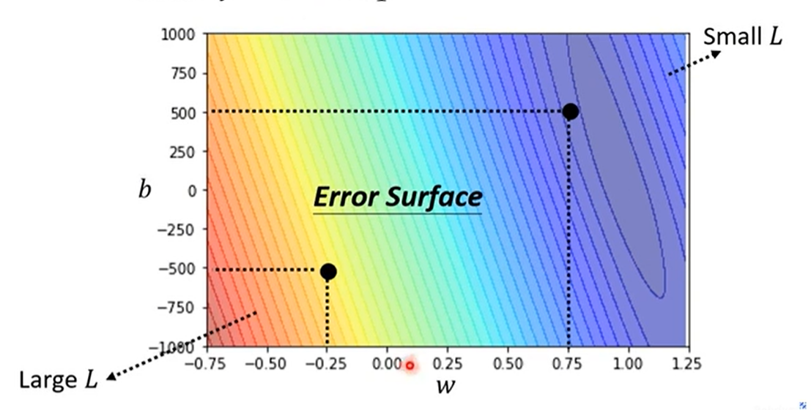

## Optimization  
* Find the best value of b and w  
$w_*, b_*=argmin_{w,b}L(w,b)$  
* Gradient Descent  
!!! tip  "Personal opinion" 

    
The essence of gradient decent is a simplified Newton's Method
   

   

* Start from a random point  
* Move in the negative direction of the gradient  
* Stop when the gradient is close to zero  
* $w_{t+1}=w_t-\eta\frac{\partial L}{\partial w}$  
* $\eta$: learning rate  
* $\frac{\partial L}{\partial w}$: gradient  
* $w_{t+1}=w_t-\eta\frac{\partial L}{\partial w}$  
* $b_{t+1}=b_t-\eta\frac{\partial L}{\partial b}$  
* $w_{t+1}=w_t-\eta\frac{\partial L}{\partial w}$  
* $b_{t+1}=b_t-\eta\frac{\partial L}{\partial b}$  

* $w_{t+1}=w_t-\eta\frac{\partial L}{\partial w}$  
* etc   
!!! Question   

    
When to stop? Until you are satisfied or the gradient is close to zero...Yet, the you cannot guarentee the smallest loss
    

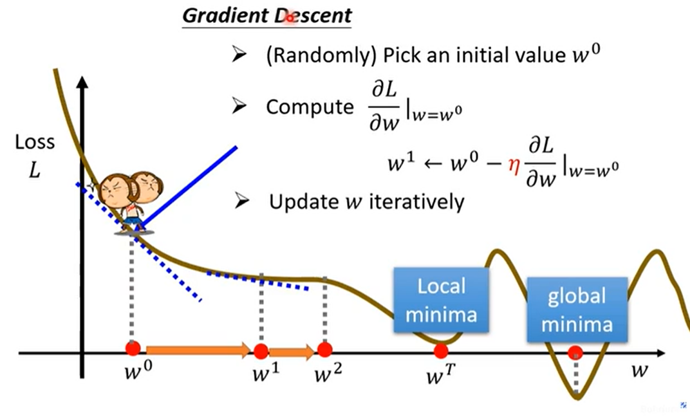   
But, does the local minima really cause problems?  
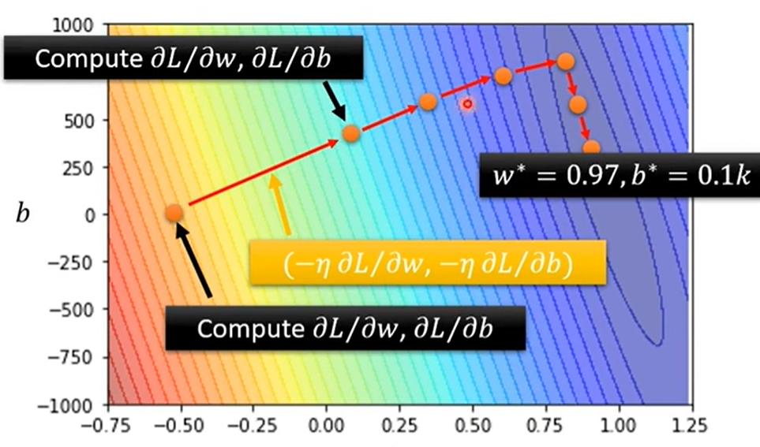
## Training  
*Process*:
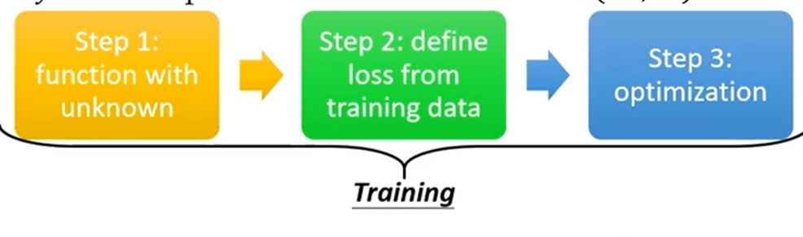   
*A more precise prediction*:  
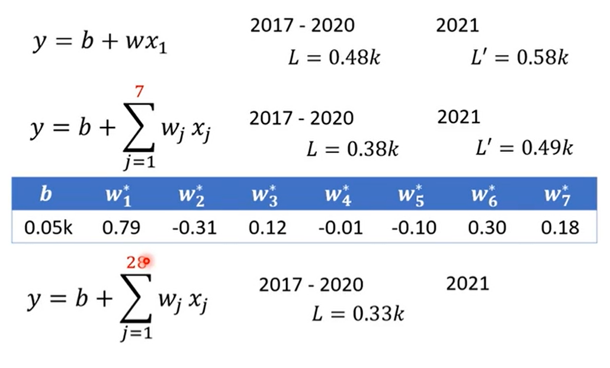   
*They are linear models*   
However, linear models are rather to simple for sophisticated situations. $->Model bias$  

## Piecewise Linear Model(hard sigmoid)  
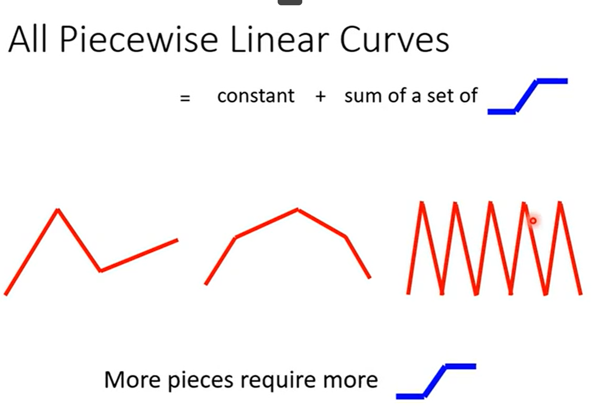
$y=c\frac{1}{1+e^{-wx_1+b}}$: to imitate the piecewise linear model  
that is: $y=sigmoid(wx_1+b)$  
*Dynamic adjuestment of the three parameters*  
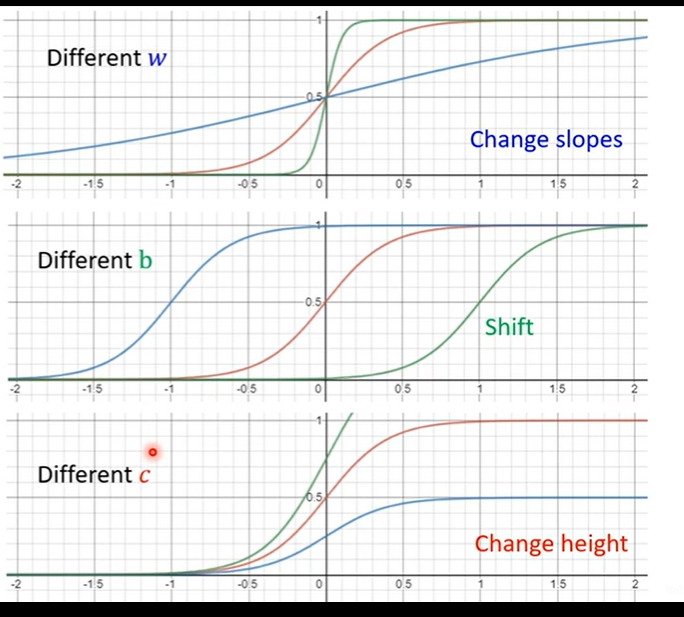  
overall: $y=b+\sum_{i=1}^{n}c_i sigmoid(b_i+w_ix_1)$  
multi-input model: $y=b+\sum_{i=1}^{n}c_i sigmoid(b_i+\sum_{j=1}^{m}w_{ij}x_j)$   
use matrics to simplify the calculation:
$\begin{bmatrix}r_1\\r_2\\r_3\end{bmatrix}=\begin{bmatrix}b_1\\b_2\\b_3\end{bmatrix}+\begin{bmatrix}w_{11}&w_{12}&w_{13}\\w_{21}&w_{22}&w_{23}\\w_{31}&w_{32}&w_{33}\end{bmatrix}\begin{bmatrix}x_1\\x_2\\x_3\end{bmatrix}$  
*r represent the parameter of sigmoid*  
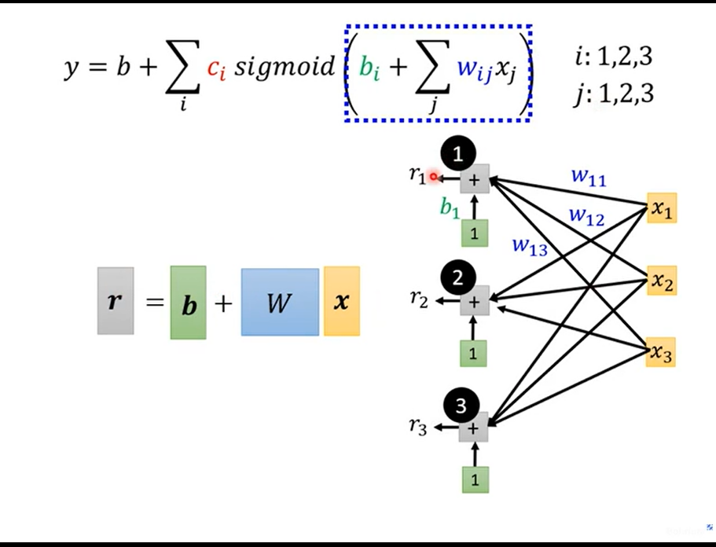  
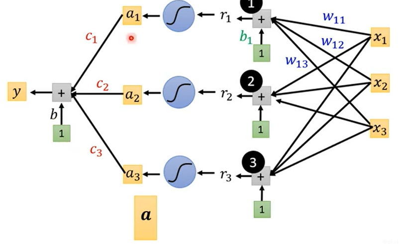  
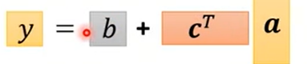   
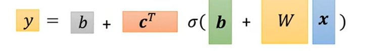  
how to calculate the parameters?  
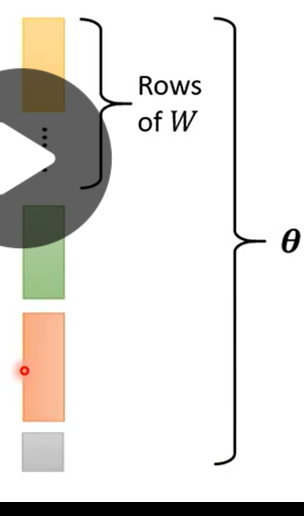  
abstraction: rotating and splitting the matrices and adding them to one vector $\theta$  
given a set of $\theta$, we can calculate the output
loss: sum the bias  
$\theta_*=argmin_{\theta}L(\theta)$  
*Gradient Descent*
$\theta_{t+1}=\theta_t-\eta\frac{\partial L}{\partial \theta}$
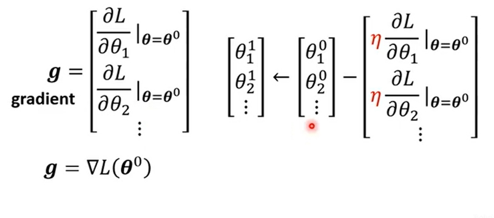  
we choose a batch instead of the whole dataset  
whenever a gradient is generate and the vector $\theta$ is updated, we use another batch to calculate the next gradient  
when we loop through the whole dataset, we call it an `epoch`
!!! note "definition"  

    
Hyperparameter: the parameters that are not learned by the model itself, but are set by the user.
   

Let's change the sigmoid function  
A hard sigmoid function:
$c max(0, wx_1+b)$

ReLU:  
two ReLU function generates a hard sigmoid function  
$y = b+\sum_{i=1}^{n}c_i max(0, \sum_{j}w_ijx_j)$  
the sigmoid and ReLU function are activation function  
## Neural Network   
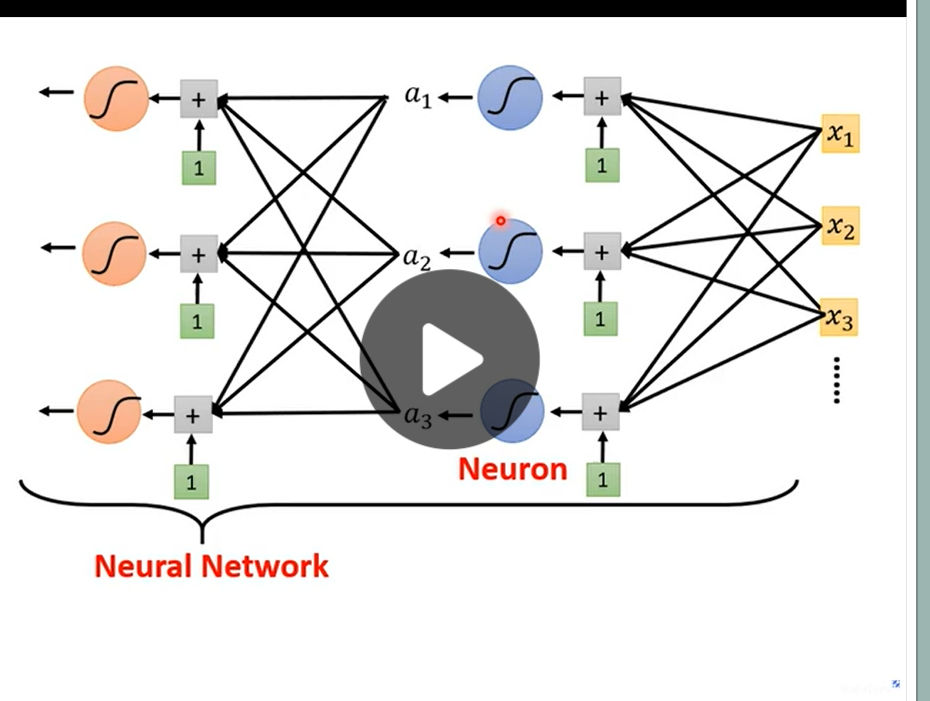  
Deep learning   
!!! Warning   

    
Deep learning is not a new concept, it is just a neural network with more layers.When too deep, better on training data, worse on unseen data
   

