## Examples  
* Euler circuit problem: Find a path that visits every edge exactly once.($P=NP$)  
* Hamiltonian circuit problem: Find a path that visits every vertex exactly once.($NP$)  
* Traveling salesman problem: Find the shortest path that visits every vertex exactly once.($NP$)  
* Single-source shortest path problem: Find the shortest path from a vertex to all other vertices.($P$)  
* Single-source unweighted longest path problem: Find the longest path from a vertex to all other vertices.($NP$)  
## Easy and Hard  
* Easy: Polynomial time(the easiest: $O(N)$, for we have to read the input)  
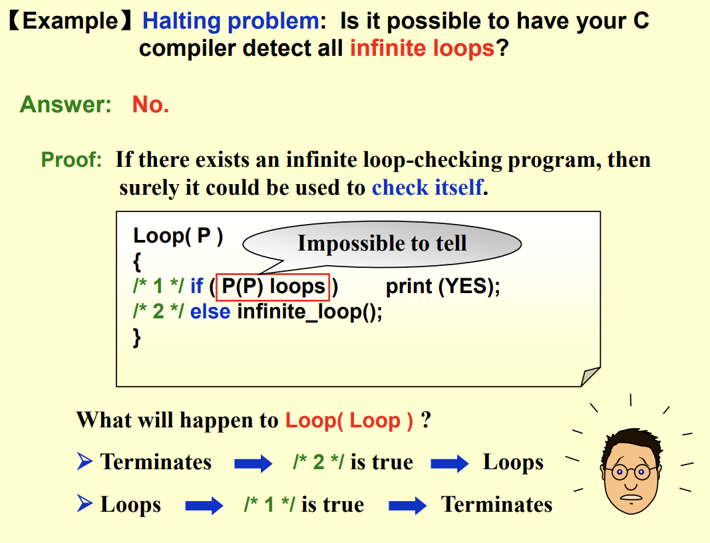  
Loop(p), the p here is the loop detecting function  
if(P(f(p))==1): implies whether f(p) is a infinite loop function  
## NP class  
### [Turing Machine](http:\\www.turing.org.uk)  
* A Turing machine is a mathematical model of computation that defines an abstract machine, which manipulates symbols on a strip of tape according to a table of rules.    
* The machine operates on an infinite memory tape divided into discrete cells.  
* Controlled by a finite set of states, one of which is the start state.    
!!! note "implication of Turing machine"  

    
assuming that the mathematician has infinite time, energy, paper and pen, and is completely dedicated to the work
  

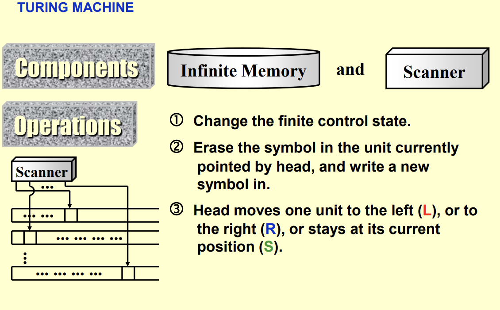  
Deterministic Turing machine:  
executes one instrcution at each point in time, and the next instruction is determined by the current state and the symbol under the tape head.(sequential, 正向)  
Non-deterministic Turing machine:  
free to choose its next step from afinite set, and clever enough to choose the solution-direct step(类似于提前知道答案只需要验证就好)  
NP: Non-deterministic Polynomial time  
* A problem is in NP if its solution can be verified in polynomial time.  
!!! example  

    
Hamilton cycle: Given a graph and a path, we can verify whether the path visits every vertex exactly once in polynomial time.
  
          
* $P \subseteq NP$   
* An NP-complete problem has the property that any problem in NP can be polynomially reduced to it.  
**The process of reduction**:  
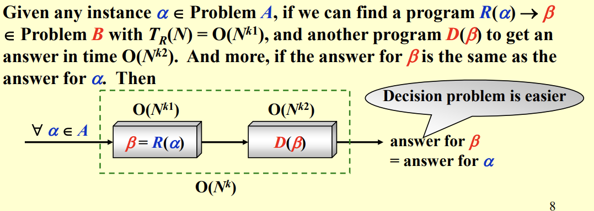  
**The first problem to be proved NP-complete**:  
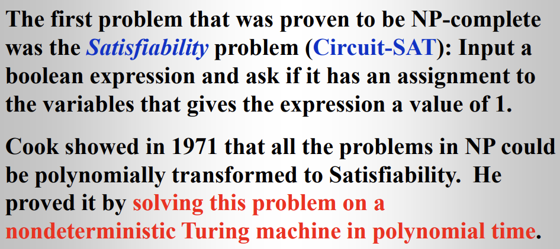   
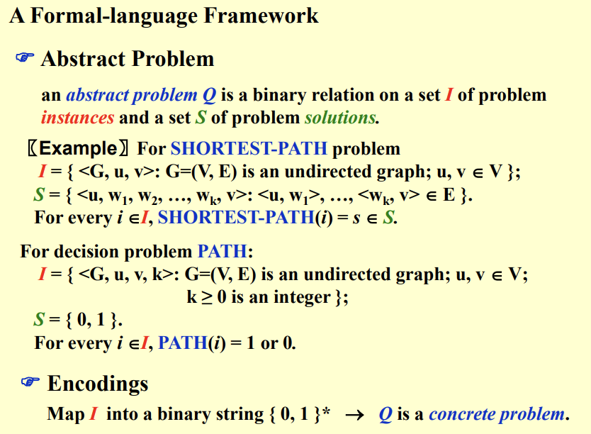  
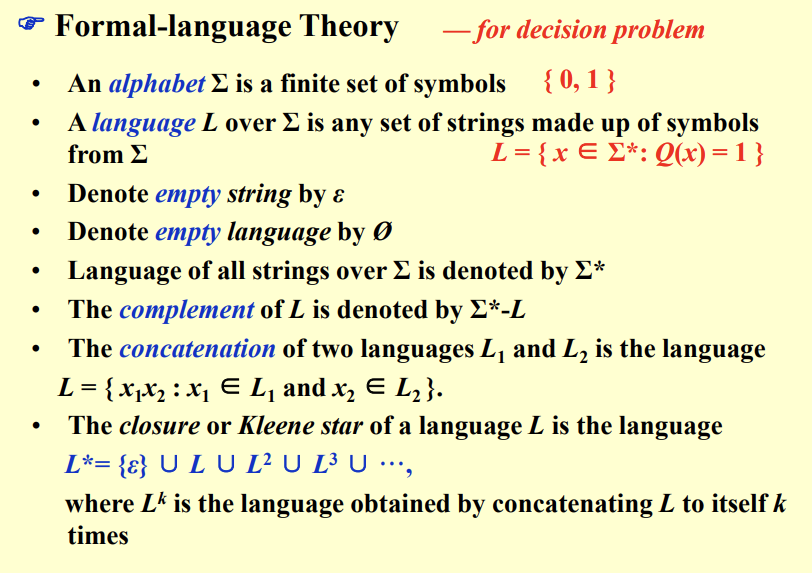  
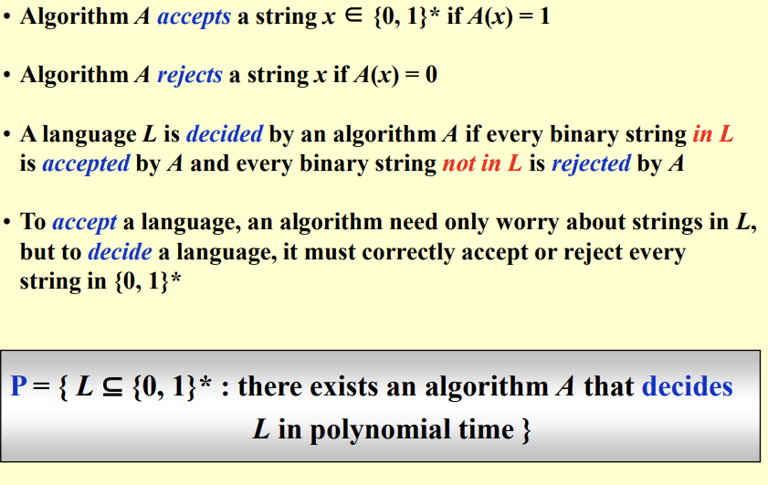   
* a verification algorithm is a two-argument algorithm A, one is input string and the other is a binary certificate string.  
whether $A(x, c)= 1$  
* The language verified by a verification algorithm A is $L = \{x \in \{ 0,1\}_* | \exists c \in \{ 0, 1 \}_*, A(x, c) = 1\}$  

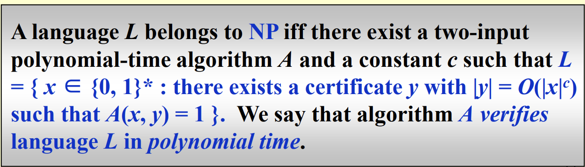  
!!! Warning "Beware"  

    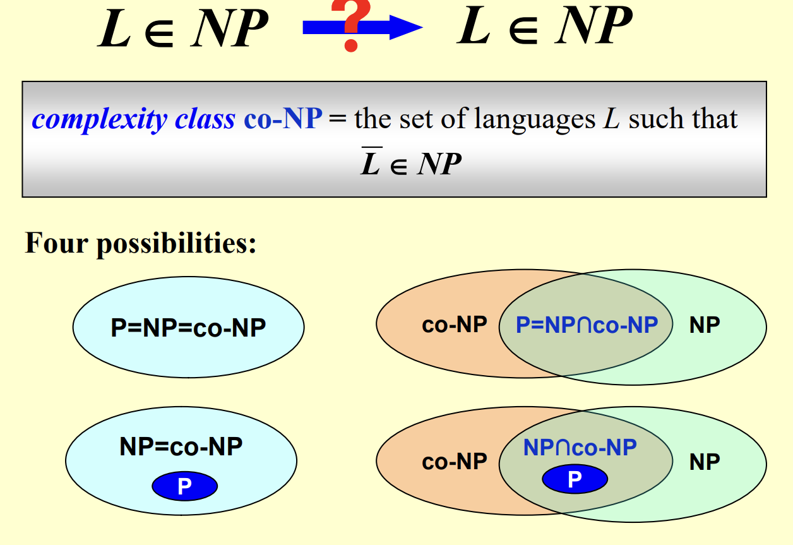  

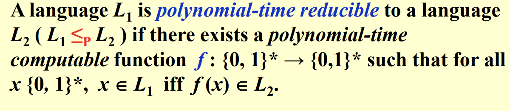  
$f$ is a reduction functiion,  and the polynomial-time algorithm F that computes $f$ is called a reduction algorithm.  
* $L_1 \leq_p L_2$ means that $L_1$ is polynomial-time reducible to $L_2$.  
!!! note  

    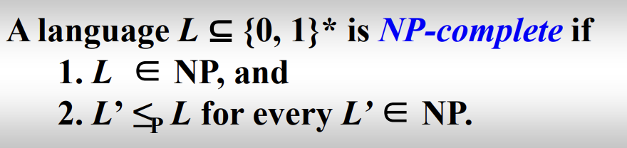  

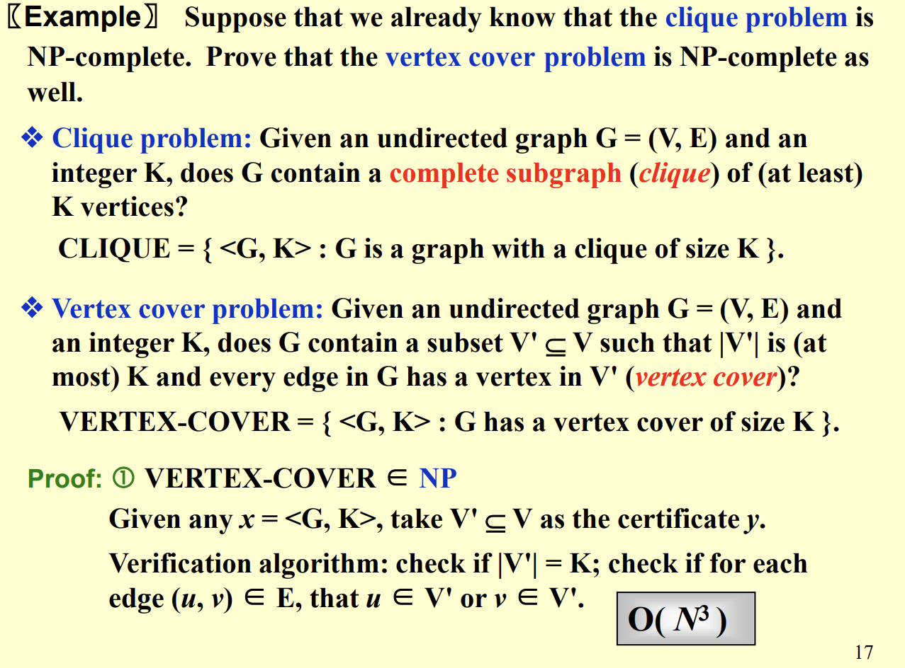  
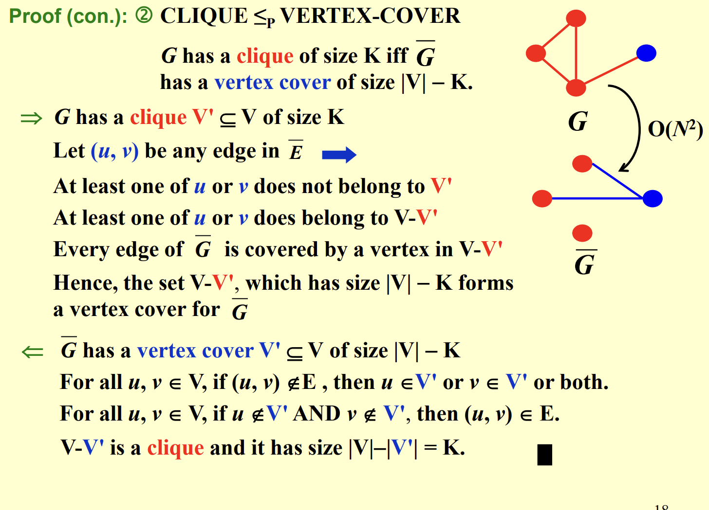   
 

