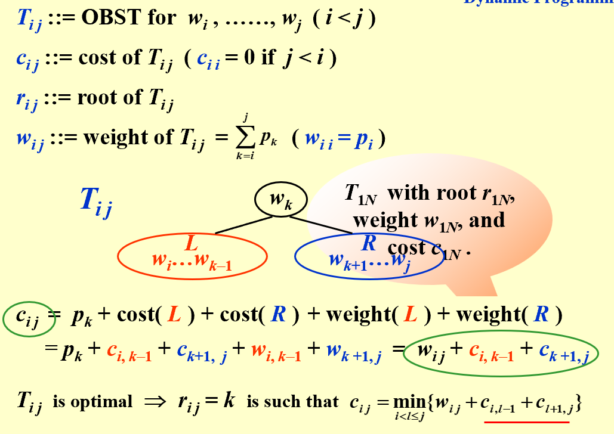
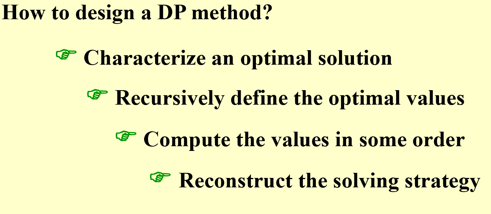

## Intro  
* **Fibonacci Numbers**  
> The problem is, normal recursion will calculate the same subproblem multiple times, which is not efficient.  
> **DP solution**:  
```less  

   int  Fibonacci ( int N ) 
   {   int  i, Last, NextToLast, Answer; 
       if ( N <= 1 )  return  1; 
       Last = NextToLast = 1;    /* F(0) = F(1) = 1 */
       for ( i = 2; i <= N; i++ ) { 
           Answer = Last + NextToLast;   /* F(i) = F(i-1) + F(i-2) */
           NextToLast = Last; Last = Answer;  /* update F(i-1) and F(i-2) */
       }  /* end-for */
       return  Answer; 
   }
```  
---------------------------------------  
## Ordering Matrix Multiplications  
* **Problem**:  
> Given a sequence of matrices to be multiplied, determine the order in which to carry out the multiplications so as to minimize the number of  multiplications.  
* **Solution**:  
> If we have $n$ matrices, $b_n=\sum_{i=1}^{n-1}b_ib_{n-i}, where b_n=\text{different way to compute the sequence of n matrices}$, and if we 
do normal iteration to deal with this problem, the time complexity will be $O(\frac{4^n}{n\sqrt{n}})$  
  
* **DP solution**:  
``` less  

    void OptMatrix( const long r[ ], int N, TwoDimArray M ) 
    {   int  i, j, k, L; 
        long  ThisM; 
        for( i = 1; i <= N; i++ )   M[ i ][ i ] = 0; 
        for( k = 1; k < N; k++ ) /* k = j - i */ 
            for( i = 1; i <= N - k; i++ ) { /* For each position */ 
        j = i + k;    M[ i ][ j ] = Infinity; 
        for( L = i; L < j; L++ ) { 
            ThisM = M[ i ][ L ] + M[ L + 1 ][ j ] 
                + r[ i - 1 ] * r[ L ] * r[ j ]; 
            if ( ThisM < M[ i ][ j ] )  /* Update min */ 
            M[ i ][ j ] = ThisM; 
        }  /* end for-L */
            }  /* end for-Left */
    }
```  
**The time conplexity is $O(N^3)$**  
----------------------------------------------------  
## Optimal Binary Search Tree  
!!! note  

       
    **Ultilize the recursive essence of a tree**  

-------------------------------------------------------  
## All-Pairs Shortest Path  
* **Problem**:  
> For all pairs of vi and vj ( i  j ), find the shortest path between.
   
* **Solution**:   
> Single-source algorithm-> $O(|V|^3)$   

* **A more clever DP when coping dense graphs**：  、
```less  

   /* A[ ] contains the adjacency matrix with A[ i ][ i ] = 0 */ 
   /* D[ ] contains the values of the shortest path */ 
   /* N is the number of vertices */ 
   /* A negative cycle exists iff D[ i ][ i ] < 0 */ 
   void AllPairs( TwoDimArray A, TwoDimArray D, int N ) 
   {   int  i, j, k; 
       for ( i = 0; i < N; i++ )  /* Initialize D */ 
            for( j = 0; j < N; j++ )
     D[ i ][ j ] = A[ i ][ j ]; 
       for( k = 0; k < N; k++ )  /* add one vertex k into the path */
            for( i = 0; i < N; i++ ) 
     for( j = 0; j < N; j++ ) 
        if( D[ i ][ k ] + D[ k ][ j ] < D[ i ][ j ] ) 
        /* Update shortest path */ 
         D[ i ][ j ] = D[ i ][ k ] + D[ k ][ j ]; 
   }
```  
**Reduce the time of sorting, unlike djikstra**  
-----------------------------------------------------  
## Conclusion  
* **DP**:  
!!! note  

      


    
