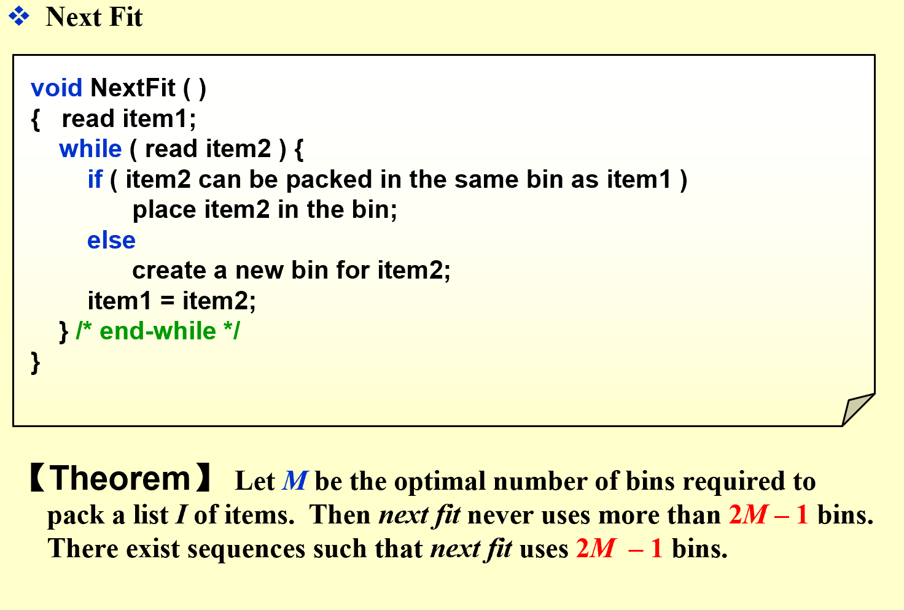
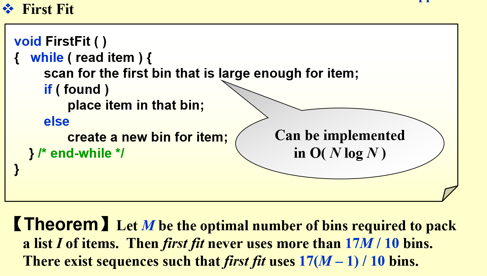
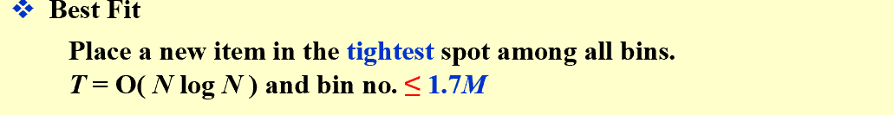
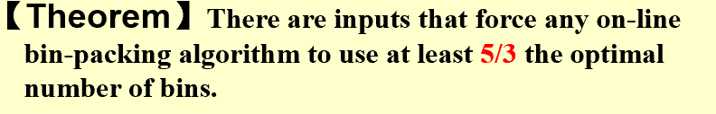
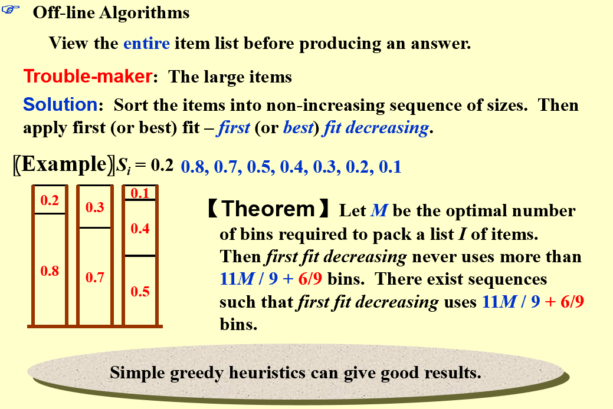
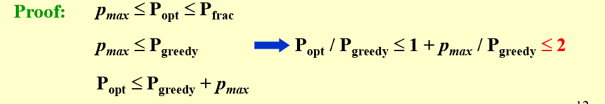
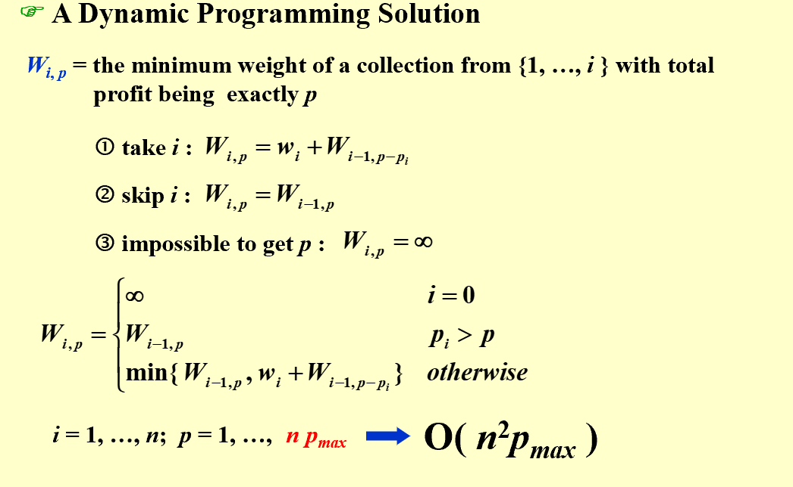
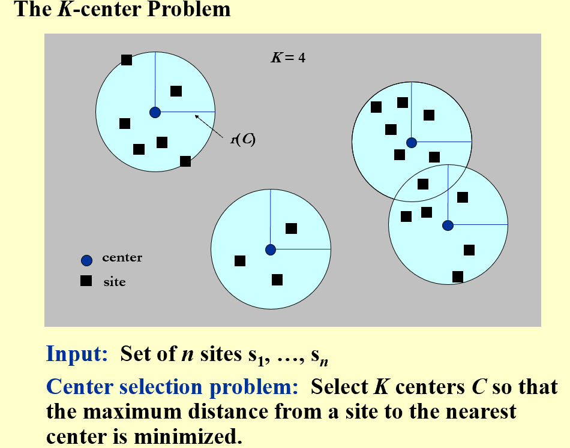
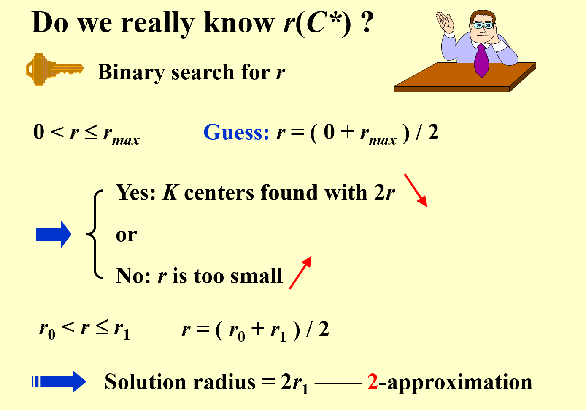
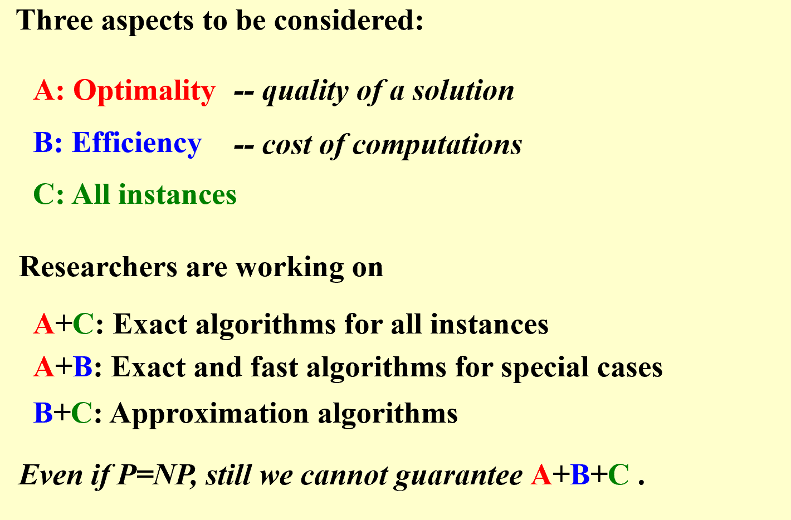

## Definition
* **Approximation Algorithms**  
> Dealing with HARD problems
> When we encounter NP-complete problems, even a solution with $O(2^n)$ is acceptable with a relative small $N$  
> Yet mostly, we find near-optimal solutions in polynomial time. ->   
* **Approximation Ratio**  
> an algorithm has an approximation ratio of $\rho (n)$ if for any input size $n$, the cost of the appeoximation solution $C^*$ satifies: $max(\frac{C}{C^*}, \frac{C^*}{C}) \leq \rho (n)$  
* **Approximation Scheme**  
> * PTAS: Polynomial-Time Approximation Scheme, satifies time complexity of $O(n^{2/\epsilon})$  
> * FPTAS: Fully Polynomial-Time Approximation Scheme, satifies time complexity of $O((1/\epsilon)^2 n^3)$  
## Bin Packing  
* **Problem**: Given N items of sizes  $S_1,S_2,\dots ,S_n$ , such that $0 < Si <= 1$ for all $1 <= i <= N$. Pack these items in the fewest number of bins, each of which has unit capacity.  

=== "Next Fit"  
    !!! note 
        
          

    **Proof**: Quite simple, group every two of the next-fit bins, add their content together, the result must be larger than a single bin. If the amount of bins is at least $2M$, the whole content will be over $M$(when the capacity is 1), which is impossible.

=== "First Fit"  
    !!! note   

          

=== "Best Fit"  
    !!! note  

          

!!! Warning "Beware"  

    * There is a big problem. Every step is irreversible, therefore the algorithms are limited. Off-line algorithms need to be taken into consideration.     

    !!! note  

            

=== "Off-line Algorithms"  
    !!! note  
     
           

    * The sequence of the items is important. If all the small ones are arranged at first, there will be no space for the large ones to combine small ones. Therefore, all the larger items should be arranged at first.  

## The Knapsack Problem  
* **Problem**: A knapsack with a capacity $M$ is to be packed. Given N items.  Each item  $i$  has a weight  $w_i$  and a profit  $p_i$ .    
* **0-1 version**: each item can be packed at most once, and connot be divided.   
!!! note "Proof"  

      

* **Dynamic Programming**:   
!!! tip  

      

    
> The undefined variable $p$ is a big problem, if $\sum P$ gets too large, things might be out of control. Therefore, round all profit values up to lie in a smaller range.  

## The K-center Problem  
!!! Qustion  

      

* **Greedy Solution**:  
> Put the first center at the best possible location for a single center, then keep adding centers , with each center reducing the largest covering radius locally.  
> Yet obviously, it can be arbitrary bad. When $K=2$, and there are two groups, huge distance between, and no distance within, boom!  
  
* **Greedy Solution Enhanced**:  
> What if we already knows a boundary in advance? What if we know or assume that $r(C^*) \leq r$, where $C^*$ is the optimal solution set?  
> Let's focused on the number $2r$, if we can find a set of sites that the distance between them is larger than $2r$, then even if we put a center in the middle, the covering radius will still be larger than $r$.

```less  

   Centers  Greedy-2r ( Sites S[ ], int n, int K, double r )
   {   Sites  S’[ ] = S[ ]; /* S’ is the set of the remaining sites */
       Centers  C[ ] = $\emptyset$;
       while ( S’[ ] != $\emptyset$) {
           Select any s from S’ and add it to C;
           Delete all s’ from S’ that are at dist(s’, s)  2r;
       } /* end-while */
       if ( |C| \leqK ) return C;
       else ERROR(No set of K centers with covering radius at most r);
   }  

```   

*  **Therom**:  
> Suppose the algorithm selects more than K centers, the covering radius is $r(C*) > r$.    
>The algorithm returns a set C of K centers such that $r(C) \leq 2r(C*)$ where C* is an optimal set of K centers.  

  

* **Greedy Enhanced with Approximation Ratio of 2**:  
=== "Algorithm Demonstration"   
    !!! tip "Algorithm Demonstration"  

           

=== "seoducode"  
    ``` less  

        Centers  Greedy-Kcenter ( Sites S[ ], int n, int K )
        {   Centers  C[ ] = $\emptyset$;
            Select any s from S and add it to C;
            while ( |C| < K ) {
                Select s from S with maximum dist(s, C);
                Add s it to C;
            } /* end-while */
            return C;
        } 
    ```  

---------------------------------------------------------  
## Final Comclusion  
!!! note  

    


   


