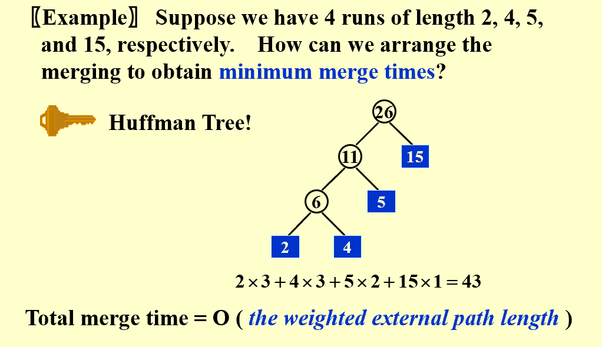

## Intro  
* Why can't we simply do quicksort on a disk?  
> Device dependent, slow disk  
> To simplify, we can assume that the disk is a tape, thus can only be accessed sequentially.  

* **Purpose**:   
> Reduction of the number of passes  
> Run merging  
> Buffer handling for parallel operation  
> Run generation  

--------------------------------------------------  

## Pass Reduction  
* **k-way merge**:  
> Yet, requires 2k tapes  
>Then, how to reduce the number of tapes?    

* **Polyphase merge**:  
> For a k-way merge, $F_N^k=F_{N-1}^k+\dots+F_{N-k}^k$, where $F_M^k=0 (0\leq M\leq k-2), F_{k-1}^k=1$  
> Only k+1 tapes only  
> What if the initial number of rins is not a Fibonacci number? Let the processor runs a few dummy runs(add dummy runs to the end of the tape)  
---------------------------------------------  

## Buffer Handling  
* **Buffer**:
> In order to keep the internal buffer running, we need to carefully arrange the buffer size.    
> for a k-way merge, when the input buffer perform sorting(merging), the result shall be stored in the output buffer. If the output buffer is only one block, then the merging process shall be stalled until the output buffer finish writing the data to disk. Therefore, output buffer should be at least 2 blocks. Thus, after the merging process is over, if there are only k buffers, to continue the process, we need to wait for the input buffer to read the data from disk. Therefore, the input buffer should be at least 2k blocks.  
  
* **Problems**:  
> Beyond a certain k value, the I\O time would actually increase despite the decrease in the number of passes being made.  The optimal value for k clearly depends on disk parameters and the amount of internal memory available for buffers.  
  
* **How to reduce the number of merges**:  
> During each merge, one item is calculated one time. To reduce the overall workload, we shall decrease the amoun of merges to prevent multiple calculations for each item(runs).  
> Therefore, using a min heap is a good idea. Compare the input with the item popped previously. If the input is larger, then the input is pushed into the heap. Otherwise, the input is written to the internal memory, waiting for the current min heap to be empty. Then it can lead another run.  
> During this process, $L_{avg}=2M$  
> Powerful when input is often nearly sorted for external sorting.( Because the runs can be really large)    
  
---------------------------------------------  

## Minimizing merging time  
* **Huffman Tree**: As I have said, some runs might be merged several times. Therefore, try to let the smallest runs to be merged most of the time. Sound familiar, a Huffman Tree.   
!!! note "Huffman Tree"  

    

