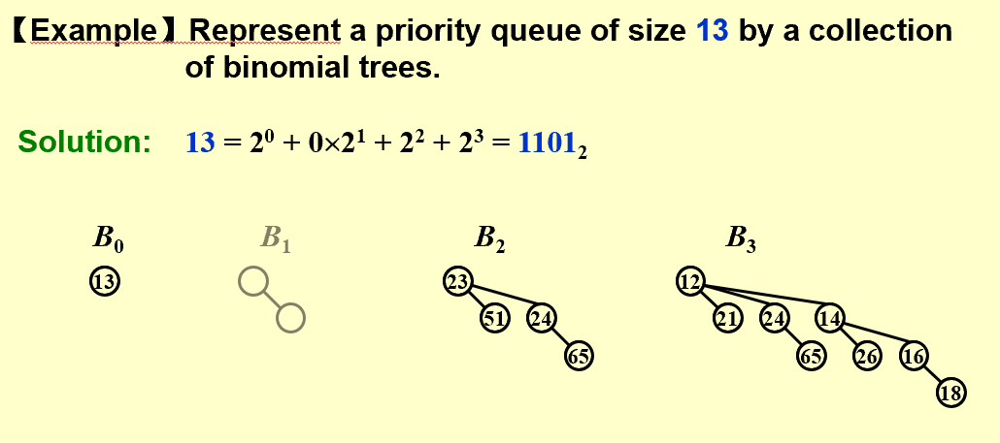
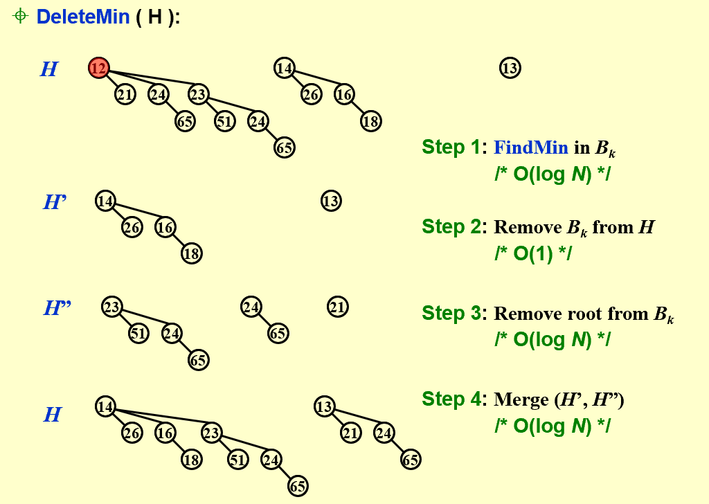
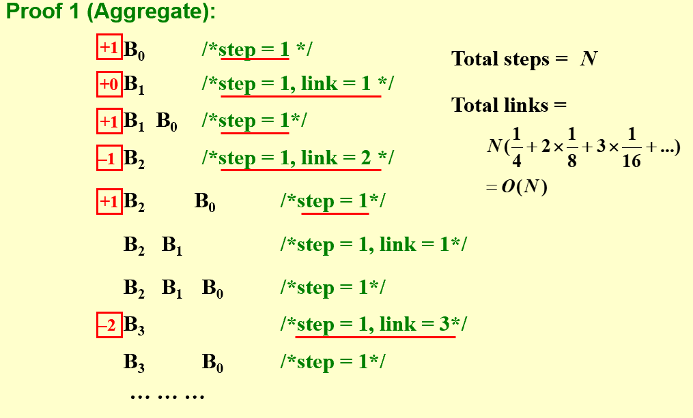
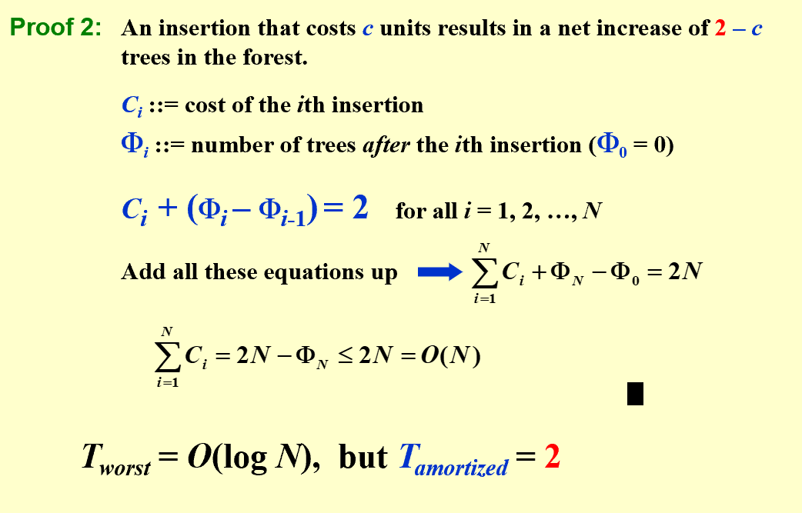

## Structure  
* **Definition**:  
> A binomial queue is not a heap-ordered tree, but rather a collection of heap-ordered trees, known as a forest.  Each heap-ordered tree is a binomial tree.  
> A priority queue of any size can be uniquely represented by a collection of binomial trees.  

  
!!! Example  

      

  
  
## Operations  
* **Findmin**:  
> The minimum key is in one of the roots. There are at most $\lceil log_2N \rceil$ roots, hence the time complexity is $O(logN)$.(Can be stored and updated in constant time)  
  
    
* **Merge**:  
> Must keep the trees in the binomial queue sorted by height.
> $T_p=O(logN)$  
  
* **Insert**:  
> If the smallest nonexistent binomial tree is Bi , then $T_p=Const·(i+1)$. Performing N Inserts on an initially empty binomial queue will take O(N) worst-case time.  Hence the average time is constant.  

  
* **DeleteMin**:  
!!! note "illustration"  

       

  
## Implementation  
=== "typestruct"    

    ```less  

       typedef struct BinNode *Position;
       typedef struct Collection *BinQueue;
       typedef struct BinNode *BinTree;  /* missing from p.176 */
       
       struct BinNode 
       { 
        ElementType	    Element;
        Position	    LeftChild;
        Position 	    NextSibling;
       } ;
       
       struct Collection 
       { 
        int	    	CurrentSize;  /* total number of nodes */
        BinTree	TheTrees[ MaxTrees ];
       } ;  

    ```    

=== "Merge"  

    ```less  

       BinTree
       CombineTrees( BinTree T1, BinTree T2 )
       {  /* merge equal-sized T1 and T2 */
        if ( T1->Element > T2->Element )
            /* attach the larger one to the smaller one */
            return CombineTrees( T2, T1 );
        /* insert T2 to the front of the children list of T1 */
        T2->NextSibling = T1->LeftChild;
        T1->LeftChild = T2;
        return T1;
       }
       BinQueue  Merge( BinQueue H1, BinQueue H2 )
       {	BinTree T1, T2, Carry = NULL; 	
        int i, j;
        if ( H1->CurrentSize + H2-> CurrentSize > Capacity )  ErrorMessage();
        H1->CurrentSize += H2-> CurrentSize;
        for ( i=0, j=1; j<= H1->CurrentSize; i++, j*=2 ) {
            T1 = H1->TheTrees[i]; T2 = H2->TheTrees[i]; /*current trees */
            switch( 4*!!Carry + 2*!!T2 + !!T1 ) { 
            case 0: /* 000 */
            case 1: /* 001 */  break;	
            case 2: /* 010 */  H1->TheTrees[i] = T2; H2->TheTrees[i] = NULL; break;
            case 4: /* 100 */  H1->TheTrees[i] = Carry; Carry = NULL; break;
            case 3: /* 011 */  Carry = CombineTrees( T1, T2 );
                            H1->TheTrees[i] = H2->TheTrees[i] = NULL; break;
            case 5: /* 101 */  Carry = CombineTrees( T1, Carry );
                            H1->TheTrees[i] = NULL; break;
            case 6: /* 110 */  Carry = CombineTrees( T2, Carry );
                            H2->TheTrees[i] = NULL; break;
            case 7: /* 111 */  H1->TheTrees[i] = Carry; 
                            Carry = CombineTrees( T1, T2 ); 
                            H2->TheTrees[i] = NULL; break;
            } /* end switch */
        } /* end for-loop */
        return H1;
       }
    ```  

=== "DeleteMin"  

    ```less  

       ElementType  DeleteMin( BinQueue H )
       {	BinQueue DeletedQueue; 
        Position DeletedTree, OldRoot;
        ElementType MinItem = Infinity;  /* the minimum item to be returned */	
        int i, j, MinTree; /* MinTree is the index of the tree with the minimum item */
       
        if ( IsEmpty( H ) )  {  PrintErrorMessage();  return –Infinity; }
       
        for ( i = 0; i < MaxTrees; i++) {  /* Step 1: find the minimum item */
            if( H->TheTrees[i] && H->TheTrees[i]->Element < MinItem ) { 
            MinItem = H->TheTrees[i]->Element;  MinTree = i;    } /* end if */
        } /* end for-i-loop */
        DeletedTree = H->TheTrees[ MinTree ];  
        H->TheTrees[ MinTree ] = NULL;   /* Step 2: remove the MinTree from H => H’ */ 
        OldRoot = DeletedTree;   /* Step 3.1: remove the root */ 
        DeletedTree = DeletedTree->LeftChild;   free(OldRoot);
        DeletedQueue = Initialize();   /* Step 3.2: create H” */ 
        DeletedQueue->CurrentSize = ( 1<<MinTree ) – 1;  /* 2MinTree – 1 */
        for ( j = MinTree – 1; j >= 0; j – – ) {  
            DeletedQueue->TheTrees[j] = DeletedTree;
            DeletedTree = DeletedTree->NextSibling;
            DeletedQueue->TheTrees[j]->NextSibling = NULL;
        } /* end for-j-loop */
        H->CurrentSize  – = DeletedQueue->CurrentSize + 1;
        H = Merge( H, DeletedQueue ); /* Step 4: merge H’ and H” */ 
        return MinItem;
       }
       
    ```  

  
-----------------------------------------  

## Proof  
* **Claim**: A binomial queue of N elements can be built by N successive insertions in O(N) time.    
!!! note "Proof"   

      
      


       


