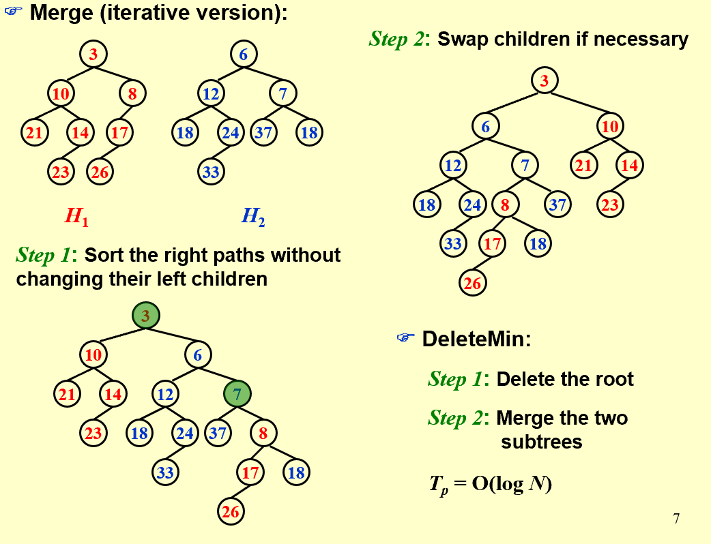
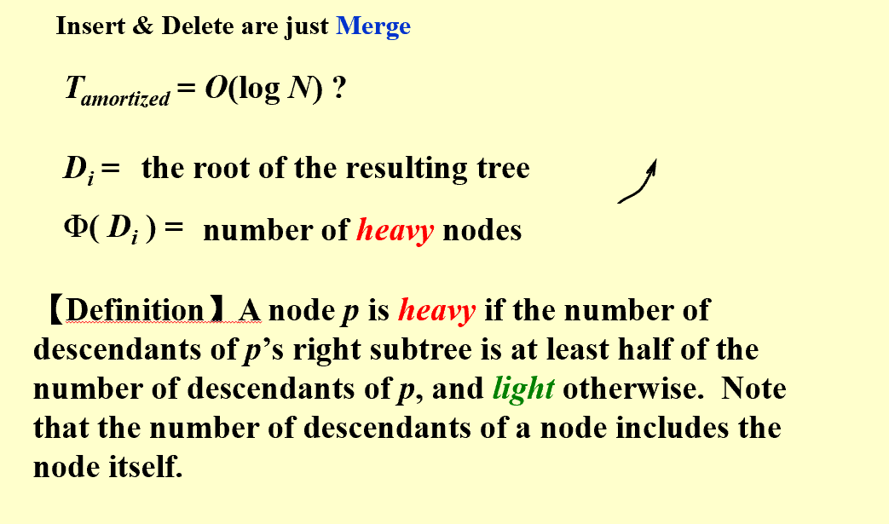
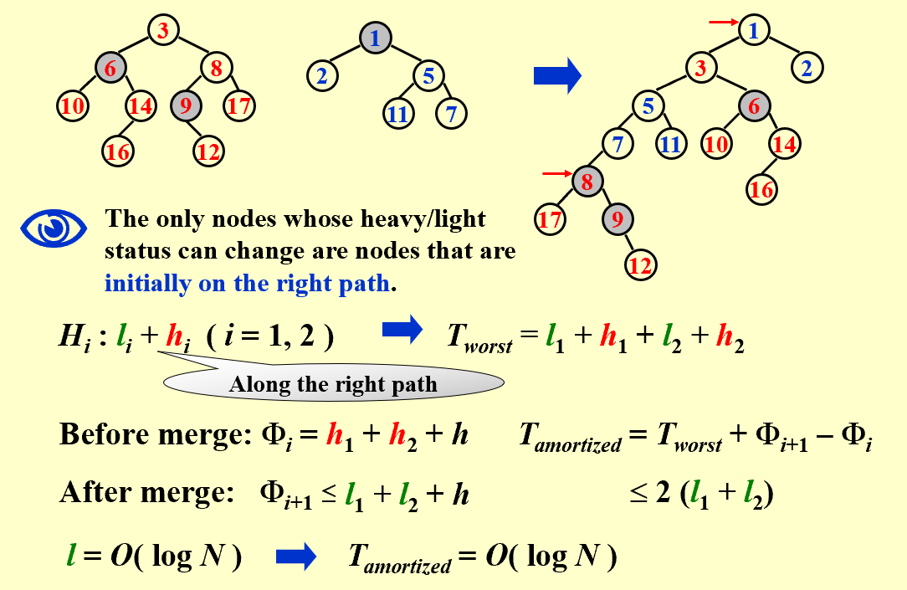

## Intro  
* **Definition**:  
> The null path length, $Npl(X)$, of any node X is the length of the shortest path from X to a node without two children.  Define $Npl(NULL)=–1$.    
> $Npl(X) = min { Npl(C) + 1 for all C as children of X }$  
> The leftist heap property is that for every node X in the heap, the null path length of the left child is at least as large as that of the right child.  
  
* **Theorem**:  
> A leftist tree with r nodes on the rightmost path must have at least $2^r-1$ nodes.  
  
## Implementation  
=== "typestruct"  

    ```less  

       struct TreeNode 
       { 
        ElementType	    Element;
        PriorityQueue	    Left;
        PriorityQueue	    Right;
        int		    Npl;
       } ;
    ```  

=== "Merge"  

    ```less  

       PriorityQueue  Merge ( PriorityQueue H1, PriorityQueue H2 )
       { 
        if ( H1 == NULL )   return H2;	
        if ( H2 == NULL )   return H1;	
        if ( H1->Element < H2->Element )  return Merge1( H1, H2 );
        else return Merge1( H2, H1 );
       }
       static PriorityQueue
       Merge1( PriorityQueue H1, PriorityQueue H2 )
       { 
        if ( H1->Left == NULL ) 	/* single node */
            H1->Left = H2;	/* H1->Right is already NULL 
                        and H1->Npl is already 0 */
        else {
            H1->Right = Merge( H1->Right, H2 );     /* Step 1 & 2 */
            if ( H1->Left->Npl < H1->Right->Npl )
                SwapChildren( H1 );	/* Step 3 */
            H1->Npl = H1->Right->Npl + 1;
        } /* end else */
        return H1;
       }  
    ```  

=== "Iterative"  

    !!! note   

          

    **Easy to illustrate yet hard to implement**  

  
  
-------------------------------------------------  
## Skewed Heap  
* **Definition**:  
> Always swap the left and right children except that the largest of all the nodes on the right paths does not have its children swapped. $No Npl$  
> Skew heaps have the advantage that no extra space is required to maintain path lengths and no tests are required to determine when to swap children.  
> It is an open problem to determine precisely the expected right path length of both leftist and skew heaps.  
  
* **Amortized Analysis**:    
!!! note "Proof"  

        
    **Please bear in mind that the rightmost path theorem**  
    
  

  


