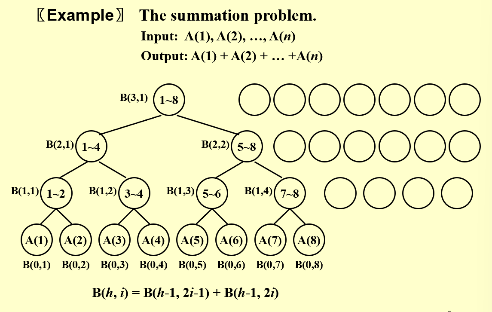
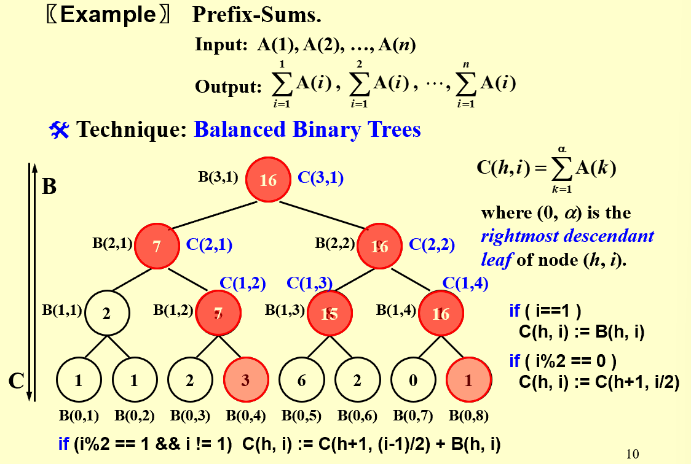
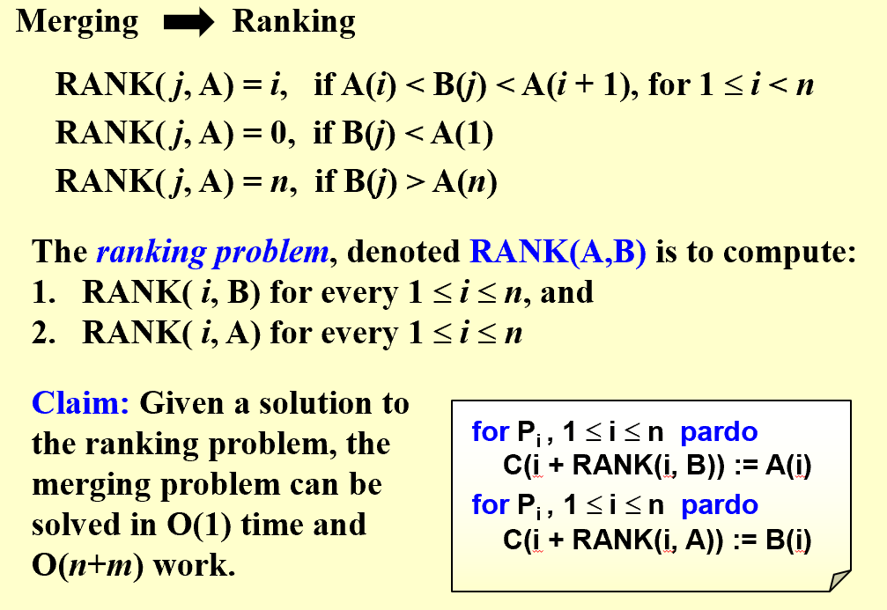
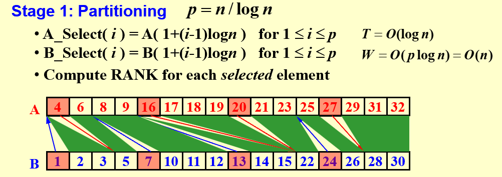
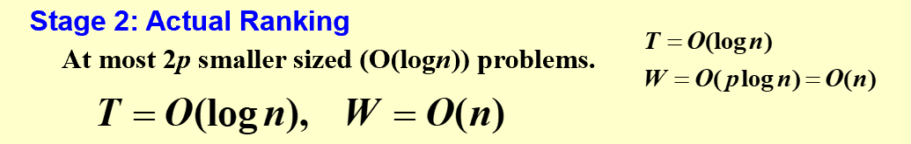
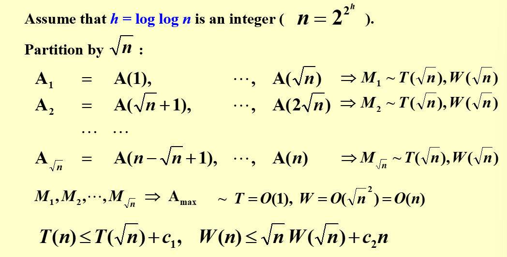
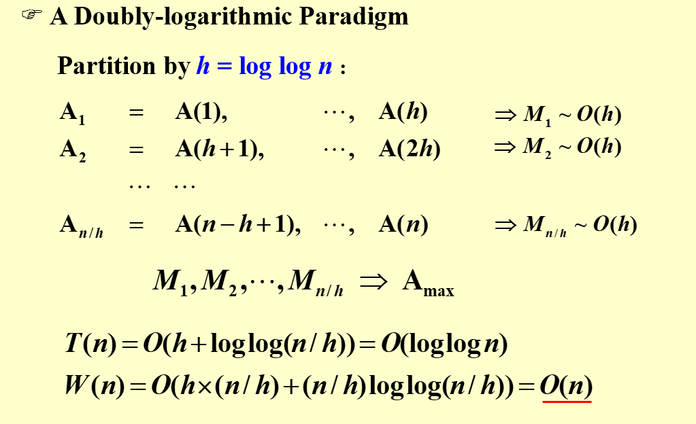
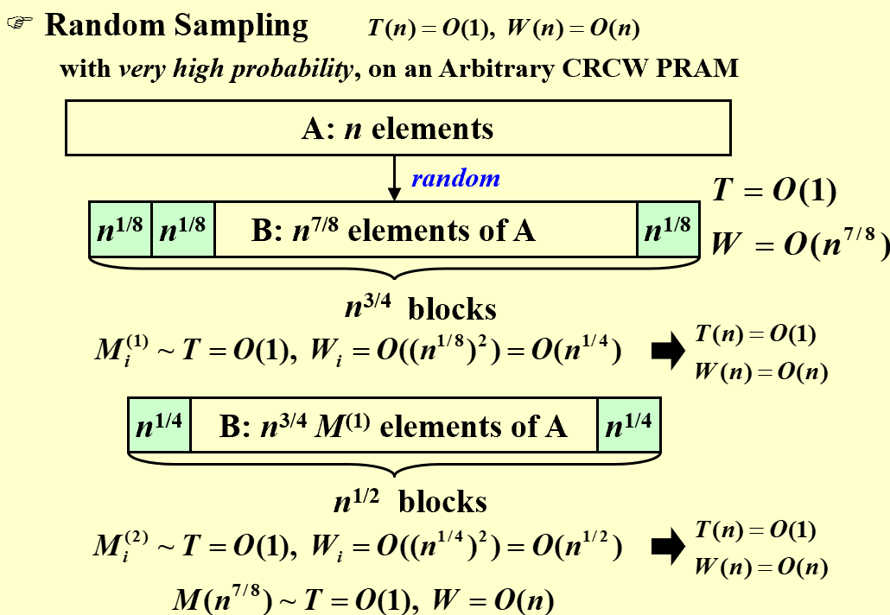

## Intro  
* **Parallelism**:  
> Machine Parallelism: Processor, Pipelining, Very-Long-Instruction-Word (VLIW), etc
> Parallel Algorithm: Today's topic  
* **Discription**:  
> PRAM: Parallel Random Access Machine  
> WD: Work Depth Model    
  
* **PRAM**:  
> multi processors, shared memory, parallel read/write, concurrent execution, etc.  
  
* **Avoid Conflicts**:  
> EREW: Exclusive Read Exclusive Write  
> CREW: Concurrent Read Exclusive Write  
> CRCW: Concurrent Read Concurrent Write, three rules arbitrary, common(when trying to write the same value), priority(P with the smallest number)  
    
* **Example**:
=== "Illustration"  

      

=== "Seudo Code"  

    ```less  
    for P_i ,  1 <=i <= n  pardo
      B(0, i) := A( i )
      for h = 1 to log n do
        if i <= n/pow(2,h)
          B(h, i) := B(h-1, 2i-1) + B(h-1, 2i)
        else stay idle
      for i = 1: output B(log n, 1); for i > 1: stay idle
    ```  
    **$T(N)=\log N+2$, because different i are send to different processors and executed simultaneously, therefore only h shall be taken into consideration.**  

> The prblems are obvious:   
> 1. Does not reveal how the algorithm will run on PRAMs with different number of processors  
> 2. Fully specifying the allocation of instructions to processors requires a level of detail which might be unnecessary  

* **WD**: Layer by layer  
```less  

   for Pi ,  1 <= i <= n  pardo
      B(0, i) := A( i )
   for h = 1 to log n 
       for Pi, 1 <= i <= n/pow(2,h)  pardo
           B(h, i) := B(h-1, 2i-1) + B(h-1, 2i)
   for i = 1 pardo
      output  B(log n, 1)  

```    
## Measuring the Performance of Parallel Algorithms  
> Work Load: total number of operations: $W(N)$  
> Worst Case Running Time: $T(N)$  
> $P(n) = W(n)/T(n)$ processors and $T(n)$ time (on a PRAM)  
> $W(n)/p$ time using any number of $p ≤ W(n)/T(n)$ processors (on a PRAM)
> $O(W(n)/p + T(n))$ time using any number of p processors (on a PRAM)   

* Let's take a look back to the previuos example pf WD.  
* **Work Load**:  
> $W(n)=n+n/2+n/4+\dots+n/2^k+1$, where $k=\log n$  
!!! note "WD-presentation Sufficiency Theorem"  

    An algorithm in the WD mode can be implemented by any $P(n)$ processors within $O(W(n)/P(n) + T(n))$ time, using the same concurrent-write convention as in the WD presentation.  

## Prefix Computations  
!!! tip "Illustration"  

      

* Remember when constructing thew whole tree, construct step by step  

```less  

   for Pi , 1 <= i <=n pardo
     B(0, i) := A(i)
   for h = 1 to log n
     for i , 1 <= i <= n/2h pardo
       B(h, i) := B(h - 1, 2i - 1) + B(h - 1, 2i)
   for h = log n to 0
     for i even, 1 <= i <= n/2h pardo
       C(h, i) := C(h + 1, i/2)
     for i = 1 pardo
       C(h, 1) := B(h, 1)
     for i odd, 3 <= i <= n/2h pardo
       C(h, i) := C(h + 1, (i - 1)/2) + B(h, i)
   for Pi , 1 <= i <= n pardo
     Output C(0, i)  
```   
* $T(n)=O(\log n)$, $W(n)=O(n)$  

  
## Merging  
* Merge two non-decreasing arrays $A(1), A(2), …, A(n) and B(1), B(2),\dots, B(m)$ into another non-decreasing array $C(1), C(2),\dots, C(n+m)$    
* To solve this problem in parallel, we need a rank(acknowlege where to put it, thus not altering C)  
!!! note "Illustration"  

      

* It's OK to use binary search or serial ranking.\, but they either increases workload or time consumed.  
* **Parallel Ranking**:  
=== "step 1"  
!!! tip   
 
      
    
**Use BS in the first search**  
=== "step 2"  
!!! tip  

      

  
  
## Maximum Finding  
* **Simple Solution**: Replace “+” by “max” in the summation algorithm $-> T(n)=O(\log n)$, $W(n)=O(n)$  
* or we can compare all pairs of elements in parallel, but how to deal with conflicts?
``` less  

    for Pi , 1 <= i <= n  pardo
        B(i) := 0
    for i and j, 1 <=i, j <=n  pardo
        if ( (A(i) < A(j)) || ((A(i) = A(j)) && (i < j)) )
                B(i) = 1
        else B(j) = 1
    for Pi , 1 <=i <= n  pardo
        if B(i) == 0
           A(i) is a maximum in A  

```    
=== "A Doubly-logarithmic Paradigm(Recursive)"  
!!! note  

        

=== "Partition by $h=\log\log n$"  
!!! note  

      

  
* Then,here comes the question: Is it possible to have a $O(1)$ time complexity?      
!!! note  "Solution"  

        
    **Theorem**: The algorithm finds the maximum among n elements.  With very high probability it runs in O(1) time and O(n) work.  The probability of not finishing within this time and work complexity is $O(1/n^c)$ for some positive constant c.


    


   
    

   