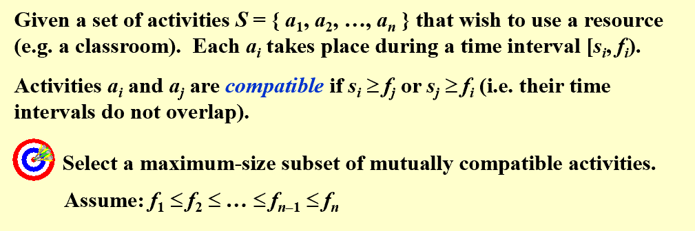
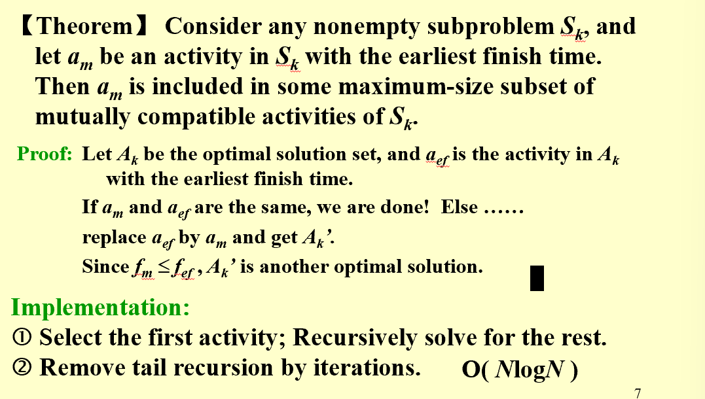
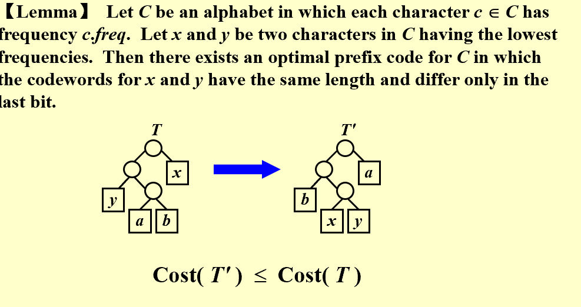
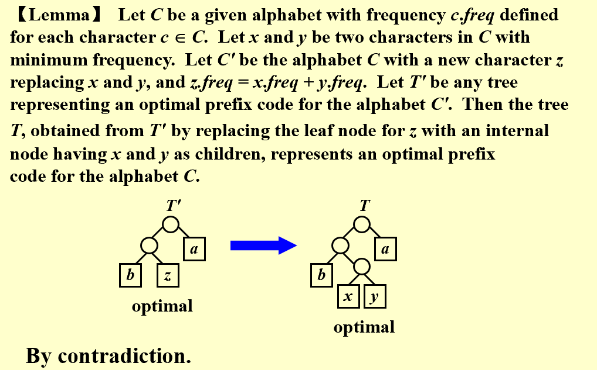

## Definition  
* **Optimization Problems**:  
> Given a set of constraints and an optimization function.  Solutions that satisfy the constrains are called feasible solutions.  A feasible solution for which the optimization function has the best possible value is called an optimal solution.(Local search is based on this principle)    

* **Greedy Method**:  
> Make the best decision at each stage, under some greedy criterion. (The typical difference between greedy algorithm and local search is that one is step based(build one output) and the other is result based(find the local optimal).  A decision made in one stage is not changed in a later stage, so each decision should assure feasibility.    

!!! note  

    * Greedy algorithm works only if the local optimum is equal to the global optimum.(even though most of the time, this is not the case, we use this to reduce time complexity)  
    * Greedy algorithm does not guarantee optimal solutions.  However, it generally produces solutions that are very close in value (heuristics) to the optimal, and hence is intuitively appealing when finding the optimal solution takes too much time.
      
---------------------------------------------  
## Activity Seclection Problem  
!!! Question  

      

* How to ultilize the greedy algorithm to solve this problem?  
> Select the interval which ends first (but not overlapping the already chosen intervals) -> Resource become free as soon as possible(left the most)  

**And for this specific problem, the greedy algorithm is optimal.**  
!!! note "Proof"  

      


* **DP solutiom**:  
> $c_{1,j} = \begin{cases} 1 & \text{if} j=1 \\ \max{c_{1,j-1}, c_{1,k(j)}+1} & \text{if} j>1} \end{cases}$ where $k(j)$ is the largest index $i<j$ such that $f_i \le s_j$  
> However, if each activity has a weight, the greedy is not correct.  
  
---------------------------------------------  

## Elements of Greedy Strategy  
* Cast the optimization problem as one in which we make a choice and are left with one subproblem to solve.    
* Prove that there is always an optimal solution to the original problem that makes the greedy choice, so that the greedy choice is always safe.  
* Demonstrate optimal substructure by showing that, having made the greedy choice, what remains is a subproblem with the property that if we combine an optimal solution to the subproblem with the greedy choice we have made, we arrive at an optimal solution to the original problem. （recursively)    

-------------------------------------------------  
## Huffman Codes  
* **Example**:  
> Suppose our text is a string of length 1000 that comprises the characters  a, u, x, and z.  Then it will take 8000 bits to store the string as 1000 one-byte characters. The size of the coded string can be reduced using variable-length codes, for example, a = 0, u = 110, x = 10, z  = 111.   
  
> If all the characters occur with the same frequency, then there are not likely to be any savings.  

* **seodo code**:  
```less  

   void Huffman ( PriorityQueue  heap[ ],  int  C )
   {   consider the C characters as C single node binary trees,
        and initialize them into a min heap;
        for ( i = 1; i < C; i++ ) { 
           create a new node;
           /* be greedy here */
           delete root from min heap and attach it to left_child of node;
           delete root from min heap and attach it to right_child of node;
           weight of node = sum of weights of its children;
           /* weight of a tree = sum of the frequencies of its leaves */
           insert node into min heap;
      }
   }
   
```  

* **Correctness**:  
!!! note "Prove by contradiction**  

      
    **Pretty same as the previous proofs, focused on one step**  
    


    

