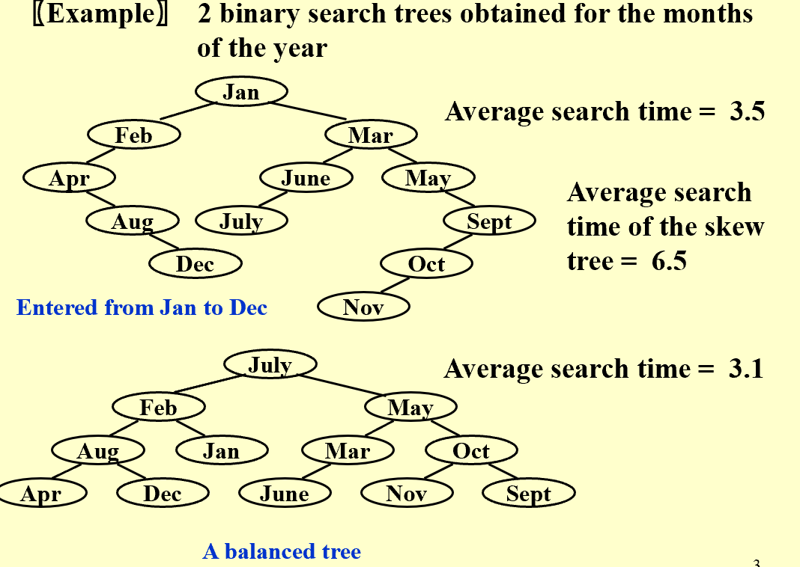
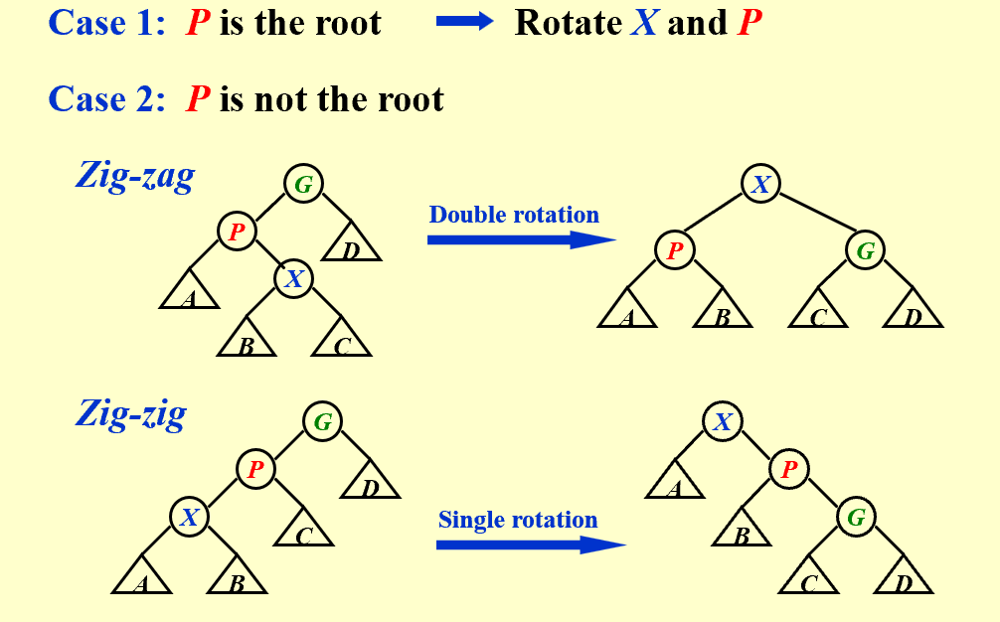

## 1. AVL tree 
!!! Tip "Intro"

    * **Target: Speed up searching(insertion && deletion)**
    * **Basic tool: `BST`**  
    * **Problem: Unbalanced tree**:   
       _Although $T_p = O(\text{height})$, but the height can be as bad as $O(N)$_ 

Normal `BST` can be skewed to a linked list,
which is not good for searching at all, thus one has absolute no control over the height of the tree.      
  


  
  
The height varies, hence the time complexity of searching is not guaranteed.

### 1.1. Definition
* An empty binary tree is height balanced.  If $T$ is a nonempty binary tree with $T_L$ and $T_R$ as its left and right subtrees, then $T$ is height balanced iff
    * $T_L$ and $T_R$ are height balanced
    * $|h_L - h_R| \leq 1$, where  $h_L$ and $h_R$ are the heights of $T_L$ and $T_R$ , respectively.
!!! note 
    
    <center>**Balance factor**: $BF(node) = h_L - h_R$  

    **In AVL tree**, $BF(node) \in \{-1, 0, 1\}$</center> 

#### Rotation
!!! Tip "Be Ware"
    
    <center>Since the tree was constructed through dynamic insertion, $BF$ is updated bottom-up.   
    Every time a rotation complete, $BF$ needs to be updated.</center>
* **Single rotation**:   $|BF(node)| > 1$
    * **LL rotation**: 
        * **Target**: $BF(node)=2$ 
        * **Condition**: $BF(node->left) = 1$ 
        * **Operation**: 
            * **Step 1**: $node->left$ becomes the new root
            * **Step 2**: $node$ becomes the right child of the new root
            * **Step 3**: $node->left$'s right child becomes the left child of $node$
    * **Right rotation**: 
        * **Target**: $BF(node) = -2$ 
        * **Condition**: $BF(node->right) = -1$ 
        * **Operation**: 
            * **Step 1**: $node->right$ becomes the new root
            * **Step 2**: $node$ becomes the left child of the new root
            * **Step 3**: $node->right$'s left child becomes the right child of $node$  

* **Double rotation**: $|BF(node)| > 1$
    * **LR rotation**: 
        * **Target**: $BF(node) = 2$ 
        * **Condition**: $BF(node->left) = -1$ 
        * **Operation**: 
            * **Step 1**: $node->left$'s right child becomes the new root
            * **Step 2**: $node->left$'s right child's left child becomes the right child of $node->left$
            * **Step 3**: $node->left$'s right child's right child becomes the left child of $node$
    * **RL rotation**: 
        * **Target**: $BF(node) = -2$ 
        * **Condition**: $BF(node->right) = 1$ 
        * **Operation**: 
            * **Step 1**: $node->right$'s left child becomes the new root
            * **Step 2**: $node->right$'s left child's right child becomes the left child of $node->right$
            * **Step 3**: $node->right$'s left child's left child becomes the right child of $node$   

!!! note "While construct"
   
    <center>Double rotation is a combination of two single rotations.  
    LR: left rotation on the left child, then right rotation on the root.  
    RL: right rotation on the right child, then left rotation on the root.</center>  

### 1.2. Insert
* **Step 1**: Insert the node as in a normal BST
* **Step 2**: Update the balance factor of the ancestors of the inserted node
* **Step 3**: If the balance factor of any node is not in $\{-1, 0, 1\}$, do the rotation

!!! abstract  "$BF$ update"

    ___<center>Considering the fact that $BF$ is calculated by substracting the height of left tree and right tree, to make $BF$ update more suitable for recusion, keep a height field instead.</center>___

=== "Fetching Height"
    ``` c  
    static int  
    Height( Position P)  
    {  
        if( P == NULL )  
            return -1;  
        else  
            return P->Height;  
    }  
    ```
=== "Insertion"
    ``` c  
    AvlTree
    Insert( ElementType X, AvlTree T )  
    {  
        if( T == NULL )  
        {  
            T = malloc( sizeof( struct AvlNode ) );  
            if( T == NULL )  
                FatalError( "Out of space!!!" );  
            else  
            {  
                T->Element = X; T->Height = 0;  
                T->Left = T->Right = NULL;  
            }  
        }  
        else if( X < T->Element )  
        {  
            T->Left = Insert( X, T->Left );  
            if( Height( T->Left ) - Height( T->Right ) == 2 )  
                if( X < T->Left->Element )  
                    T = SingleRotateWithLeft( T );  
                else  
                    T = DoubleRotateWithLeft( T );  
        }  
        else if( X > T->Element )  
        {  
            T->Right = Insert( X, T->Right );  
            if( Height( T->Right ) - Height( T->Left ) == 2 )  
                if( X > T->Right->Element )  
                    T = SingleRotateWithRight( T );  
                else  
                    T = DoubleRotateWithRight( T );  
        }  
        T->Height = Max( Height( T->Left ), Height( T->Right ) ) + 1;  
        return T;  
    }  
    ```
=== "Single Rotate"
    ``` c
    static Position
    SingleRotateWithLeft( Position K2 )  
    {  
        Position K1;  
      
        K1 = K2->Left;  
        K2->Left = K1->Right;  
        K1->Right = K2;  
      
        K2->Height = Max( Height( K2->Left ), Height( K2->Right ) ) + 1;  
        K1->Height = Max( Height( K1->Left ), K2->Height ) + 1;  
      
        return K1;  
    }  
    ```
=== "Double Rotate"
    ``` c
    static Position
    DoubleRotateWithLeft( Position K3 )  
    {  
        K3->Left = SingleRotateWithRight( K3->Left );  
      
        return SingleRotateWithLeft( K3 );  
    }  
    ```
### 1.3. Height of AVL tree
* **Theorem**: The height of an AVL tree storing $N$ nodes is $O(\ln N)$
!!! note "Proof"
    
    ***<center>$n(h)$: the number of nodes in an AVL tree of height $h$</center>*** 

    * **Iteration**: $n(h) = 1 + n(h-1) + n(h-2)$
        * **Proof**: 
            * **Fibonacci**: $F(N) = F(N-1) + F(N-2)$
            * **$F(N) \approx \frac{1}{\sqrt{5}} \left( \frac{1 + \sqrt{5}}{2} \right)^N$**
            * **$n(h) = F_{h+3}-1$**
    * **Conclusion**: $h = O(\ln N)$

## Splay Trees  
* **Definition**:  
> Any M consecutive tree operations starting from an empty tree take at most $O(MlogN)$ time.  
  
!!! note "illustration"  

      


## Amortized Analysis    
* **Aggregate analysis**:  
> Basically , worst case average  
* **Accounting method**:  
> When an operation’s amortized cost $c_i^'$ exceeds its actual cost  $c_i$, we assign the difference to specific objects in the data structure as credit. Credit can help pay for later operations whose amortized cost is less than their actual cost.   
* **Potential method**:  
> The potential method is a way to determine the amortized cost of an operation  
> $c_i^' = c_i + \Phi(D_i) - \Phi(D_{i-1})$  
> $\sum_{i=1}^{n}c_i^' = \sum_{i=1}^{n}c_i + \Phi(D_n) - \Phi(D_0)$  
> The main purpose is to use $\Phi(D_i)$ to eliminate some unknown factors in the actual cost of the operation.  


