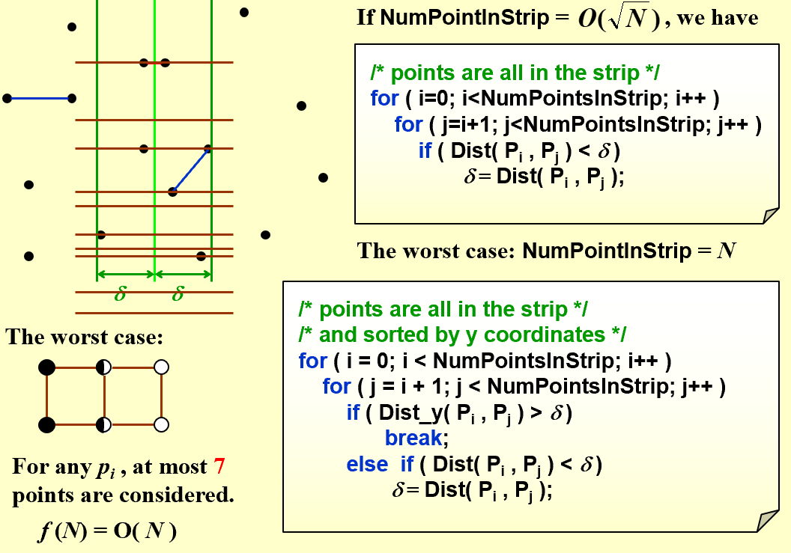
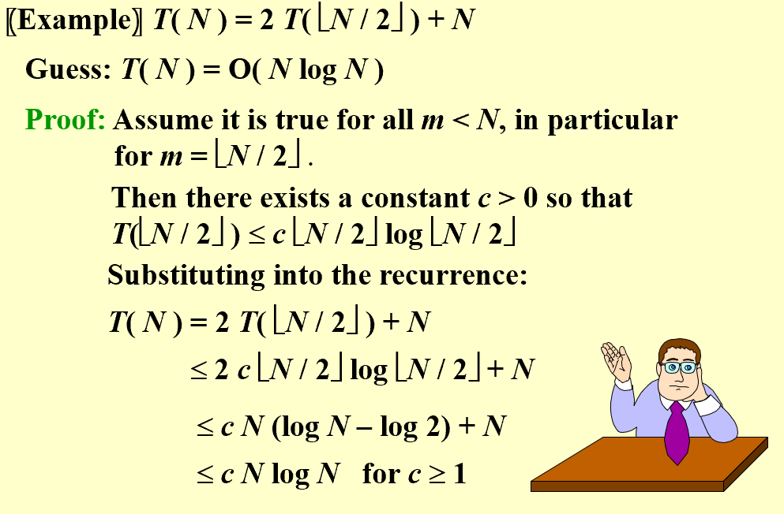
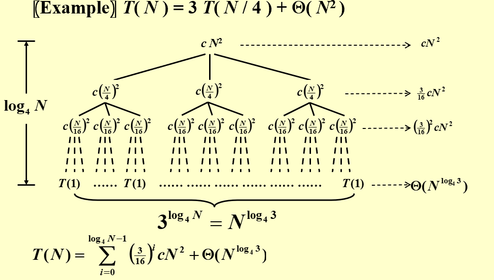

## Closest Points Problem  
* **Problem**:  
> Given N points in a plane.  Find the closest pair of points.  (If two points have the same position, then that pair is the closest with distance 0.)  
  
* **Solution**:  
!!! note  

      

-----------------------------------------------  
## Recursive Time Complexity Analysis  
* **Substitution Method**:  
> Guess, then prove by induction  
  
!!! Example  

      

  
* **Recursion-tree method**:  
> Draw the recursion tree, then sum the cost of each level.  
!!! Example  

      

  
> Thus, there is no need to draw the whole tree, just make a thorough guess and proove by substitution  

    
* **Master Method**:   
* $T(N)=aT(N/b)+f(N)$  
> If $f(N)=O(N^{\log_b{a}-\epsilon})$, for \epsilon>0, then $T(N)=\Theta(N^{\log_b{a}})$    
> If $f(N)=\Theta(N^{\log_b{a}})$, then $T(N)=\Theta(N^{\log_b{a}}\log{N})$  
> If $f(N)=\Omega(N^{\log_b{a}+\epsilon})$, for \epsilon>0, and $af(N/b)\le kf(N)$, for k<1, thus N sufficiently large then $T(N)=\Theta(f(N))$  

* **Another Form**:  
> If $af(N/b)=Kf(N)$, for K<1, then $T(N)=\Theta(f(N))$  
> If $af(N/b)=Kf(N)$, for K=1, then $T(N)=\Theta(f(N)\log{N})$  
> If $af(N/b)=Kf(N)$, for K>1, then $T(N)=\Theta(N^{\log_b{a}})$  

* **Another Theorem**:  
> the solution to the equation $T(N)=aT(N/b)+\Theta(N^k\log^p{N})$ is $T(N)= \begin{cases} O(N^k\log^{p+1}{N}) & \text{if} k=\log_b{a} \\ O(N^{\log_b{a}}\log{N}) & \text{if} k<\log_b{a} \\ O(N^k\log^pN) & \text{if} k>\log_b{a} \end{cases}$  
