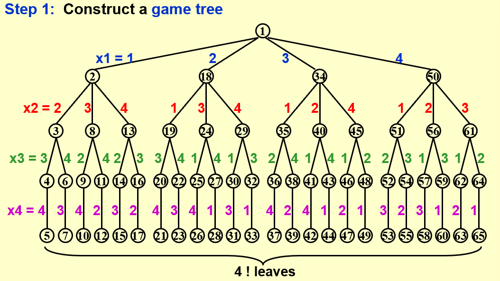
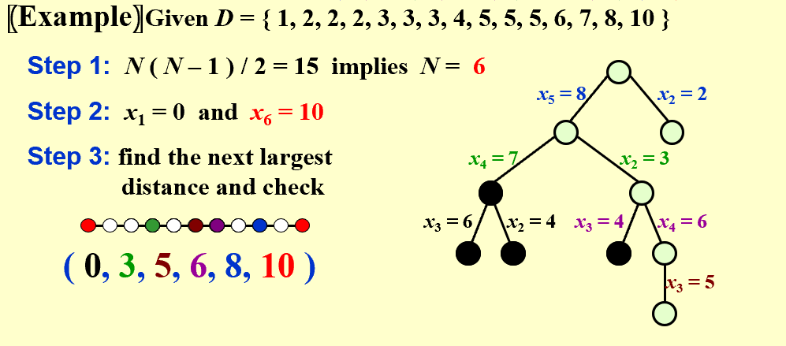

## Rationale of Backtracking  
* **Definition**:  
> A sure-fire way to find the answer to a problem is to make a list of all candidate answers, examine each, and following the examination of all or some of the candidates, declare the identified answer.  
> Backtracking enables us to eliminate the explicit examination of a large subset of the candidates while still guaranteeing that the answer will be found if the algorithm is run to termination.  
> The basic idea is that suppose we have a partial solution $(x_1,\dots, x_i)$ where each $x_k \in S_k$ for  $1 \leq k \leq i < n$.   First we add  $x_{i+1} \in S_{i+1}$ and check if $(x_1,\dots, x_i, x_{i+1})$ satisfies the constrains.  If the answer is “yes” we continue to add the next x, else we delete xi and backtrack to the previous partial solution $(x_1,\dots, x_{i-1})$.    
  
## Eight Queens  
=== "Step One"  
!!! note  

      
  
=== "Step Two"  

    **Perform a depth-first search(oost-order traversal) to examine the paths**  

  
  
## The Turnpike Reconstruction Problem  
* **Problem**:    
> Given N points on the x-axis with coordinates $x_1 < x_2 <\dots< x_N$. Assume that $x_1 = 0$.  There are $N(N–1)/2$ distances between every pair of points.  
> Given $N(N–1)/2$ distances.  Reconstruct a point set from the distances.   

=== "Solution Illustration"  

    !!! note  

          
=== "seodu code"  
```less  

   bool Reconstruct ( DistType X[ ], DistSet D, int N, int left, int right )
   { /* X[1]...X[left-1] and X[right+1]...X[N] are solved */
       bool Found = false;
       if ( Is_Empty( D ) )
           return true; /* solved */
       D_max = Find_Max( D );
       /* option 1：X[right] = D_max */
       /* check if |D_max-X[i]| \in D is true for all X[i]’s that have been solved */
       OK = Check( D_max, N, left, right ); /* pruning */
       if ( OK ) { /* add X[right] and update D */
           X[right] = D_max;
           for ( i=1; i<left; i++ )  Delete( |X[right]-X[i]|, D);
           for ( i=right+1; i<=N; i++ )  Delete( |X[right]-X[i]|, D);
           Found = Reconstruct ( X, D, N, left, right-1 );
           if ( !Found ) { /* if does not work, undo */
               for ( i=1; i<left; i++ )  Insert( |X[right]-X[i]|, D);
               for ( i=right+1; i<=N; i++ )  Insert( |X[right]-X[i]|, D);
           }
       }
       /* finish checking option 1 */  
       if ( !Found ) { /* if option 1 does not work */
               /* option 2: X[left] = X[N]-D_max */
               OK = Check( X[N]-D_max, N, left, right );
               if ( OK ) {
                   X[left] = X[N] – D_max;
                   for ( i=1; i<left; i++ )  Delete( |X[left]-X[i]|, D);
                   for ( i=right+1; i<=N; i++ )  Delete( |X[left]-X[i]|, D);
                   Found = Reconstruct (X, D, N, left+1, right );
                   if ( !Found ) {
                       for ( i=1; i<left; i++ ) Insert( |X[left]-X[i]|, D);
                       for ( i=right+1; i<=N; i++ ) Insert( |X[left]-X[i]|, D);
                   }
               }
               /* finish checking option 2 */
           } /* finish checking all the options */
           
           return Found;
       }  
```    
=== "Template"  
    ```less  
       
       bool Backtracking ( int i )
       {   Found = false;
           if ( i > N )
               return true; /* solved with (x1, …, xN) */
           for ( each xi \in Si ) { 
               /* check if satisfies the restriction R */
               OK = Check((x1, …, xi) , R ); /* pruning */
               if ( OK ) {
                   Count xi in;
                   Found = Backtracking( i+1 );
                   if ( !Found )
                       Undo( i ); /* recover to (x1, …, xi-1) */
               }
               if ( Found ) break; 
           }
           return Found;
       }  
    ```  


  
  
-------------------------------------------------  
## Tic-Tac-Toe  
* **Minimax Strategy**:  
> Use an evaluation function to quantify the "goodness" of a position.  For example: $f(P)=W_{Computer}-W_{Human}$ where $W_{Computer}$ is the number of ways the computer can win and $W_{Human}$ is the number of ways the human can win.  
> The computer will choose the move that maximizes the evaluation function, while the human will choose the move that minimizes the evaluation function.  
> $\alpha-\beta$ pruning is a technique to reduce the number of nodes that need to be evaluated in the search tree, with $\alpha$ indicates that if the min stage has a value less than $\alpha$, the max stage will not choose it, hence the child of the smaller node in min stage can be pruned. And $\beta$ indicates that if the max stage has a value greater than $\beta$, the min stage will not choose it, hence the child of the larger node in max stage can be pruned.  
> when both techniques are combined. In practice, it limits the searching to only $O(\sqrt N)$ nodes, where N is the size of the full game tree.  


  

   
  
    


   

