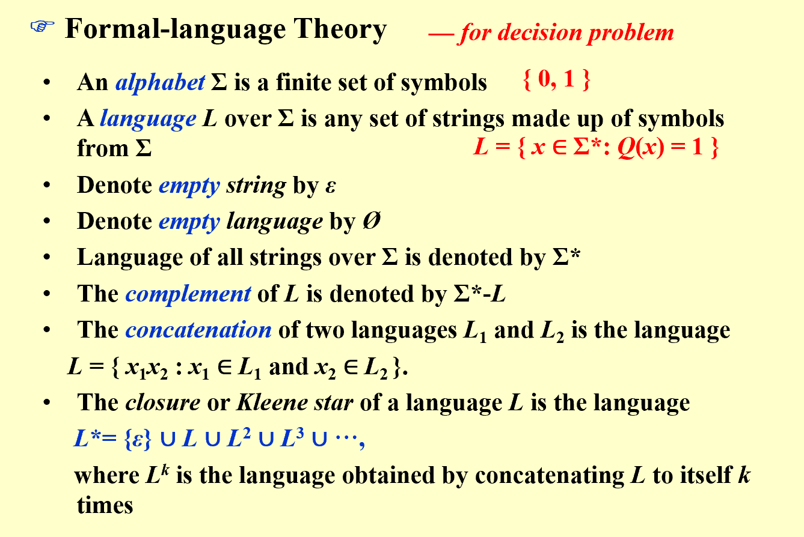
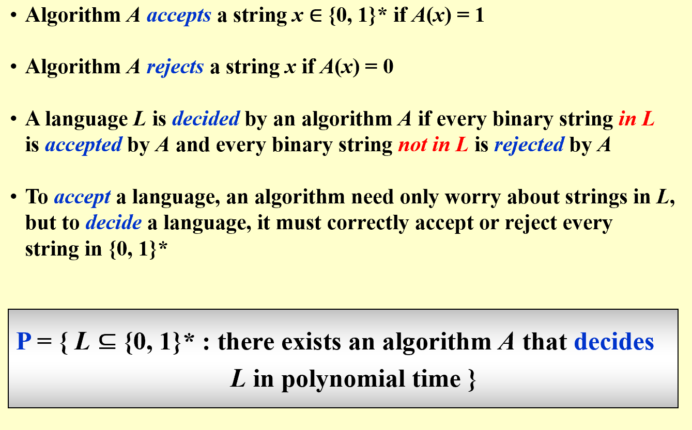
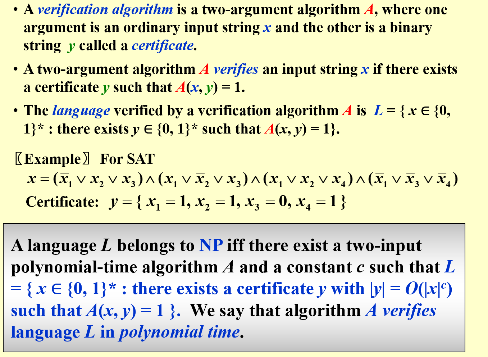
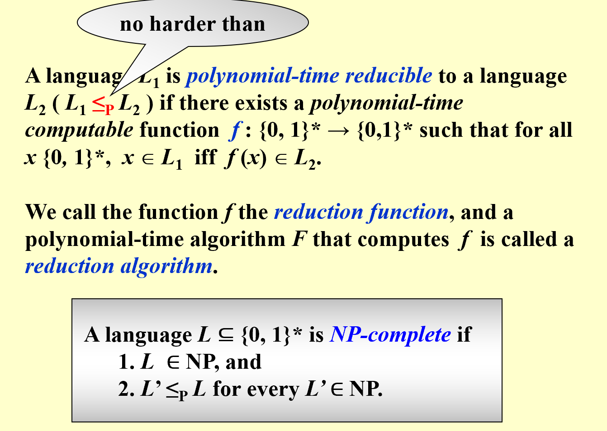
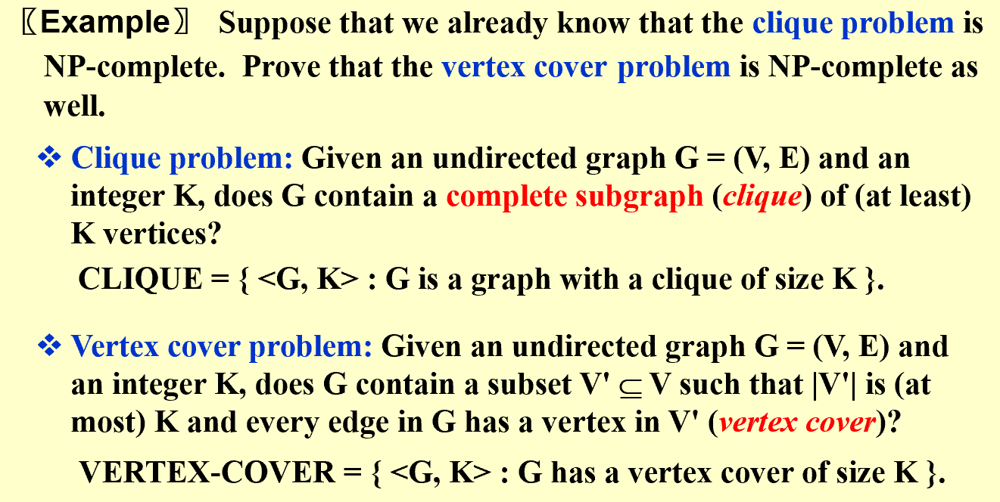
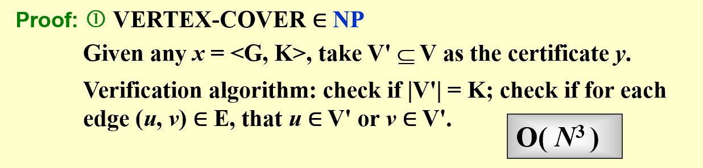
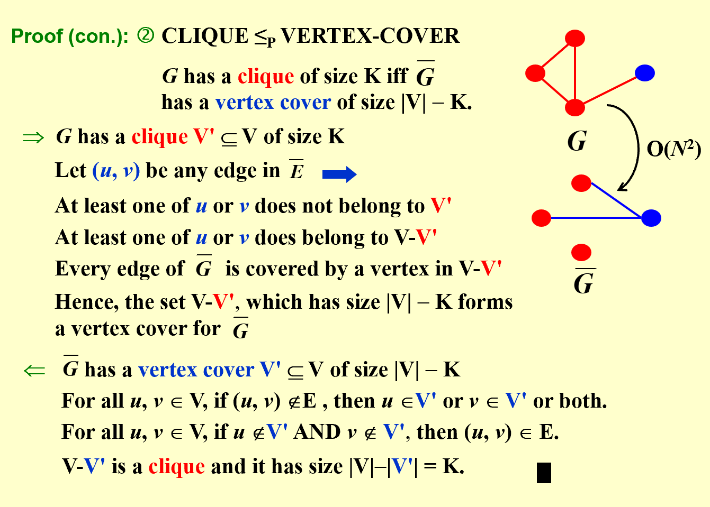

## Examples  
* Euler circuit problem: Find a path that visits every edge exactly once.($P=NP$)  
* Hamiltonian circuit problem: Find a path that visits every vertex exactly once.($NP$)  
* Traveling salesman problem: Find the shortest path that visits every vertex exactly once.($NP$)  
* Single-source shortest path problem: Find the shortest path from a vertex to all other vertices.($P$)  
* Single-source unweighted longest path problem: Find the longest path from a vertex to all other vertices.($NP$)  
## Easy and Hard  
* Easy: Polynomial time(the easiest: $O(N)$, for we have to read the input) 
 

> Loop(p), the p here is the loop detecting function if(P(f(p))==1): implies whether f(p) is a infinite loop function    

* Hard: undecidable problems    
* **Turing Machine**:  
>    Deterministic Turing machine: executes one instruction at each point each time, based on the current state and the symbol under the tape head.  
> Non-deterministic Turing machine: free to choose its next step from a finite set, and clever enough to choose the solution-direct step.  
> which can be simply indicated as NTM knows the answer at the very first, therefore it only needs to verify the answer.  
* **Hamilton cycle problem**: to check whether it is a NP problem, we only need to assume that there is a solution, and ask ourselves: does this simple circuit include all the vertices? And this process can be done in $O(V)$ time.    
> However we need to realize that not all decidiable problems are NP. Try whether a graph does not have a Hamilton cycle.  
* **the basic relationship**: $P \leq NP$  

## NP class  
* **NP-Complete problem**: an NP-complete problem has the property that any problem in NP can be polybomially reduced to it. (reduced is the proper definition, but I personally prefer the word "transformed") If we can solve an NPC,  all NP problems can be solved. (Personal understanding, NPC is a one way result, you can assume that every problem that can be transformed polynomially from NPC is NPC, yet that is not the case with "to")   

!!! Example 

     
Suppose we already knew the Hamilton cycle problem is NPC, prove the TSP problem is NPC too. 

     **The graph has a hamilton cycle if and only if the complete graph generated from the previous graph has a TSP path with $K<=\sum W_{edge_i}$, where $W_{edge_i}$ is the weight of the edge in the original graph.**  

* **SAT**: the satisfiability problem, which is the first problem to be proved NPC. Describe the problem as follows:  
> * Given a boolean formula, is there a way to assign the boolean variables to make the formula true?  

## A Formal-Language Framework  
* **Abstact Problem**: A binary relation on a set $I$ of problem instances and a set if $S$ of problem solutions.   
=== " Formal Language Thery"
    !!! note  "Formal-language Theory"   

           

=== "Decide and Accept"  
    !!! note " Decide and Accept"  

          

=== "Verify and Certificate"    
    !!! note "Verify and Certificate"  

          

* **$co-NP$**: if the complement of a problem is in NP, then the problem is in $co-NP$.  
* **relationship**: $P \subseteq NP \cap co-NP$   
!!! tip "Usage Example" 
    === "The Precise Definition of NPC"
        !!! note  

               

    === "Example Problem"  
        !!! note  

               

    === "Answer: Proof of NP"   
        !!! note  

              

    === "Answer: Proof of NPC"  
        !!! note   

              

----------------------------------------------

    
 

