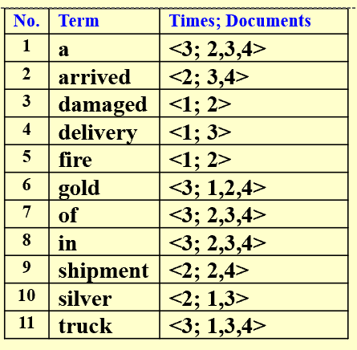
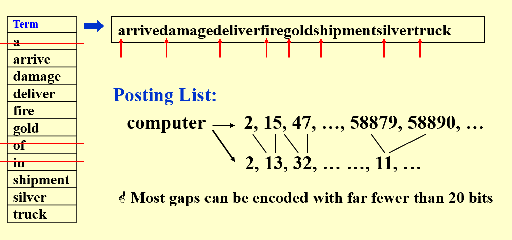
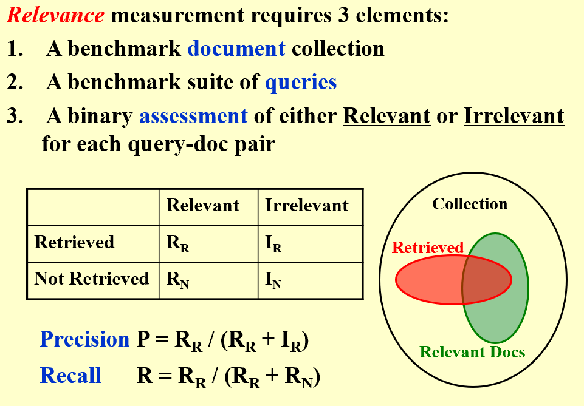

## Intro  
* **Term-Document Incidence Matrix**  
> Too sparse for a matrix  
  
* **Inverted File Index**  
> Index is a mechanism for locating a given term in a text.  
> Inverted file contains a list of pointers (e.g. the number of a page) to all occurrences of that term in the text.  
!!! note  

      

  
* **Word Stemming**:  
> Process a word so that only its stem or root form is left. 
  
* **Stop Words**:  
> Some words are so common that almost every document contains them, such as “a” “the” “it”.  It is useless to index them.  They are called stop words.  We can eliminate them from the original documents.  

## Distributed Indexing  
* **Term-partitioned index**:  
> Seperate by alphabets  
* **Document-partitioned index**:  
> Seperate by file  
  
## Dynamic Indexing  
  
## Compression  
!!! note  
  
      

## Thresholding  
> Sort the query terms by their frequency in ascending order; search according to only some percentage of the original query terms  

  
## User Happiness  
!!! note  
  
      

    

