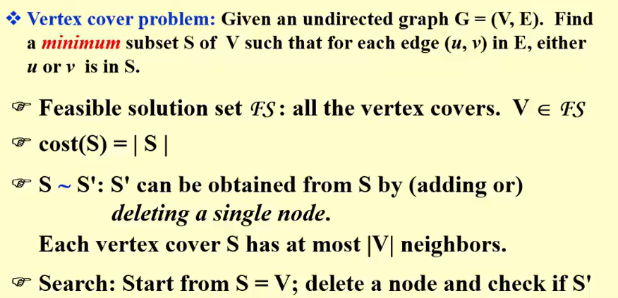
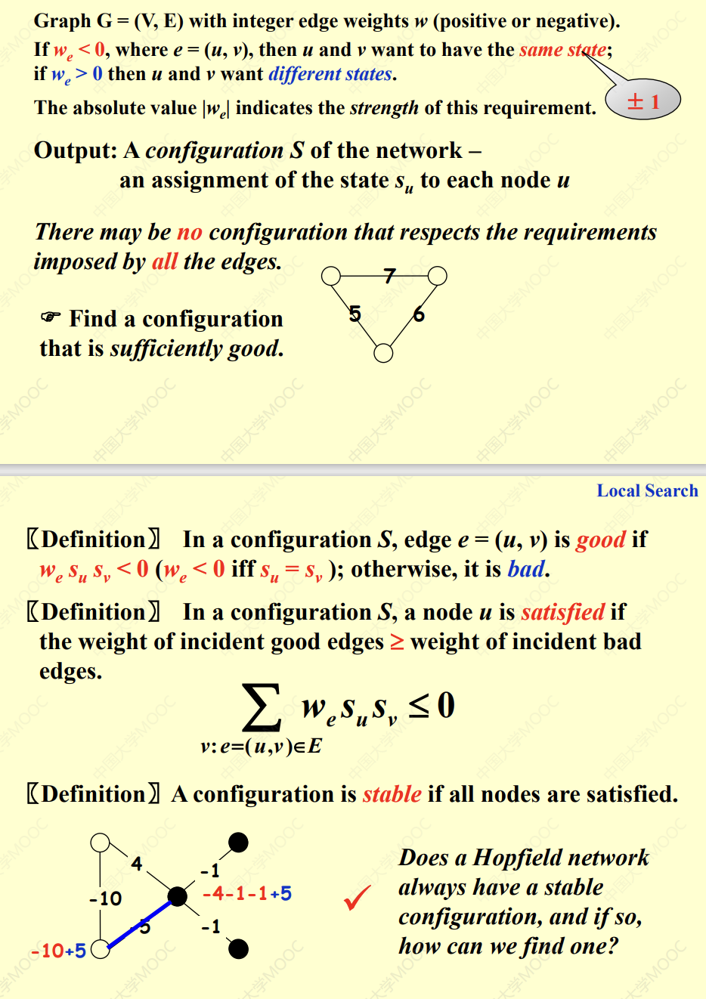
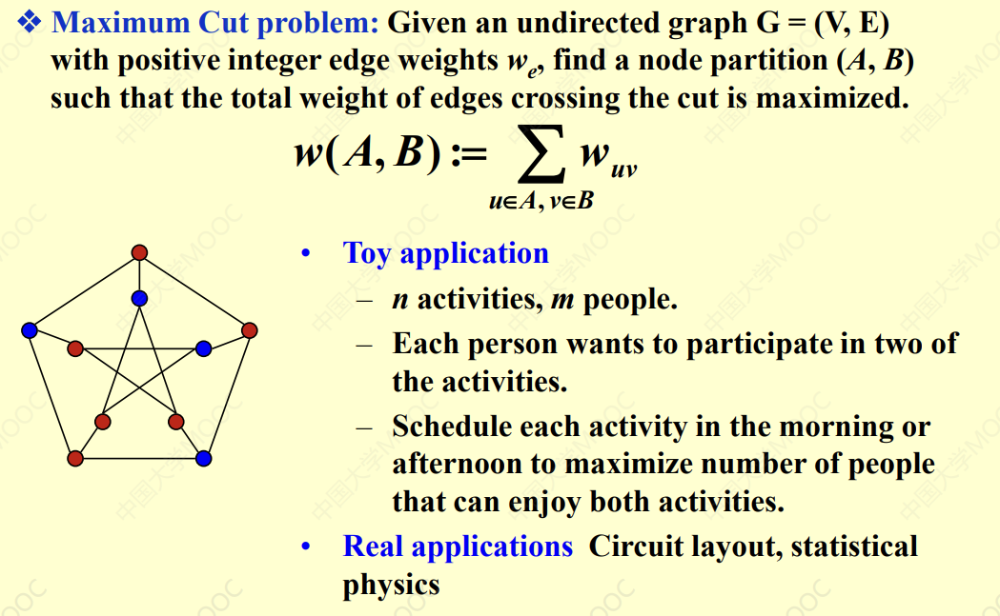
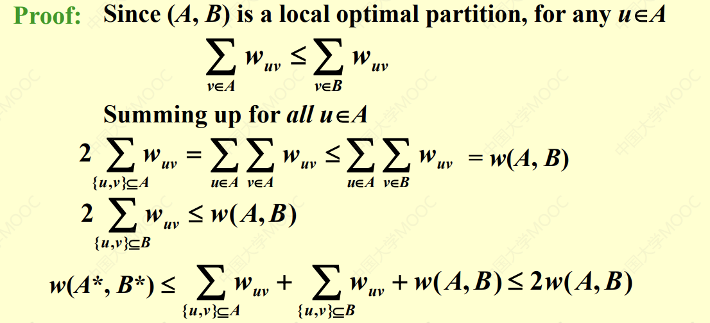
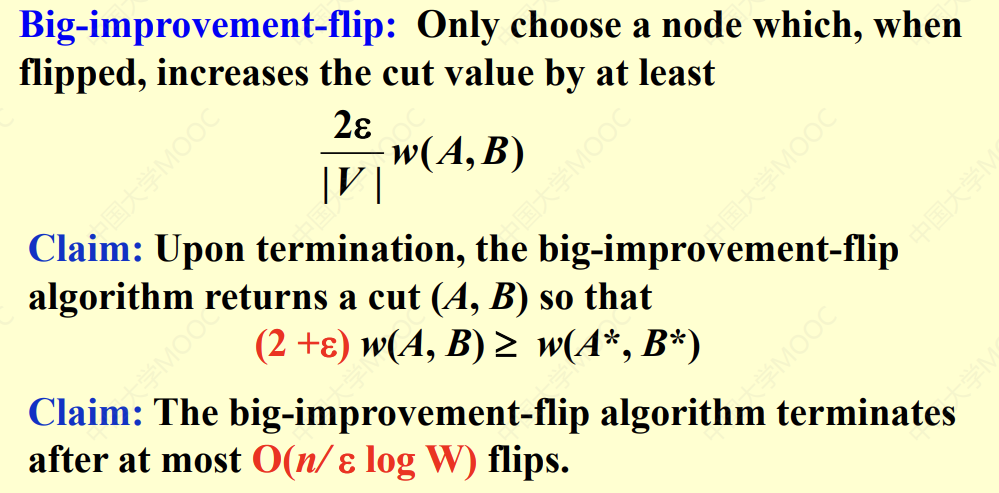
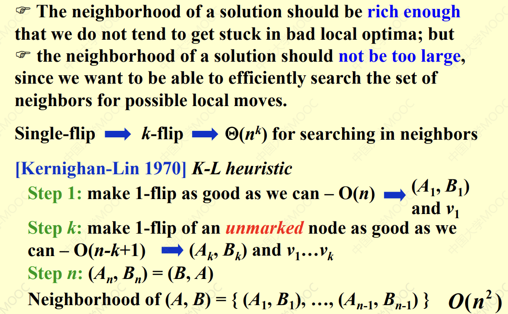

## Intro  
* Solve problem approximately  
* aim at a local optimal
---------------------------------------  
## Framework of Local Search  
* Local:  
> Define neighborhoods in the feasible set  
> A local optimum is the best solution in a neighbourhood  
* Search  
> Start with a feasible solution and search a better one within the neighbourhood  
> A local optimum is achieved if no improvement is possible  
------------------------------------  
## Neighbor Relation  
* $S ~ S'$: $S'$ is a neighbouring solution of $S$->$S'$ can be obtained by a small modification of $S$.  
* $N(S)$: neighborhood of $S$ -> the set ${S':S~S'}$  
> * Famous implementation: Gradient Decent  
??? Example "The Vertex Cover Problem"  

      

-----------------------------------------  
## Improvement  
* The Metropolis Algorithm  
```less  
   Solution Type Metropolis(SolutionType S, double T)  
   {  
       SolutionType S' = RandomNeighbor(S);  
       if (f(S') < f(S))  
           return S';  
       else if (Random(0,1) < exp((f(S) - f(S'))/T))  
           return S';  
       else  
           return S;  
   }  
```    
> But it might bounce back and forth between several solutions(therefore customize the temperature)  

* Simulated Annealing   
> * $T$ is a decreasing function of time  
> * $T = T_0 \times \alpha^t$   

## Hopfield Neural Network
!!! Example "Problem Description"  
    
      

* **State-flipping Algorithm**:  
``` less  

    ConfigType State_flipping()  
    {
        Start from an arbitrary configuration S;
        whie(!IsStable(S))
        {
            u=GetUnsatisfied(S);  
            S[u] = -S[u];
        }
        return S;
    }
```  
    
* **Claim**: The state-flipping algorithm terminates at a stable configuration after at most $W=\sum_e|w_e|$ iterations.  
* **Proof**:  
> Every time we flip a state, the $\phi(S)=\sum_{e is good}|w_e|$ by at least 1, thus $\phi(S)$ is non-negative and bounded by $W$.    

## Maximum Cut Problem  
!!! Example  "Problem Description"  

      

* **Claim**: Let (A, B) be a local optimal partition and let (A*, B*) be a global optimal partition. Then $w(A, B) \beq \frac{2}{1}w(A^*, B^*)$   

!!! tip "Proof"  

       
  
* Try to use the "local optiaml partition" as a tool.     

* **Limited Executed Time**:    
=== "Big-improvement-flip"  

    !!! note  

            

=== "K-L heuristic"  

    !!! note  

        


    

