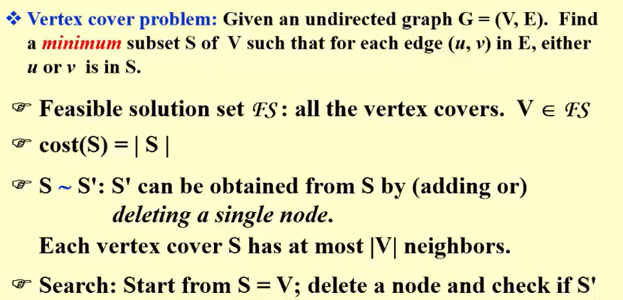
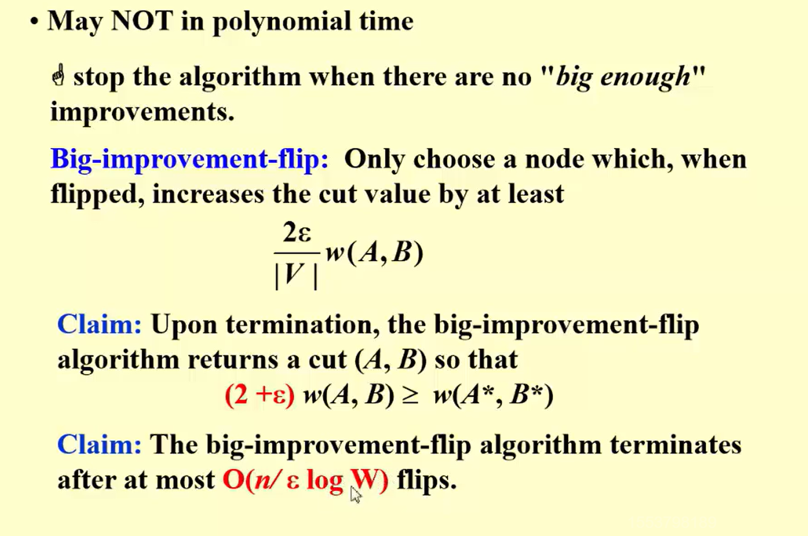

## Intro  
* Solve problem approximately  
* aim at a local optimal
---------------------------------------  
## Framework of Local Search  
* Local:  
> Define neighborhoods in the feasible set  
> A local optimum is the best solution in a neighbourhood  
* Search  
> Start with a feasible solution and search a better one within the neighbourhood  
> A local optimum is achieved if no improvement is possible  
------------------------------------  
## Neighbor Relation  
* $S ~ S'$: $S'$ is a neighbouring solution of $S$->$S'$ can be obtained by a small modification of $S$.  
* $N(S)$: neighborhood of $S$ -> the set ${S':S~S'}$  
> * Famous implementation: Gradient Decent  
??? Example "The Vertex Cover Problem"  

      

-----------------------------------------  
## Improvement  
* The Metropolis Algorithm  
```less  
   Solution Type Metropolis(SolutionType S, double T)  
   {  
       SolutionType S' = RandomNeighbor(S);  
       if (f(S') < f(S))  
           return S';  
       else if (Random(0,1) < exp((f(S) - f(S'))/T))  
           return S';  
       else  
           return S;  
   }  
```    
> But it might bounce back and forth between several solutions(therefore customize the temperature)  

* Simulated Annealing   
> * $T$ is a decreasing function of time  
> * $T = T_0 \times \alpha^t$   

??? Example "Hopfield Neural Network"

      

**General simple implementation, yet difficult to quantify its result**

