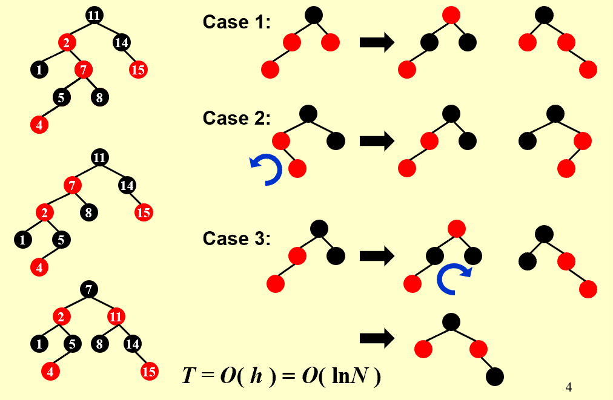
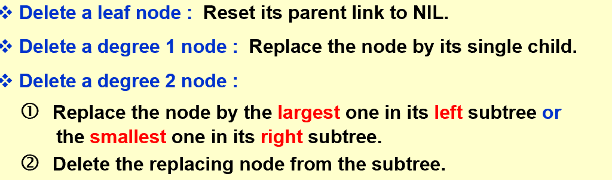
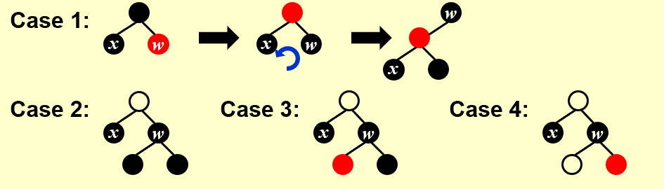
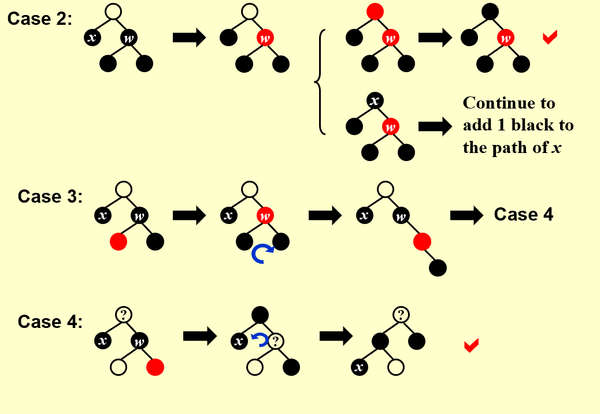
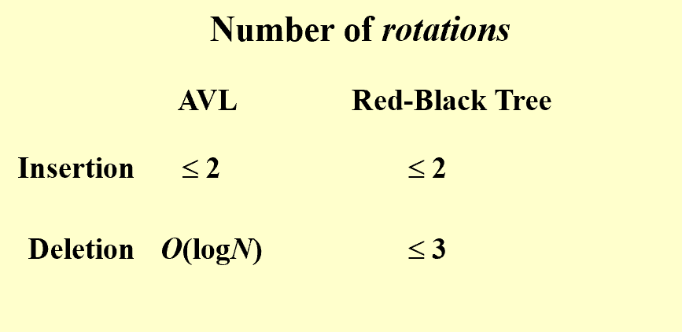

## Intro  
* **Definition**:  
> A red-black tree is a binary search tree that satisfies the following red-black properties:
> * Every node is either red or black.
> * The root is black.
> * Every leaf (NIL) is black.
> * If a node is red, then both its children are black.
> * For each node, all simple paths from the node to descendant leaves contain the same number of black nodes.  

------------------------------------------------  
## Black Height  
* **Definition**:  
> The black-height of any node x, denoted by bh(x), is the number of black nodes on any simple path from x (x not included) down to a leaf.  bh(Tree) = bh(root).  
> Proof: for any node x, $sizeof(X) \geq 2^{bh(x)}-1$, by inducting on the height of the tree, we can get the conclusion.  
> $bh(Tree) \geq h(Tree)/2$  
  
-----------------------------------------------------  
## Operations  
=== "Insert"  

    !!! note

           


=== "Delete"  

    !!! note  

            
          
          

  
## Conclusion  
!!! tip  

      

------------------------------------------------  
## B+ Tree  
* **Definition**:  
> A B+ tree of order M is a tree with the following structural properties:
> * The root is either a leaf or has between 2 and M children.
> * All nonleaf nodes (except the root) have between $\lceil M/2 \rceil$ and M children.
> * All leaves are at the same depth. Assume each nonroot leaf also has between $\lceil M/2 \rceil$ and M children.  
  
```less  

   Btree  Insert ( ElementType X,  Btree T ) 
   { 
    Search from root to leaf for X and find the proper leaf node;
    Insert X;
    while ( this node has M+1 keys ) {
            split it into 2 nodes with (M+1)/2 and (M+1)/2 keys, respectively;
            if (this node is the root)
                create a new root with two children;
            check its parent;
    }
   }   
```  
**$Depth(M,N)=O(\log_{\lceil M/2 \rceil}N)$**  

   
   


    

        
