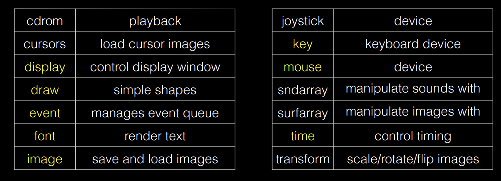

## [Pygame](https://www.pygame.org/docs/)  
* Wraps SDL  
### Modules  
  
### Game Loop  
* 1. Check for inputs  
* 2. update states 
* 3. draw another frame base on the current situation  
### MVC  
* 1. architecutal style for GUI  
* 2. Model, View, Controller  
#### Model  
* 1. well-defined interface for data processing  
* 2. database    
#### View
* 1. visualization  
* 2. rendering  
#### Controller  
* 1. user input  
* 2. update model and view actions  
### Object-Oriented Models 
!!! tip 

    * 1. Object: instance of a class
    * 2. Class: blueprint for objects
    * 3. Inheritance: subclass inherits from superclass
    * 4. Polymorphism: subclass can override methods of superclass
    * 5. Encapsulation: data hiding   

* use objects for items in my game  
* use classes to define objects
* each object knows its own state, and so is part of the model  
* each object can draw itself, so is part of the view  

