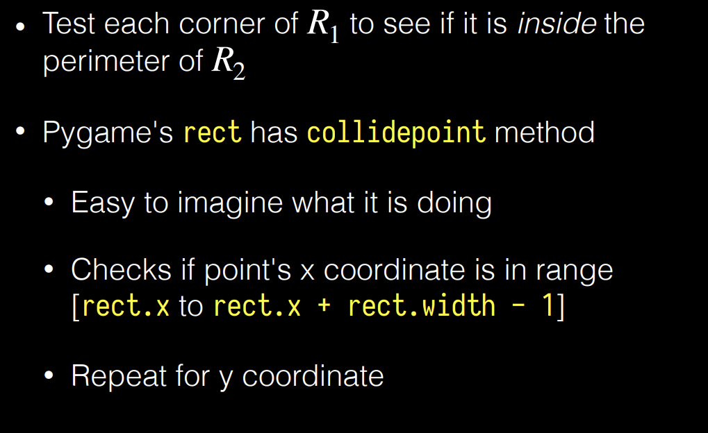
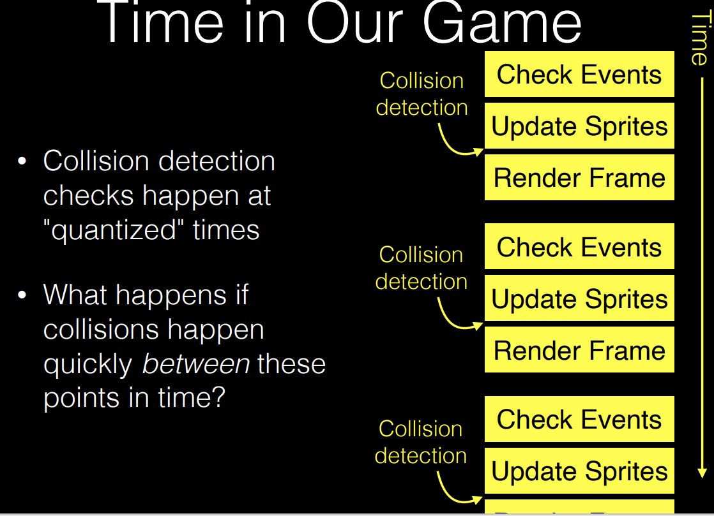
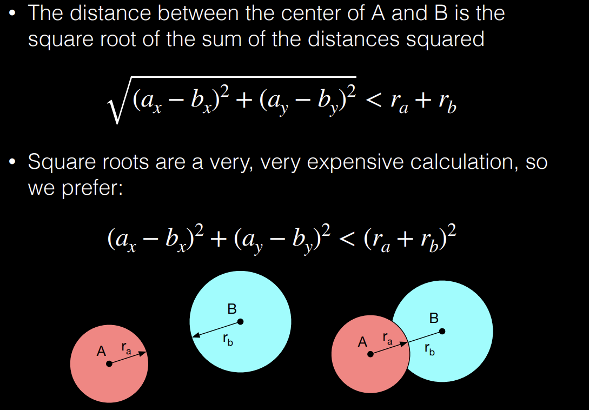

comments: true

## Collision Detection  
* Collision detection is a fundamental problem in computer graphics and game development.  
* The problem is to determine whether two objects are intersecting.  
* for each pair of sprites, check wheher $p_1 \cap p_2 \eq \emptyset ->$ No collision!!!  
### Rect Collision Algorithm  
  
collidepoint:  
```python   
def collidepoint(self, x, y):  
    return self.left <= x <= self.right and self.top <= y <= self.bottom  
```  
!!! warning  

    <center>The test need to be bi-directional.</center>  

colliderect:  
```python  
def colliderect(self, rect):  
    return self.left < rect.right and self.right > rect.left and self.top < rect.bottom and self.bottom > rect.top  
```  
Problematic indeed: checks too frequently, move-through prolems  

### Tyranny of numbers  
!!! note  

    <center>checking collisions for all pairs of objects is not feasible</center>  

(就像时序下沿时原件的delay)  
## Solving all the possible problems  
* need to look for objects that don't move, and that are allowed to go through other objects  
* distant objects can be ignored  
* objects that are not visible can be ignored(off-screen objects)  
* restricted locations  
### Quadtree(and other sorting methods) 
* A tree data structure in which each internal node has exactly four children.   
## Quick test  
* Circle/ Sphere test  
  
don't use `sqrt` function, too ecpensive(Numerical Analysis)   
* Bounding Box(a better rectangle)   
* a better collision detection algorithm(don't use corners of the rec)   
* Separating Axis Theorem:  
       * if two convex shapes do not intersect, there exists a line such that the projection of the two shapes onto the line do not overlap.   
* Capsule(semicircles: a bounding test for the rec,and a circle test for the circle)  
!!! note  "Book Recommendation"

    <center>Game Programming: Algorithms and Techniques by Sanjay Madhaven</center>  

* Swept Sphere Algorithm(use math to determine whether two moving objects will collide dynamically)  
$(B\cdot B)t^2+2(A\cdot B)t+A\cdot A-(r_p+r_q)^2=0$    
## Resolve Collision  
* Bounces  
* Elastic Collisions  
  
find the touching point   

$\vec{v_1}=\vec{v}-2\vec{n}(\vec{v} \cdot \vec{n})$ 


          


 


