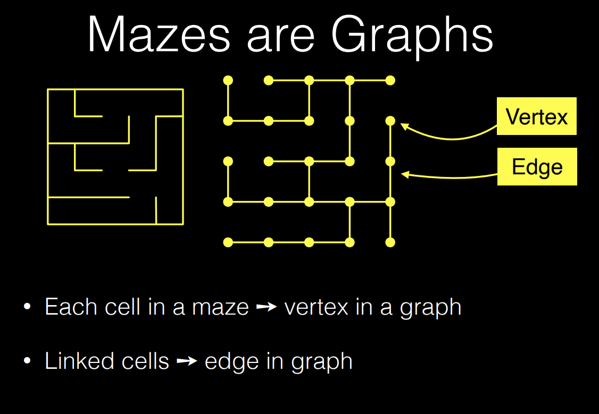
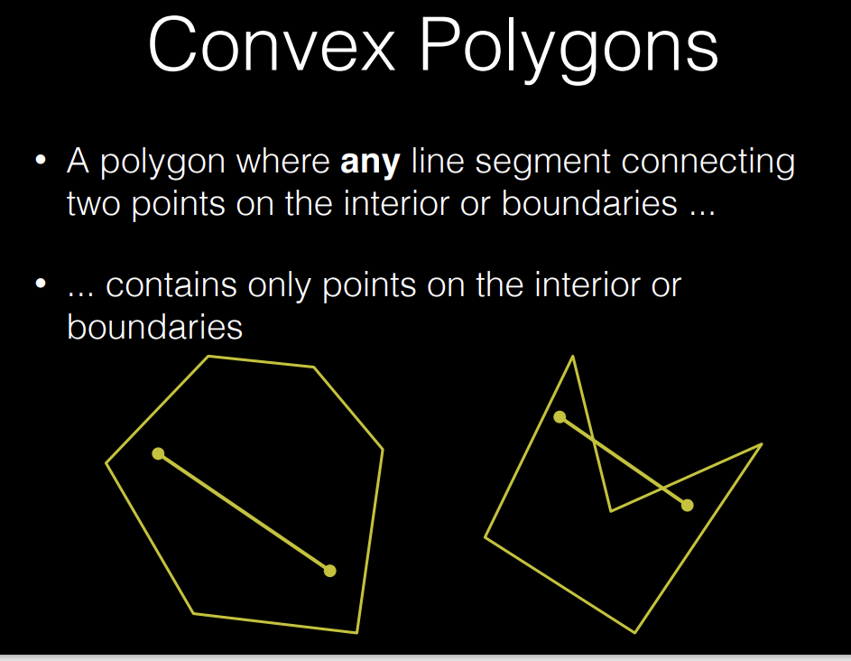
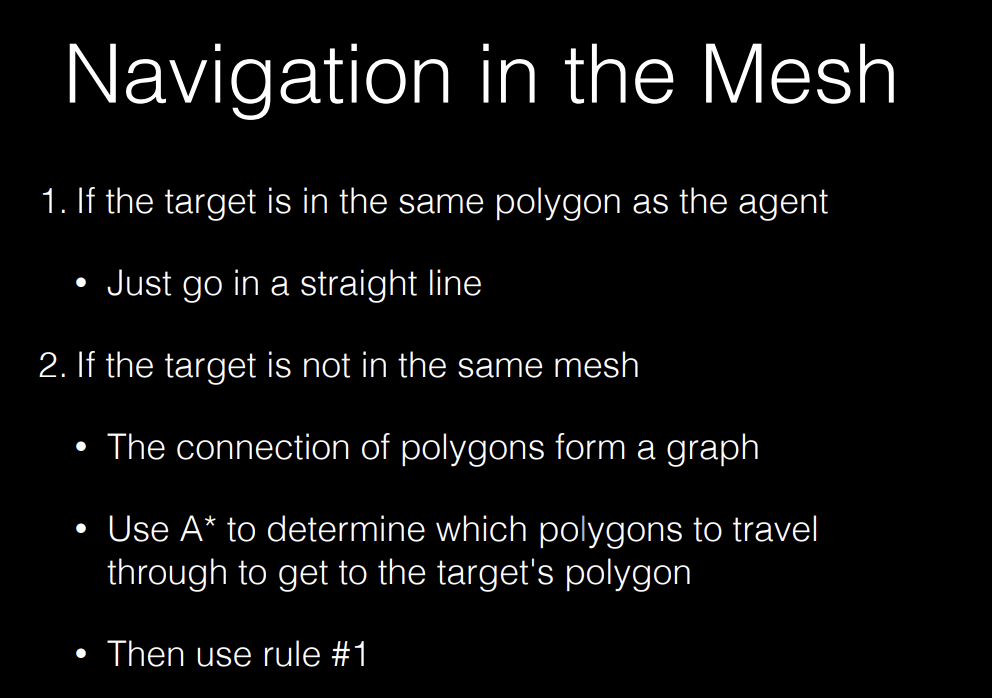
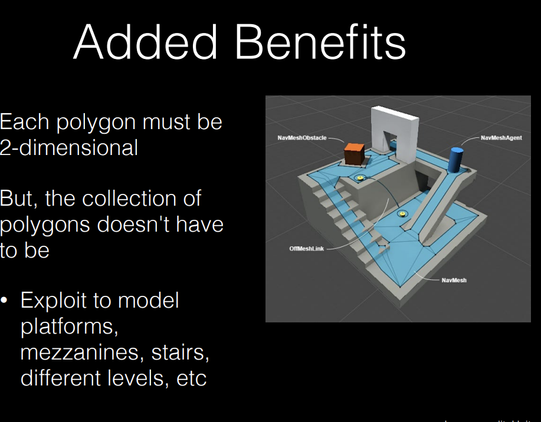

## Navigation  
### Control  
* where control means AI  
* pay attention to "State Machines"  
* *State Machines*: a way of representing the state of an object and the transitions between those states  

### Graph  
$Graph =Set(Vertices,Edges)$  
The relationship between mazes and graphs:  
  
[How big shall each vertices be?](http://www.zarkonnen.com/grids_in_games
)    
*How to approximate a line?*  
* Bresenham's line algorithm  
* Linear interpolation  
* Orthognal steps  (Numerical Analysis)  

### Navigation 
*single source, all destinations* 
* Generally so Sum(cost) is minimized  
* *Classic Graph Search*  
* Breath First Search: Unweighted edges  
* Dijkstra: weighted 
* Bellman-Ford: wieghted with negative edges    
*all source, all destinations*  
* Floyd  
* Johnson's Algorithm  
#### BFS  
* the point is to discover some destination cell  
*simply look up in the dictionary is enough*  
#### Early Exit  
Add a conditional choice to end the loop  
#### Obstacles  
!!! tip  

    
Obstacles shall not be listed as neighbours
  

#### Dijkstra  
* use a minheap  

#### Heuristic  
Greedy+Heuristic function  
* A* Algorithm  
$F(n)=G(n)+H(n)$  
* G(n): the cost of the path from the start node to n  
* H(n): the heuristic function, the estimated cost from n to the goal  
* A* is optimal if H(n) is admissible  
### Navmesh  
* A* at scale: takes too long   
  

* Navmesh: a mesh of polygons  
  
Navigation in the mesh:   
if the target is not in the same polygon as the agent, the agent will move to the edge of the polygon (use A* to determine which mesh to cross)and then move to the target.   
!!! note "more benefit"  

      

### Funnel Algorithm  
* smoothing the ideal path  
* that is choosing the vertices of the polygon and find the shortest path  
* the funnel is the area that the agent can move in  

 

   

