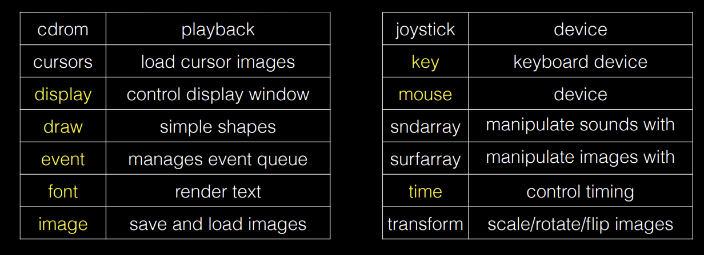
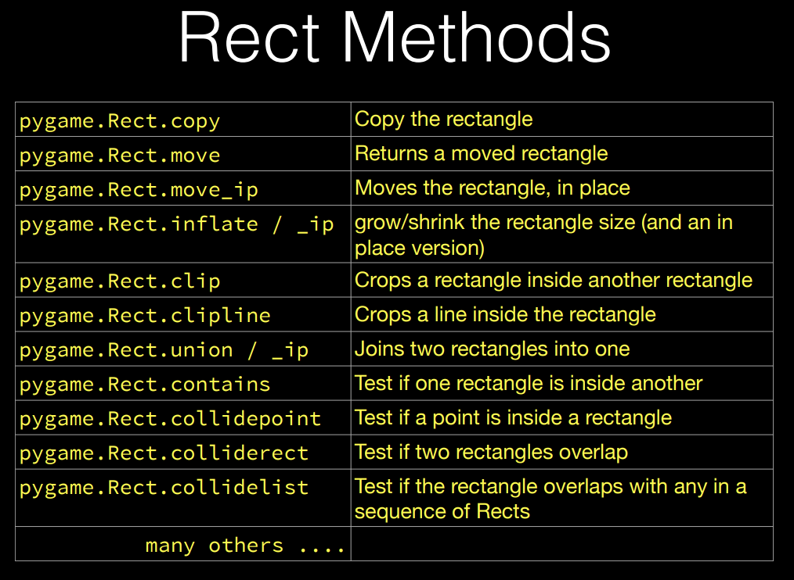

## [Pygame](https://www.pygame.org/docs/)  
* Wraps SDL  
### Modules  
  
### Game Loop  
* 1. Check for inputs  
* 2. update states 
* 3. draw another frame base on the current situation  
### MVC  
* 1. architecutal style for GUI  
* 2. Model, View, Controller  
#### Model  
* 1. well-defined interface for data processing  
* 2. database    
#### View
* 1. visualization  
* 2. rendering  
#### Controller  
* 1. user input  
* 2. update model and view actions  
### Object-Oriented Models 
!!! tip 

    * 1. Object: instance of a class
    * 2. Class: blueprint for objects
    * 3. Inheritance: subclass inherits from superclass
    * 4. Polymorphism: subclass can override methods of superclass
    * 5. Encapsulation: data hiding   

* use objects for items in my game  
* use classes to define objects
* each object knows its own state, and so is part of the model  
* each object can draw itself, so is part of the view  
!!! tip
    * 1. Model: has references to objects and calls their update methods
    * 2. View: draw()
    * 3. Controller: user input  

### Graphics  
* 1. Engine: graphics algorithms embedded  
* 2. Colors: RGB, Alpha  
#### The Surface  
* 1. 2D array of pixels,returned from display.set_mode()  
!!! Question "The difference between class and module"  

    
Classes are blueprints that allow you to create instances with attributes and bound functionality. Classes support inheritance, metaclasses, and descriptors.

    
Modules can't do any of this, modules are essentially singleton instances of an internal module class, and all their globals are attributes on the module instance. You can manipulate those attributes as needed (add, remove and update), but take into account that these still form the global namespace for all code defined in that module. 

* 2. The display Surface is visible to the user  
* 3. background surface is copyed to the display surface while rendering  
* 4. get_at and set_at methods to access pixel values, set colors of it  
#### Draw module  
* surface is a parameter  
* draw.rect(surface, color, rect)  
* draw.circle(surface, color, center, radius)
* draw.line(surface, color, start_pos, end_pos, width)
* draw.arc(surface, color, rect, start_angle, stop_angle, width)  
`surface.fill(color)`: to fill the entire function  
* draw.polygon(surface,color,points,width=1)  
* Rect object:
> * 1. x,y,width,height
>   
* Using rect with draw:  
### Pygame Images  
* 1. image formats: PNG, JPEG, BMP, GIF, etc  
* 2. load image: image.load(filename) 
* 3. convert() method to convert image to the same format as the display surface
* 4. blit() method to draw the image on the display surface
* 5. Blit optimization: blit() is faster than draw(), graphics harware handles the entire BLIT  
* 6. colorkey
    * set_colorkey() method to set the transparent color
* 8. surface transformation: scale, rotate, flip
    * surface.transform.scale(surface, (width, height))
    * surface.transform.rotate(surface, angle)
    * surface.transform.flip(surface, xbool, ybool)  

