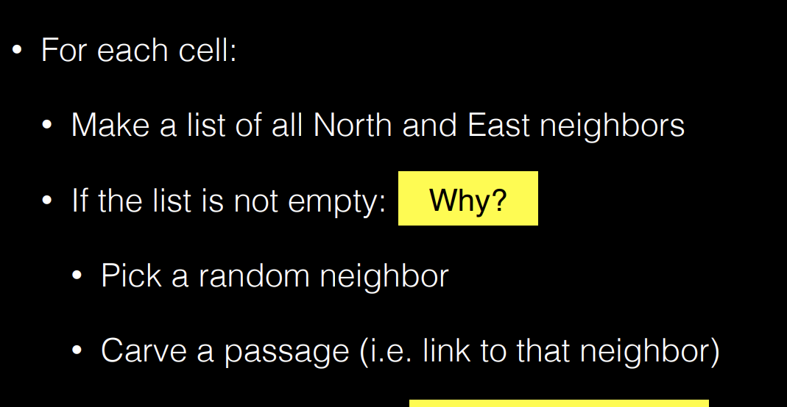
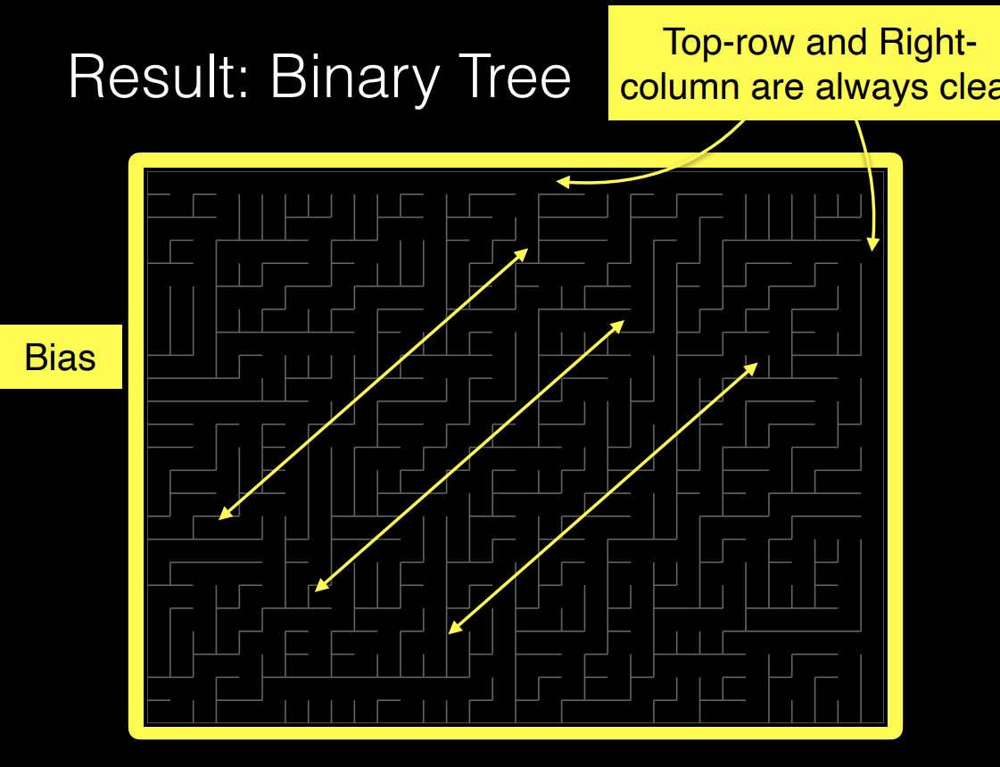
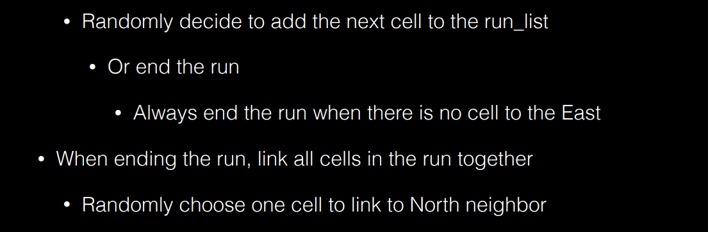
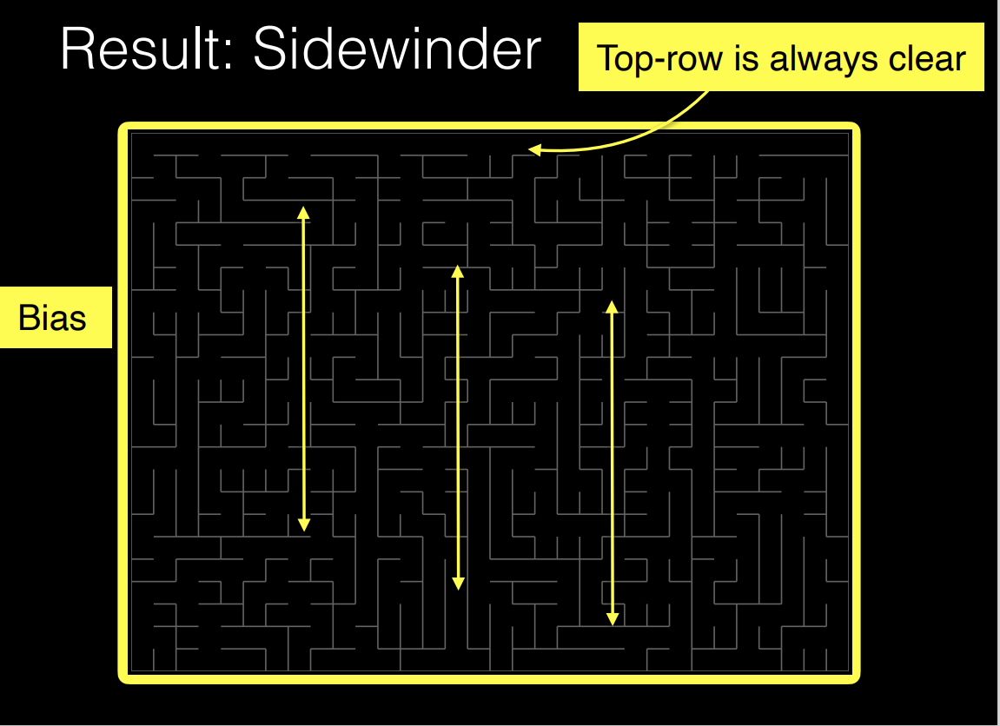
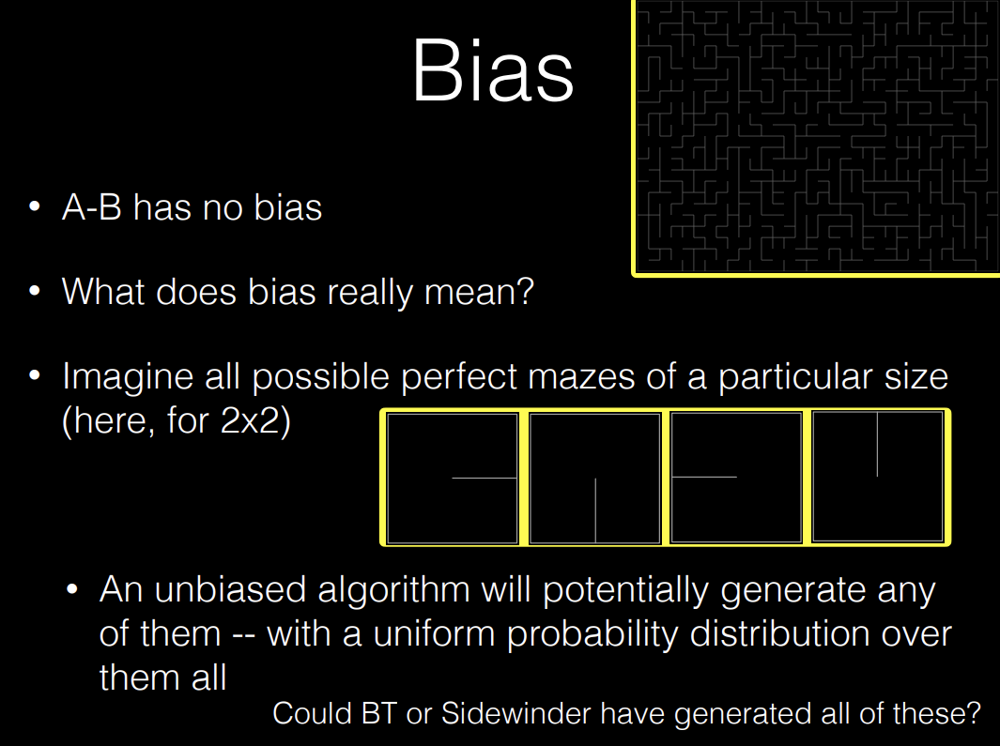
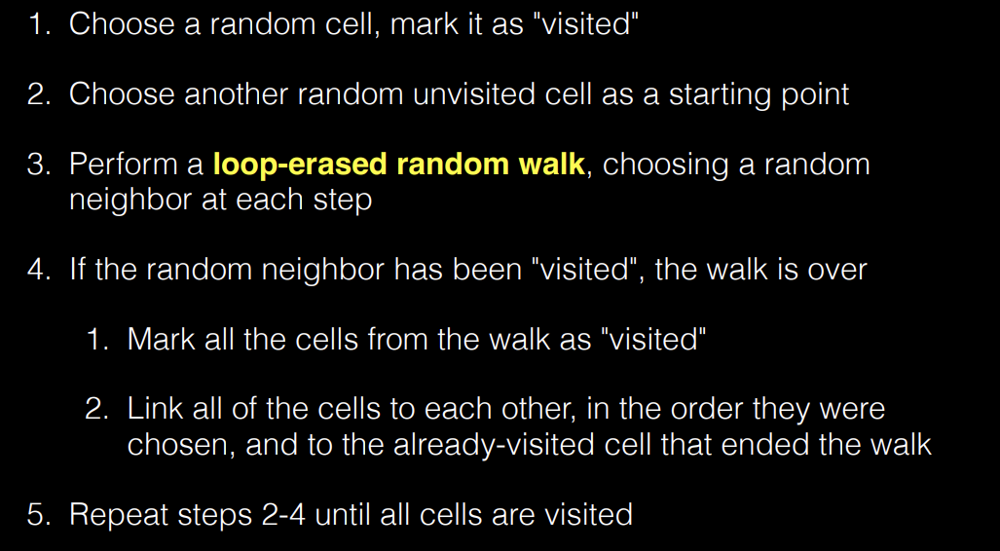
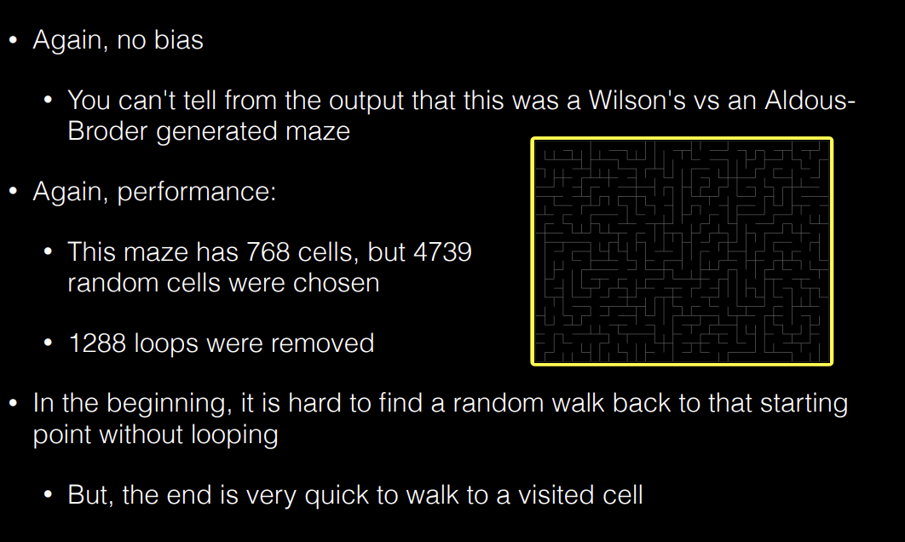
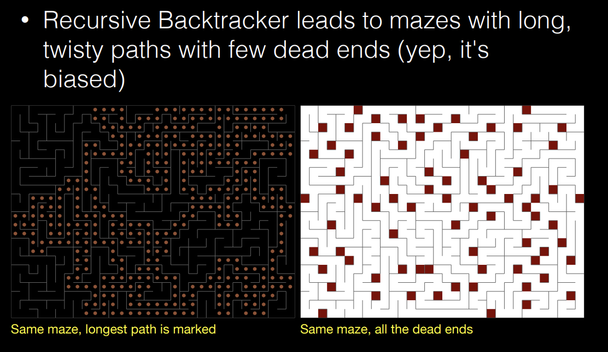
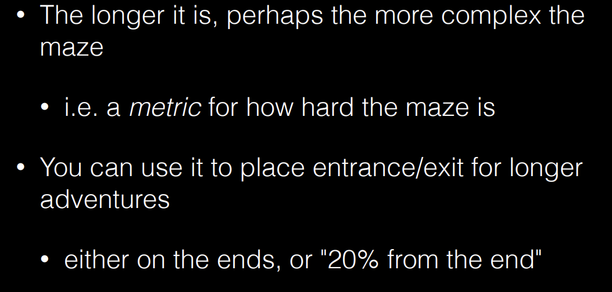

## Mazes  
* Perfect mazes: no loops, has one and only one path between any two cells    
* Unicursal mazes: no branches, a single path from start to finish  
* Braid mazes: loops, but no dead ends  
* weave maze: passages go over and under each other  
## Metrics  
* All neighboring cells will be either linked or unlinked  
## Algorithms  
### Binary Tree(a wall carving algorithm)
* Cells on the East column are all linked to their North neighbor(右侧一条线)  
* Cells on the North row are all linked to their East neighbor(上侧一条线)  
Except:   
* The North-East cell  
  
  
a clear path from the bottom left to the top right  
No entry or exit, yet perfect   
### Sidewinder  
* a wall carving algorithm  
* Top rows: link cells together  
* Other rows: Add leftmost cell to the 
  
  
top-row clear  
rows are longer, yet not linked  
cons are random, mostly blocked  
each row can be handled in parallel  
### Aldous-Broder  
* Random walk:  
    * Randomly choose a neighbor  
    * If not visited, link and move  
    * If visited, move
    * Random walk until all cells are visited   
  
take a long time to generate  
### Wilson's  
  
* in the beginning, its hard to find a random walk back to that starting point without looping  
* But the end is quick   
 
### Recursive Backtracker  
  
few dead ends yet biased  
yet it is not memory-efficient (recursive calls)  
### Solution algorithm  
 * Wall follower:  
    * Always follow the right wall  
    * If no right wall, turn right  
    * If no right wall, turn left  
    * If no right wall, turn around  
* Dead-end filler  
* Recursive backtracker  
* Trémaux's algorithm  
#### Dijkstra's algorithm  
longest path:  
* pick a random cell for the root(A)   
   * run Dijkstra's algorithm on it (find the furthest from A, call it B)  
   * run Dijkstra's algorithm on B (find the furthest from B, call it C)    
* $B->C$ is the longest path    
  

