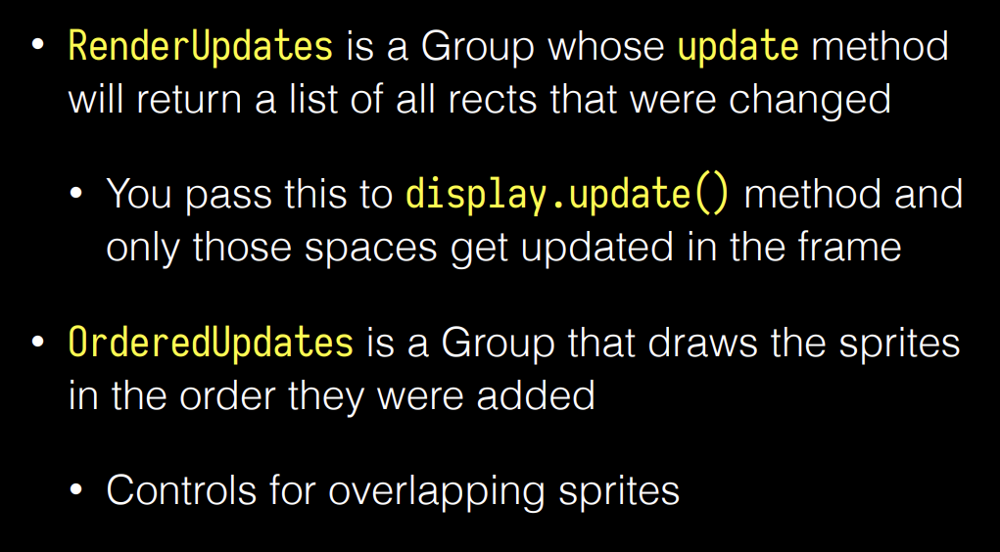
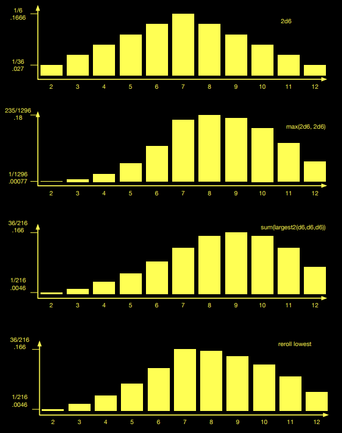

## Fonts and text renders  
* Pygame renders text to a surface with the font module  
* Font module can locate and load a font as a Font object  
How to render text:
```python
font = pygame.font.Font(None, 36)
text = font.render("Hello, World", True, (255, 0, 0))
screen.blit(text, (200, 200))
```
the font.render() method returns a surface with the text rendered on it  
`a_font.size()`: method returns the size of the text  , a turple of width and height
`a_font.get_height()`: method returns the height of the font
`a_font.get_linesize()`: method returns the height of a line of text
`a_font.metrics`:returns a list with one turple per character in ttext  
## Sprites(Object-Oriented Models)  
```python  
class MySprite(pygame.sprite.Sprite):
    def __init__(self):
        pygame.sprite.Sprite.__init__(self)
        self.image = pygame.Surface((50, 50))
        self.image.fill((255, 0, 0))
        self.rect = self.image.get_rect()
        self.rect.topleft = (100, 100)
```
the usage of sprites:  
```python
sprite = MySprite()
sprite_group = pygame.sprite.Group()
sprite_group.add(sprite)
sprite_group.draw(screen)
```
`sprite_group.draw(screen)`: method draws all the sprites in the group to the screen
sprite operations with group:
```python
sprite_group.update()
sprite_group.clear(screen, background)
sprite_group.remove(sprite)
```
`Group.clear(surface, background)`: clears the sprites from the screen  
`Group.draw(surface)`: draws the sprites to the screen  
  
LayerUpdates class:  
```python
class LayerUpdates(pygame.sprite.LayeredUpdates):
    def __init__(self):
        pygame.sprite.LayeredUpdates.__init__(self)
        self.add(MySprite())
```
a group within group  
DirtySprite class:  
```python
class DirtySprite(pygame.sprite.DirtySprite):
    def __init__(self):
        pygame.sprite.DirtySprite.__init__(self)
        self.image = pygame.Surface((50, 50))
        self.image.fill((0, 255, 0))
        self.rect = self.image.get_rect()
        self.rect.topleft = (200, 200)
```  
`DirtySprite.dirty`: attribute to indicate whether the sprite needs to be updated  
`DirtySprite.dirty = 1`: set the sprite to be updated
`DirtySprite.dirty = 0`: set the sprite not to be updated
LayeredDirty class:  
```python
class LayeredDirty(pygame.sprite.LayeredDirty):
    def __init__(self):
        pygame.sprite.LayeredDirty.__init__(self)
        self.add(DirtySprite())
```
*Collision Detection*:will be discussioned in chapter five  
## Animation  
*Animation*: a series of images displayed in rapid succession to create the illusion of movement  
!!! Question "how to make shure that the animation is smooth?"  

    1. slow the game loop down to a consistent number  
    2. measure the time between frames and adjust the speed of the animation accordingly  

Approach 1: Slowerloop  
a tick() method to control the speed of the game loop  
```python
def tick(self):
    self.clock.tick(30)
```
Approach 2: Measure
delta value: the time cost of the last frame(game loop)  
delta=clock.tick()  
it will return number of milliseconds 
since last time

## Randomness  
*Randomness*: a key element in games
`random.randint(a, b)`: returns a random integer between a and b
`random.choice(sequence)`: returns a random element from a sequence
`random.shuffle(sequence)`: shuffles the sequence in place
`random.seed()`: initializes the random number generator
*LCG: Linear Congruential Generator*: a simple algorithm to generate random numbers
$X_{n+1}=(aX_n+c)mod m$
$ex: X_{n+1}=(1664525X_n+1013904223)mod 2^{32}$
LCG has a specific period, and the period is the maximum number of random numbers that can be generated before the sequence repeats
### PRNG: Pseudo-Random Number Generator  
*PRNG*: a deterministic algorithm that generates a sequence of numbers that approximates the properties of random numbers  
a good PRNG should have a long period, be unpredictable, and have a uniform distribution  
### Random distributions  
*Uniform distribution*: each number has an equal chance of being selected  
*Normal distribution*: a bell-shaped curve with the mean at the center  
*Asymmetric distribution*: a distribution that is not symmetrical: Dropping the lowest roll, reroll the lowest
  
*Critical Hit*: a game mechanic that allows a player to deal extra damage  
How to construct a critical hit?
```python
def roll_with_crit():
    roll = random.randint(1, 20)
    if roll < crit_threshold:
        return 2 * random.randint(1, 6)
    return roll
```  
*Arbitrary distribution*: a distribution that is not uniform, normal, or asymmetric  
use die-size to control the scale

