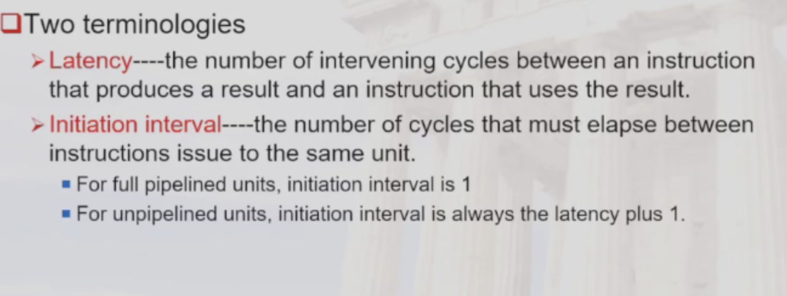
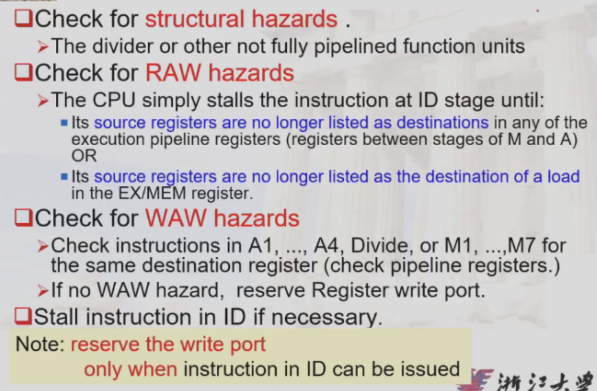
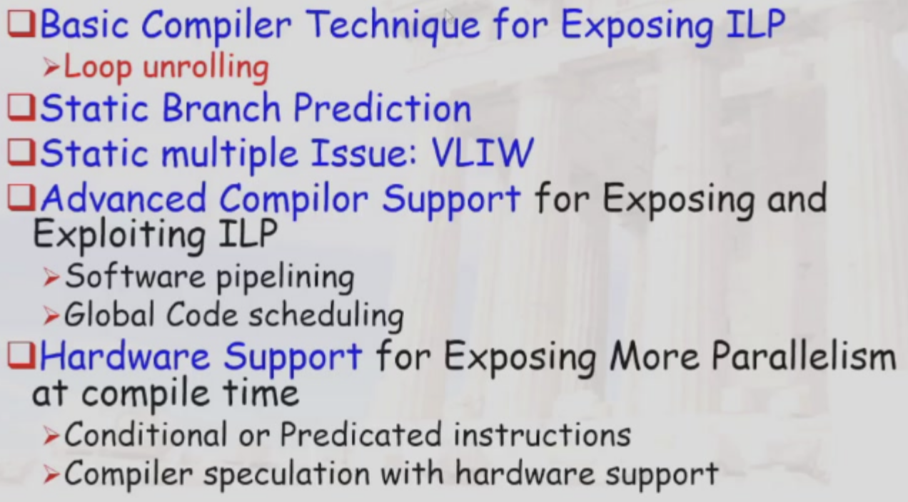

## Review of Pipeline Hazards

* Structural Hazards
  * Occur when two or more instructions require the same hardware resource at the same time.
  * Example: Two instructions trying to access the same memory location simultaneously.

* Data Hazards
    * Occur when an instruction depends on the result of a previous instruction that has not yet completed.
    * Types:
        * Read After Write (RAW): An instruction reads a value before it is written by a previous instruction.
        * Write After Read (WAR): An instruction writes a value before it is read by a previous instruction.
        * Write After Write (WAW): Two instructions write to the same location, and the order of writes matters.

* Control Hazards

## Pipelining some of the FP units

!!! tip "Terminology"

    

* unpipelined structure, structural hazard may occur

* use delay counting while implemented on verilog in labs

* data hazards and exceptions

### Stalls arising from RAW hazards

* load stall
* stall because of previous stalls(sequential issue)

### Solving WAW hazards

* stall until the previous instruction has written its result(WB)
* do not WB the previous instruction

#### Check for WAW hazards

!!! note "Check for Hazards"

    

### The MIPS R4000 Pipeline

* use instruction manipulation

## What is ILP?

* Basic Block is quite small

* reduce CPI

* Hardware-based dynamic approaches

* compiler based

* loop-level parallelism

> vector based instructions(GPU is the way)

> dynamic branch

* name dependence

> renaming

* true dependency

## Lecture for ILP: Software approaches

!!! note "Content"

    

## Dynamic Scheduling

* issue and read operand: should be separated

### Scoreboarding

* in-order issue
* out-of-order completion

* Pipeline stages with scoreboard:

> IF, IS, RO, EX, WB

