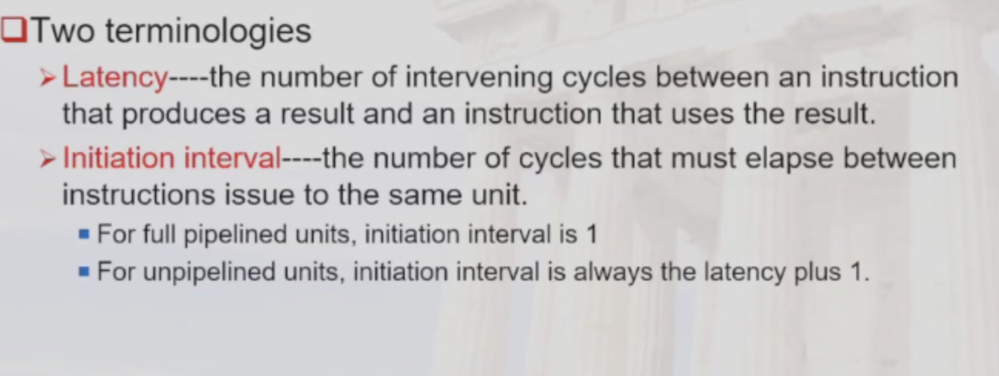
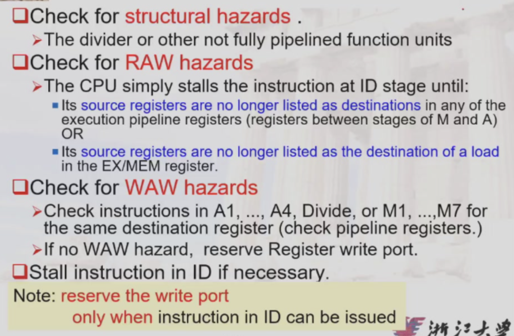
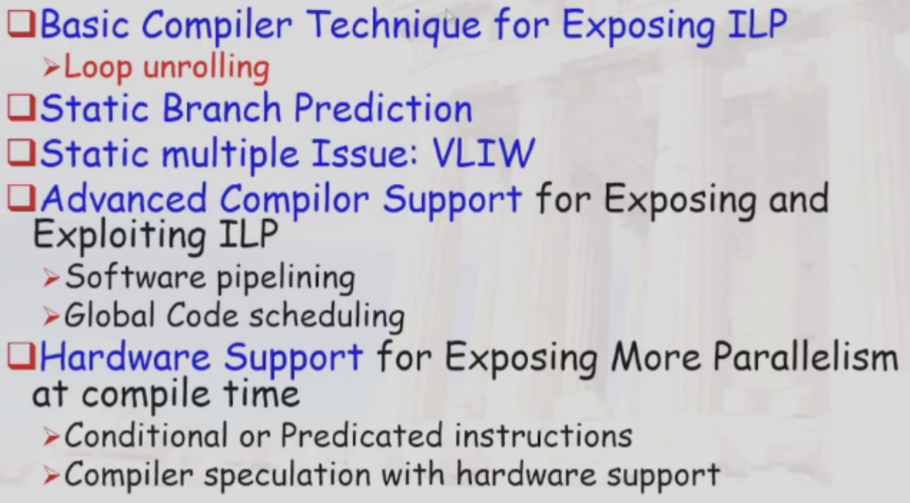
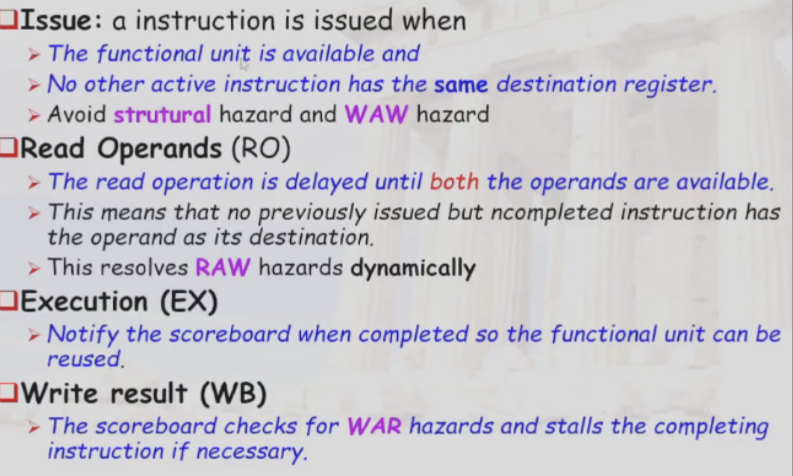
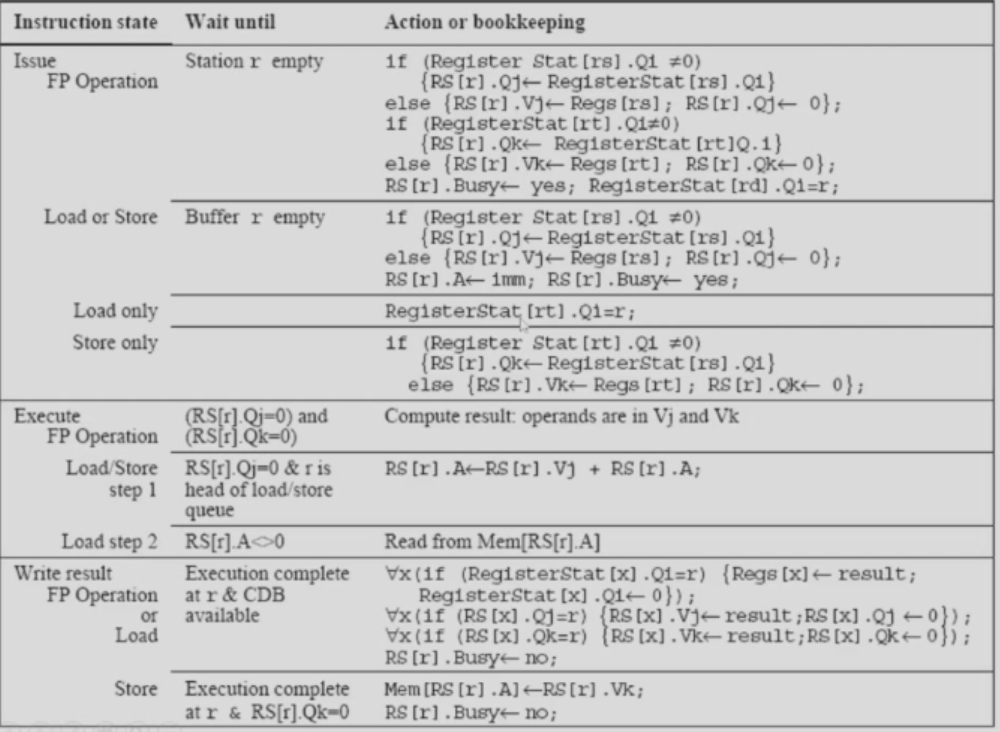
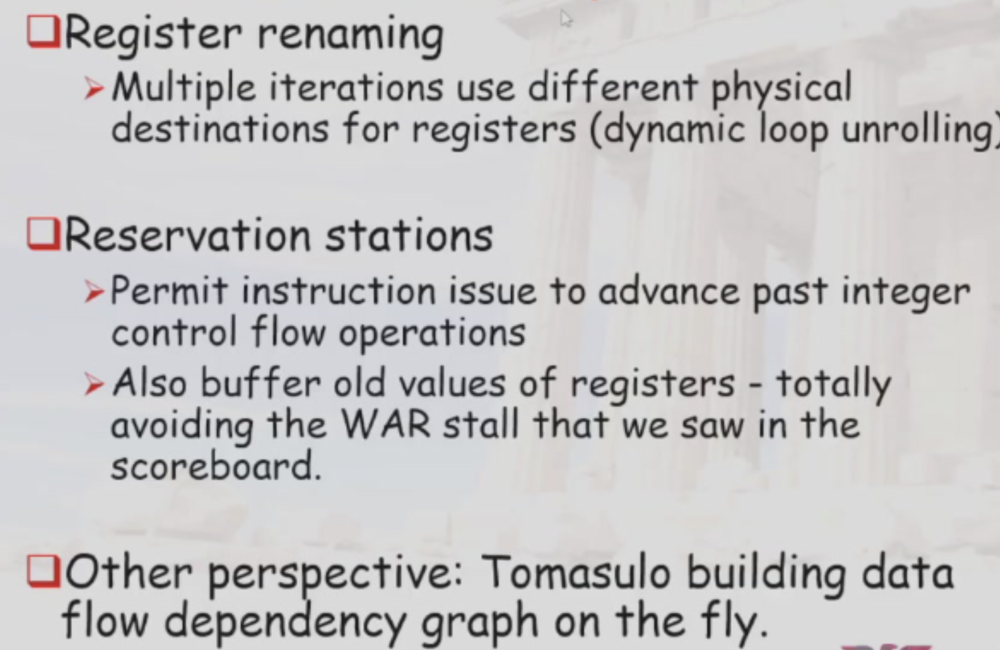
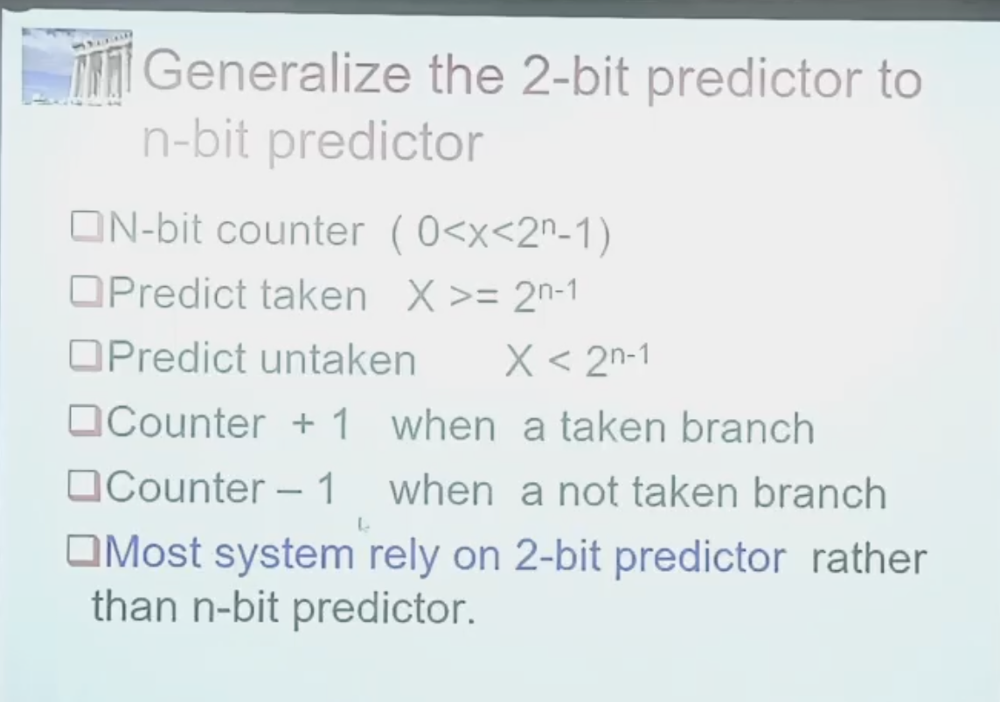
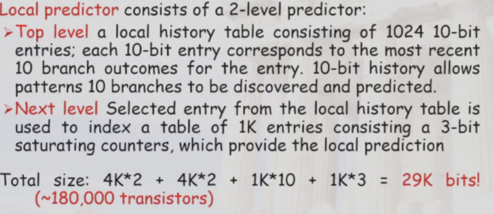
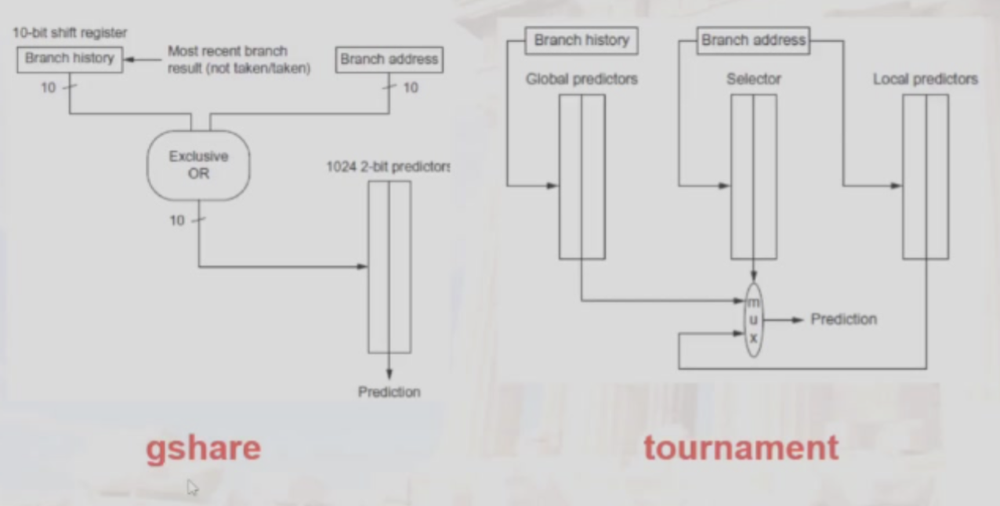
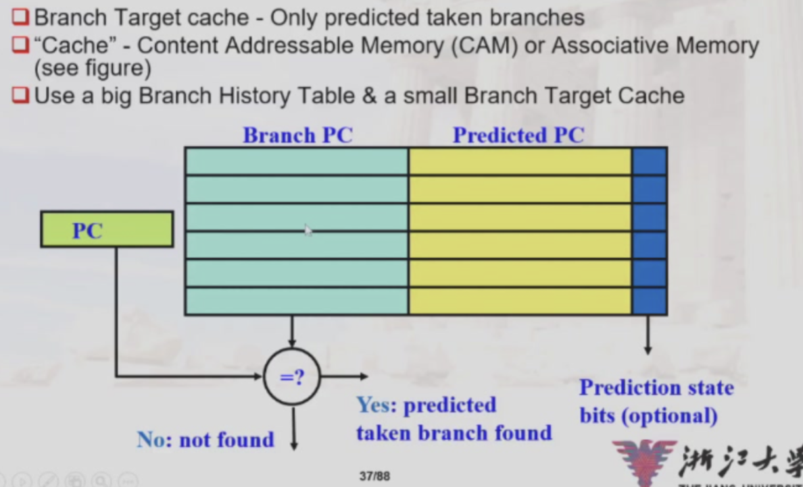

## Review of Pipeline Hazards

* Structural Hazards
  * Occur when two or more instructions require the same hardware resource at the same time.
  * Example: Two instructions trying to access the same memory location simultaneously.

* Data Hazards
    * Occur when an instruction depends on the result of a previous instruction that has not yet completed.
    * Types:
        * Read After Write (RAW): An instruction reads a value before it is written by a previous instruction.
        * Write After Read (WAR): An instruction writes a value before it is read by a previous instruction.
        * Write After Write (WAW): Two instructions write to the same location, and the order of writes matters.

* Control Hazards

## Pipelining some of the FP units

!!! tip "Terminology"

    

* unpipelined structure, structural hazard may occur

* use delay counting while implemented on verilog in labs

* data hazards and exceptions

### Stalls arising from RAW hazards

* load stall
* stall because of previous stalls(sequential issue)

### Solving WAW hazards

* stall until the previous instruction has written its result(WB)
* do not WB the previous instruction

#### Check for WAW hazards

!!! note "Check for Hazards"

    

### The MIPS R4000 Pipeline

* use instruction manipulation

## What is ILP?

* Basic Block is quite small

* reduce CPI

* Hardware-based dynamic approaches

* compiler based

* loop-level parallelism

> vector based instructions(GPU is the way)

> dynamic branch

* name dependence

> renaming

* true dependency

## Lecture for ILP: Software approaches

!!! note "Content"

    

## Dynamic Scheduling

* issue and read operand: should be separated

### Scoreboarding

* in-order issue
* out-of-order completion

* Pipeline stages with scoreboard:

> IF, IS, RO, EX, WB

=== "Concept"

    !!! tip "Scoreboard Basic Concept"

        

=== "More specific"

    !!! tip "More Specific"

        
        

### Limitations of Scoreboard

* size of issue queue

* WAR and WAW

### Tomasulo's Algorithm

* Common Data Pass:

* Op, Vj(Value of Operands), Vk, Qj(reservation station code), Qk, A, Busy

!!! note "Basic Operation"

    

* overlap iterations of loop(when load, etc)

* non-precise interrupts

!!! note

    

### What about Precise Interrupts?

* reordered buffer

### Explicit Register Renaming

* renaming physical registers

* precise interrupts: 

> future file: when ensured that the instruction is no interrupts thus needed writng, the written process can be done

> history file: store in the physical register, yet the previous, or old register will be preserved

## Dynamic Hardware Prediction

### One bit Branch-Prediction Buffer

> take the previous "whether jump"

### Two bit Branch Prediction

> a state machine or a counter

> but 1 0 1 0 1 0 is not as efficient as one-bit buffer

### Generalize the 2-bit predictor to the n-bit predictor

!!! note

    

### Correlating Branch Prediction(m,n)

* m-bit history register($2^m$ situations)

* n-bit saturating counter

### Tournament Predictors

* global and local predictors work together

!!! note
 
    

### Gshare

!!! note 

    

### Branch Target Buffer

* store whether jump and the address

!!! note

    

### Integrated Instruction Fetch

* fetch and branch-predict

### Return Address Predictor

