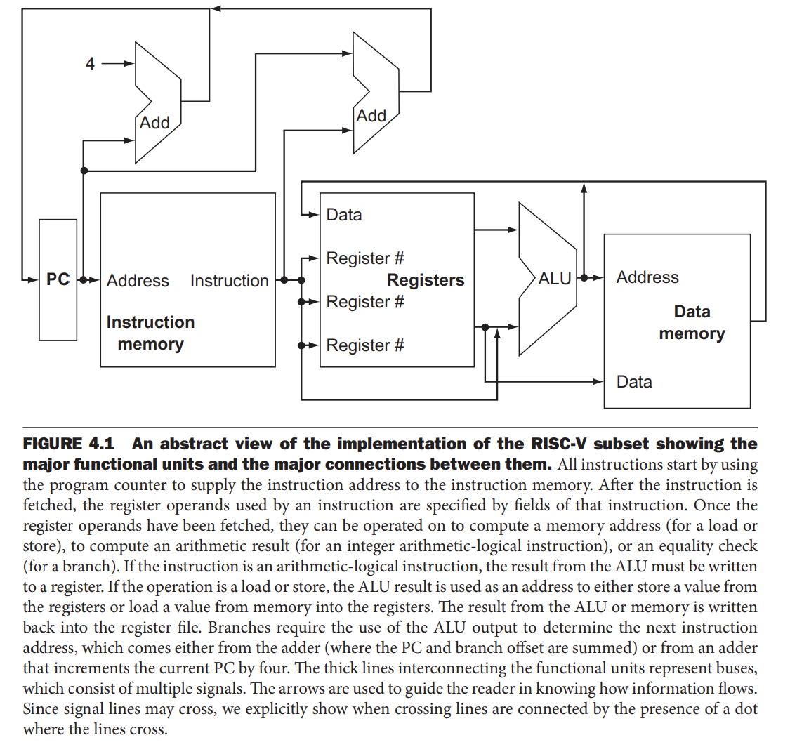
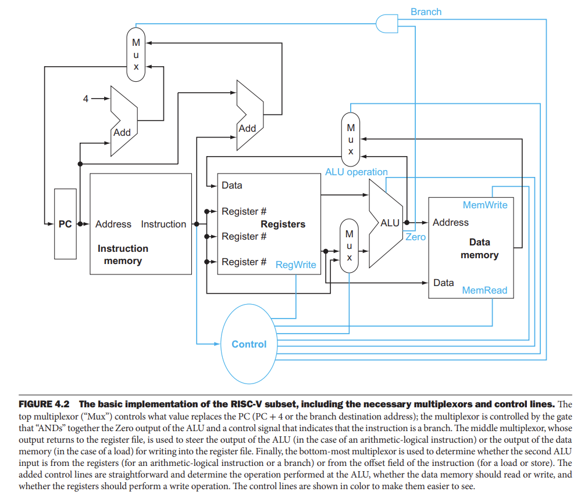
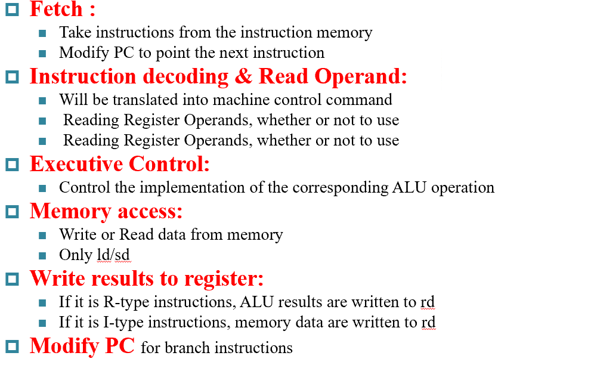
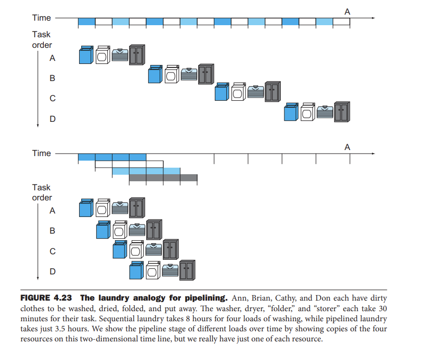

## 4.1 Introduction  
* **Chapter One**:  
> Explain that the performance of a computer is determined by three key factors: instruction count, clock cycle time, and clock cycles per instruction (CPI).  
* **Chapter Two**:  
> Explain that the compiler and the instruction set architecture determine the instruction count required for a given program. However, the implementation of the processor determines both the clock cycle time and the number of clock cycles per instruction. In this chapter, we construct the datapath and control unit for two different implementations of the RISC-V instruction set.  
* **This Chapter**:  
> This chapter contains an explanation of the principles and techniques used in implementing a processor, starting with a highly abstract and simplified overview in this section. It is followed by a section that builds up a datapath and constructs a simple version of a processor sufficient to implement an instruction set like RISC-V. The bulk of the chapter covers a more realistic pipelined RISC-V implementation, followed by a section that develops the concepts necessary to implement more complex instruction sets, like the x86.  
### An overview  
=== "Major Function"  
    !!! note  

          

=== "Major Function With Control"  
    !!! note  

          

----------------------------------------------  

## 4.2 Logic Design Convention  
* Information are encoded in binary to make the information conveyed less sensitive, hence more resilient to noise  
> One wire per bit, multi-bit encoded on multi-wire buses  
> combinational curcuits perform data processing  
> sequential circuits store state  
**Sequential Elements**  
* register: stores data in circuit  
> when clk changes from 0 to one, update with delay  
> a write control shall be implemented in regs->Update only when write control is `1`  
**Clocking Methodology**  
* Combinational logic transforms data during clock cycles  
> its longest delay determines the clock period   
## 4.3 Building a Datapath  
* Datapath:  
> elements that process data and addresses in the CPU  
**basic procedure**  
  

## 4.5 An Overview of Pipeling  
* **Pipelining**:  
> An implementation technique in which multiple instructions are overlapped in execution, much like an assembly line.  
!!! tip "Intro"  

      
    
**The same principle can be applied to instruction execution**
  

