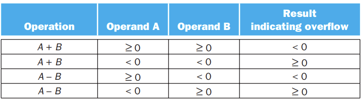
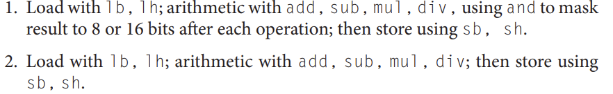
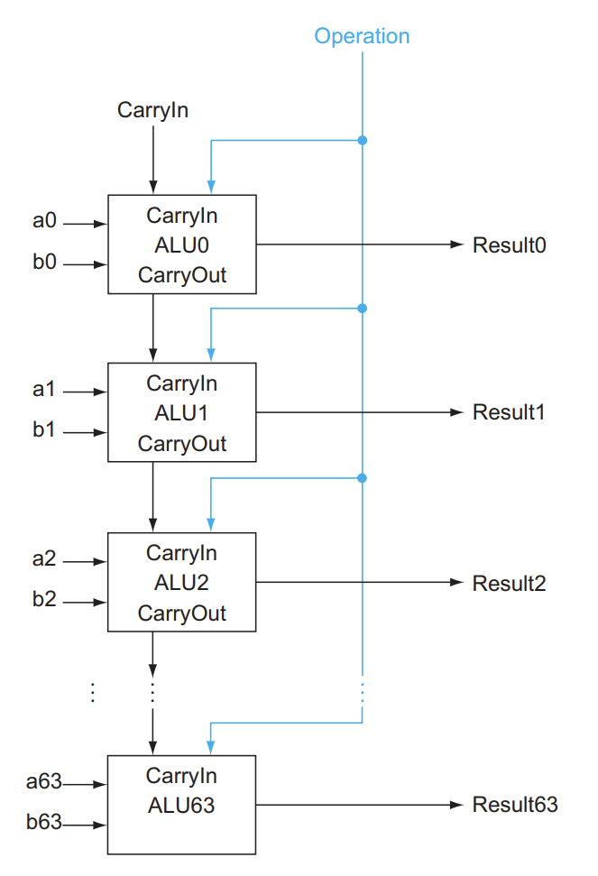
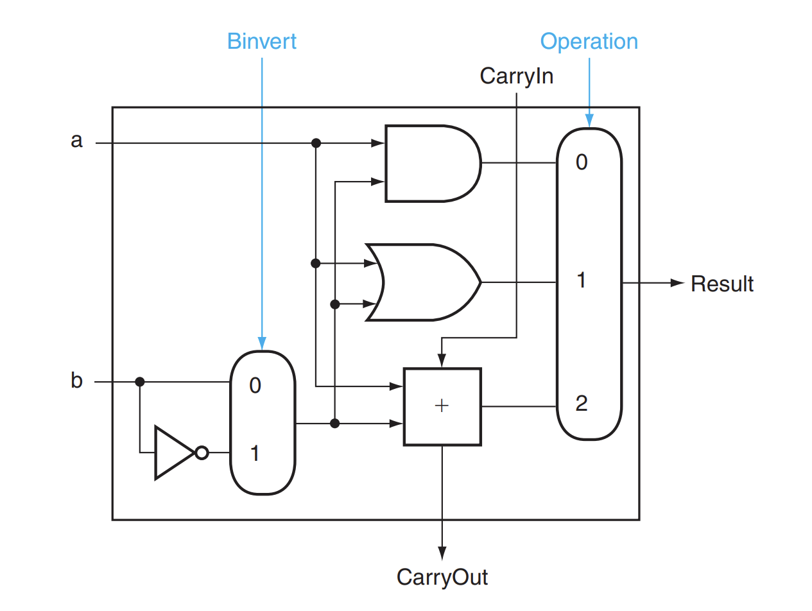
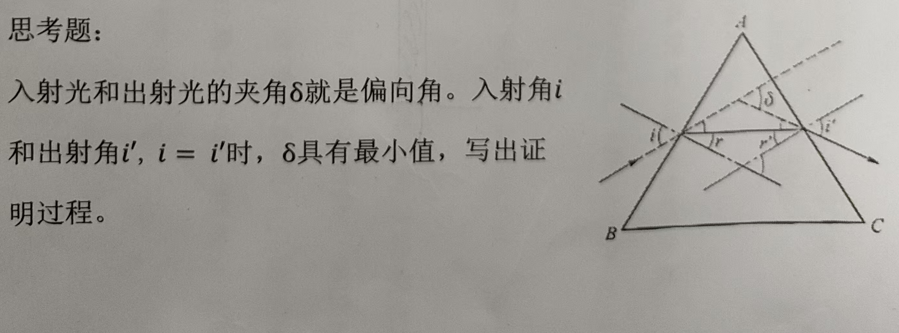
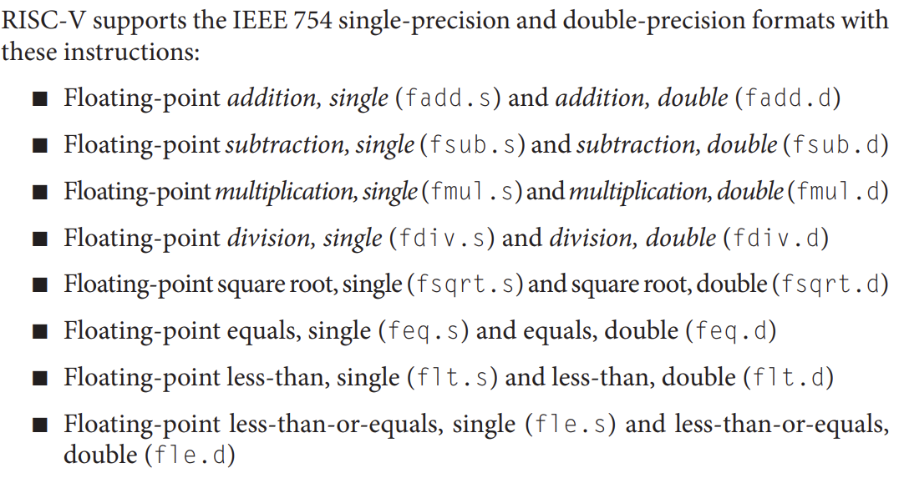
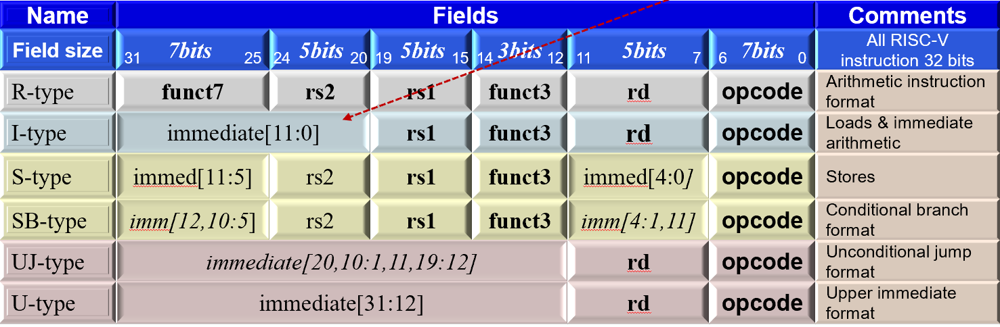
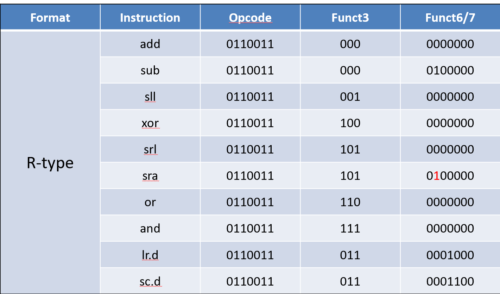
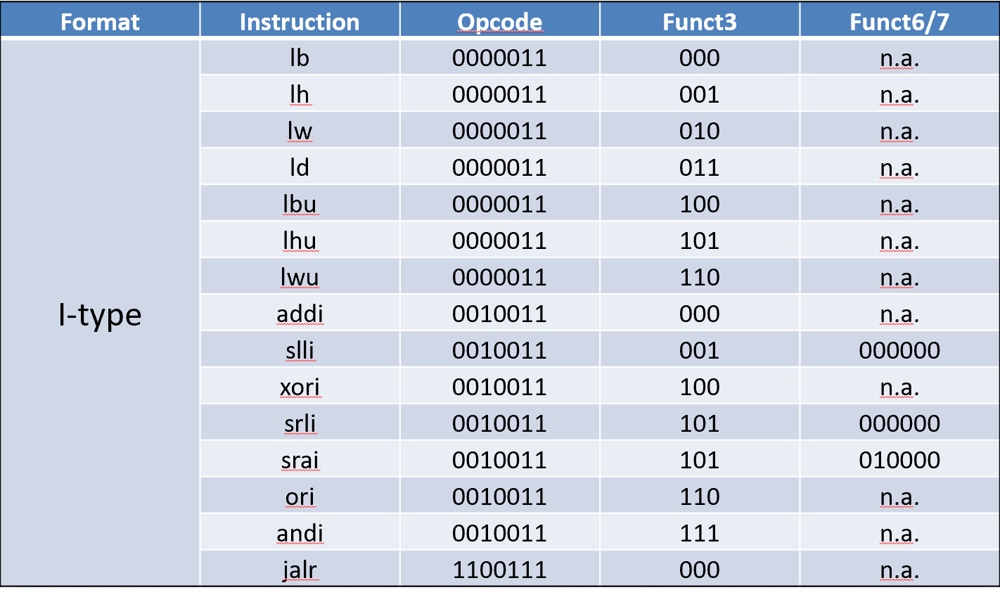
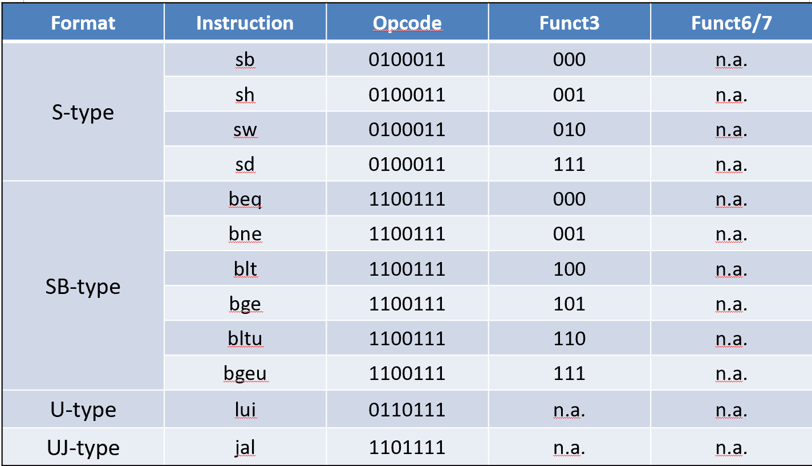

## 3.1 Intro  
!!! Question  

    
Fractions, real numbers, overflow, and how hardware do multiplication and division.
  

## 3.2 Addition and Subtraction  
* Addition:  
add from right to left, carry bit  
* Subtraction:  
directly or via 2's complement  
* Overflow:  
differnet signs: cannot occur  
  
overflow occurs when adding two positive numbers and the sum is negative, or vice versa. This spurious sum means a carry out occurred into the sign bit.  
unsigned overflow: used in memory addresses, where overflow is usually ignored.  
It is easy to detect, for the result smaller than any addends while adding , or the difference bigger than the minuend while subtracting.   
!!! Warning  

    
RISC-V does not have arithmetic operations on byte or halfwords, yet it can still load and store them.
   
       

**Saturation**: when a calculation overflows, the result is set to the largest positive number or the most negative number, rather than a modulo calculation as in two’s complement arithmetic. (media operations, volumn knob)  
!!! note "Acceleration"  

    
implementing anticipation of carries accelerate the adding process, add reduce the time complexity to $O(\log n)$
  
### Impelmentation  
    
a basic implementation of a 64-bit ALU: **a ripple-carry adder** 
significant bit: 权重，位次    
To make it available to calculate negative numbers, we can use 2's complement, and add a carry at the least significant bit.  
  
To make the ALU more suitable for RISC-V:  
we need only connect the sign bit from the adder output to the least significant bit to get set less than(no overflow)  
  
  

## 3.3 Multiplication    
## 3.4 Division  
## 3.5 Floating Point  
1. float: 32-bit, 1 bit for sign, 8 bit for exponent and 23 bit for fraction  
   
2. double: 64-bit, 1 bit for sign, 11 bit for exponent and 52 bit for fraction  
3. interrupt: The address of the instruction that overflowed is saved in a register, and the computer jumps to a predefined address to invoke the appropriate routine for that exception.  
### IEEE 754 Floating-Point Standard  
1. make the leading 1 bit of normalized binary number implicit, therefore, one plus the fraction is named $significand$    
    *  Since 0 has no leading 1, it is given the reserved exponent value 0 so that the hardware won’t attach a leading 1 to it  

2. NaN: Not a Number, used to represent the result of an invalid operation, such as 0/0 or $\infty/\infty$  
  
3. IEEE 754 always keeps two extra bits on the right during intervening additions, called guard and round, 0 to 49 to round down and 51 to 99 to round up   
4. units in the last place:  (ulp) The number of bits in error in the least significant bits of the significand between the actual number and the number that can be represented.  
5. three extra digits are kept in the significand to prevent rounding errors from accumulating.（guard, round, and sticky bits， used in rounding to the nearest even）   
**Assembly $->$ Machine Code** 
  
**operands**  

  
  
  

