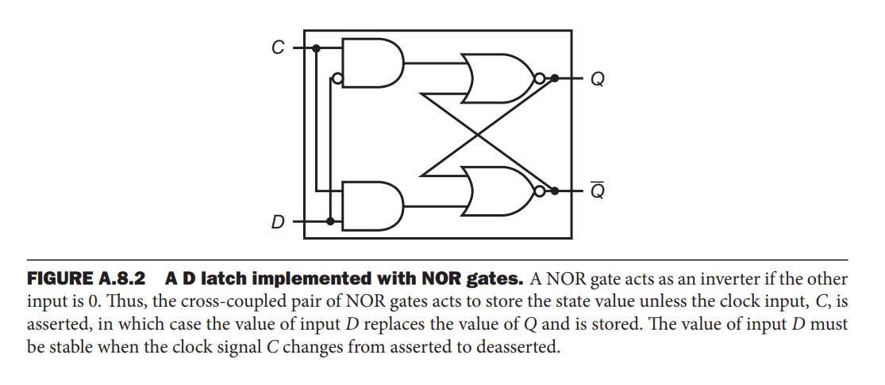
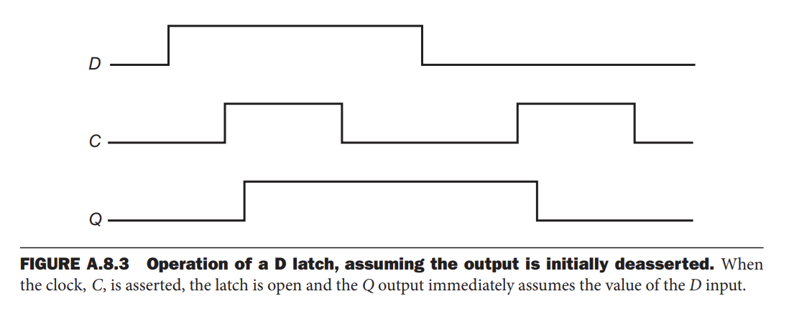
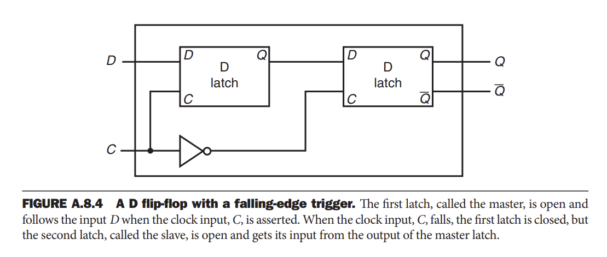
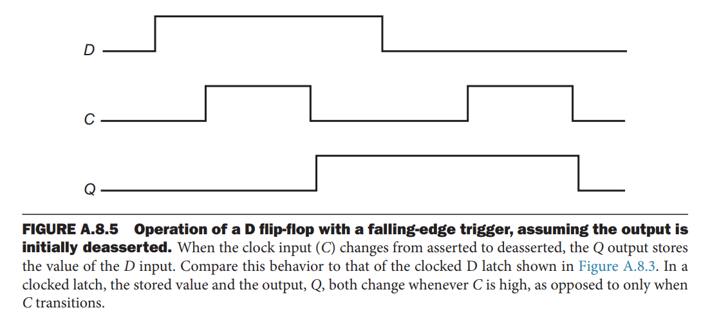
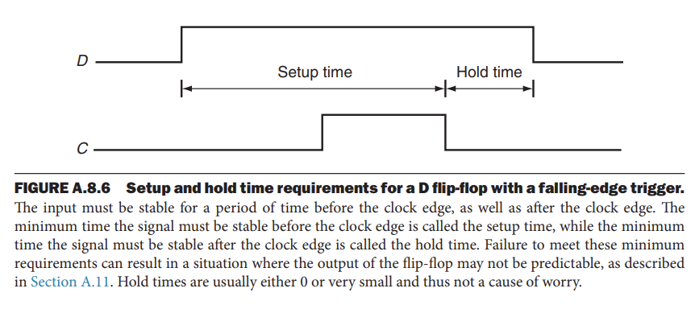
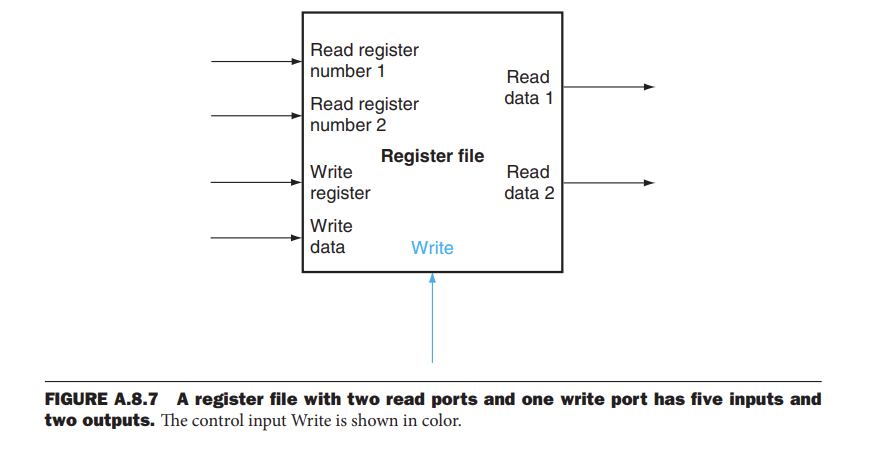

## Flip-Flops and Latches  
- **Latch**: A memory element in which the output is equal to the value of the stored state inside the element and the state is changed whenever the appropriate inputs change and the clock is asserted.  
- **Flip-Flop**: A memory element for which the output is equal to the value of the stored state inside the element and for which the internal state is changed only on a clock edge.
=== "D latch"  
    !!! note "D latch"  

             

=== "Operation of D latch"  
    !!! note  
        
        
         
    
=== "D flip-flop with a falling edge trigger"  
    !!! note
      
          

=== "Operation of D flip-flop"   
    !!! note
     
          

=== "Implementation of D flip-flop with rising edge"
    ```verilog  
       module DFF(clock,D,Q,Qbar);
           input clock, D;
           output reg Q;
           output Qbar;
           assign Qbar = ~Q;  
           always @(posedge clock)
               Q = D;
        endmodule
    ```  
-----------------------------------    
* Setup Time:  
> Because the D input is sampled on the clock edge, it must be valid for a period of time immediately before and immediately after the clock edge. The minimum time that the input must be valid before the clock edge is called the setup time.  
!!! note "Setup Time"  
    
      

----------------------------------------------  
## Register Files  
- **Register File**: A register file consists of a set of registers that can be read and written by supplying a register number to be accessed. A register file can be implemented with a decoder for each read or write port and an array of registers built from D flip-flops.    
=== "Register File"  
    !!! note "Register File"  
        
          

=== "Register File with Read Ports"  
    !!! note "Register File with Read Ports"  
        
          

=== "Register File with Write Ports"  
    !!! note "Register File with Write Ports"  
        
          

=== "Question"  
    !!! question "What happens if the same register is read and written in the same cycle?"  
        
        <center>Because the write of the register file occurs on the clock edge, the register will be valid during the time it is read. The value returned will be the value written in an earlier clock cycle. </center>   

-------------------------------------  
## Specifying Sequential Logic in Verilog  
* Specifying a clock:  
> A clock is not a predefined object in Verilog; instead, we generate a clock by using the Verilog notation #n before a statement; this causes a delay of n simulation time steps before the execution of the statement. In most Verilog simulators, it is also possible to generate a clock as an external input, allowing the user to specify at simulation time the number of clock cycles during which to run a simulation.
```verilog  
   reg clock;
   always #1 clock=~clock;  
```  
* Specify the operation of an edge-triggered register:  
> In Verilog, this is done by using the sensitivity list on an always block and specifying as a trigger either the positive or negative edge of a binary variable with the notation posedge or negedge, respectively  
=== "register"  
    ```verilog  
       reg [63:0] A;
       wire [63:0] B;
       always @(posedge clock)
           A <= B;
    ```  
=== "register file"  
    ```verilog  
       module registerfile(Read1,Read2,WriteReg,WriteData,RegWrite,Data1,Data2,clock);  
              input [5:0] Read1,Read2,WriteReg;  
              input [63:0] WriteData;  
              input RegWrite, clock;  
              output [63:0] Data1,Data2;  
              reg [63:0] RF [31:0];
              assign Data1=RF[Read1];  
              assign Data2=RF[Read2];  
              always begin  
              @(posedge clock) 
              if(RegWrite) RF[WriteReg]<=WriteData;  
              end  
        endmodule;  
    ```  
-------------------------------------  

