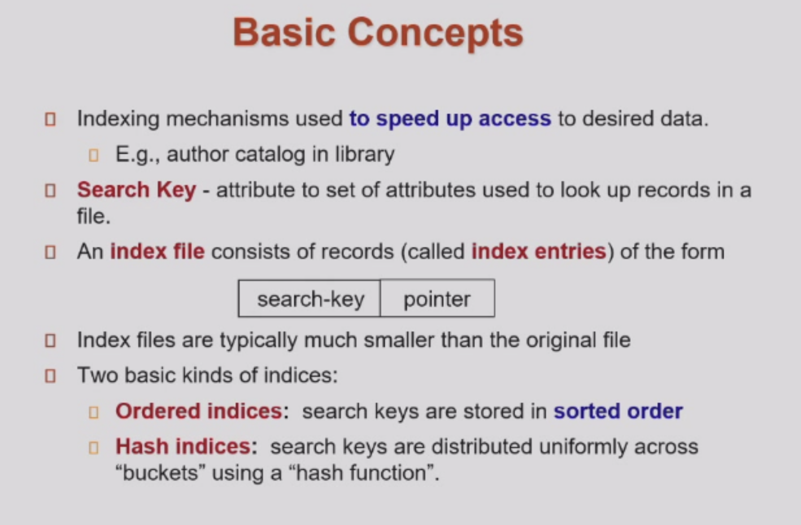
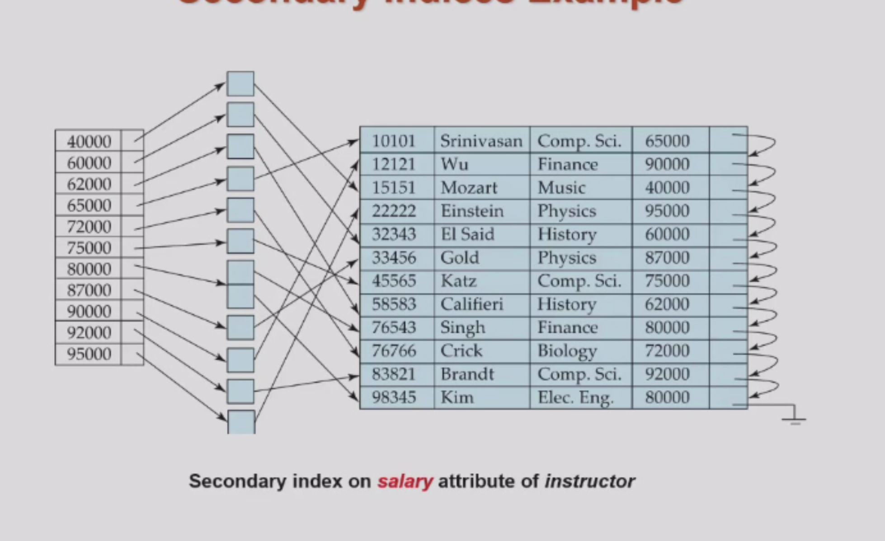
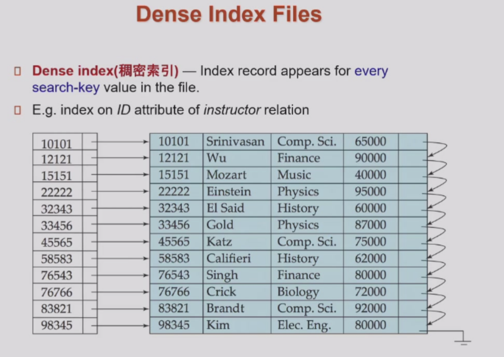
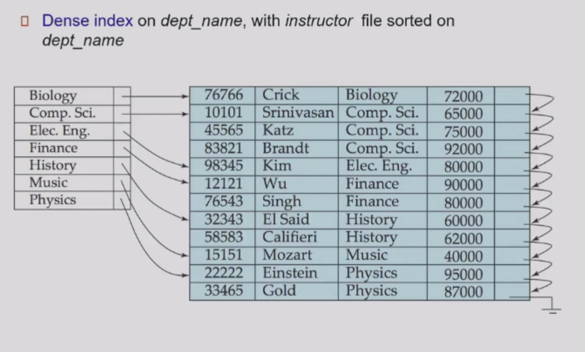
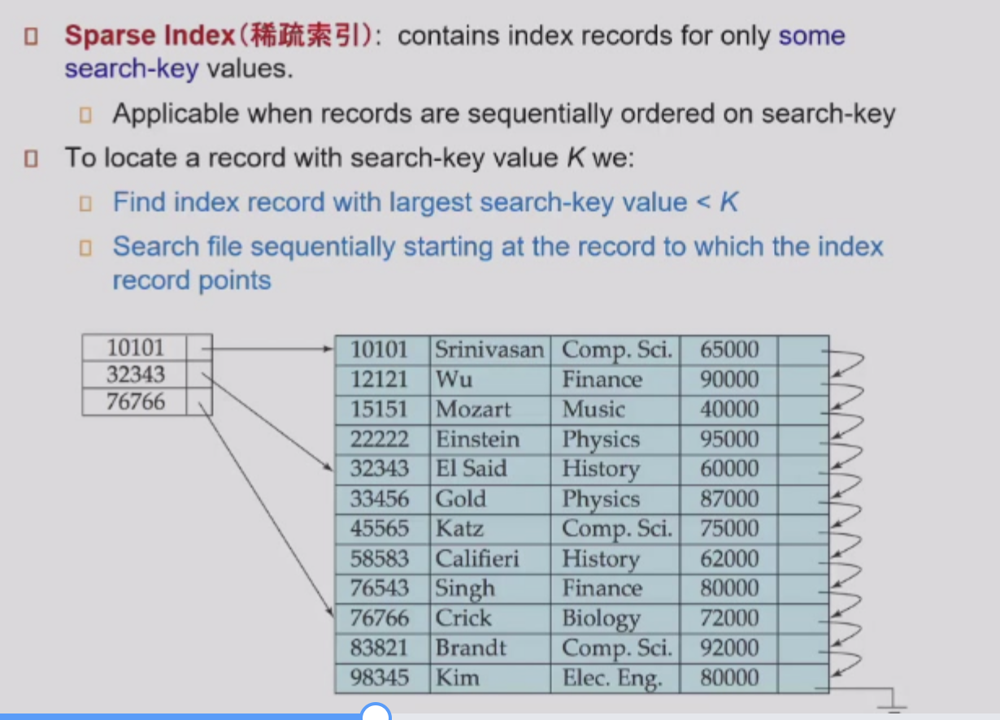
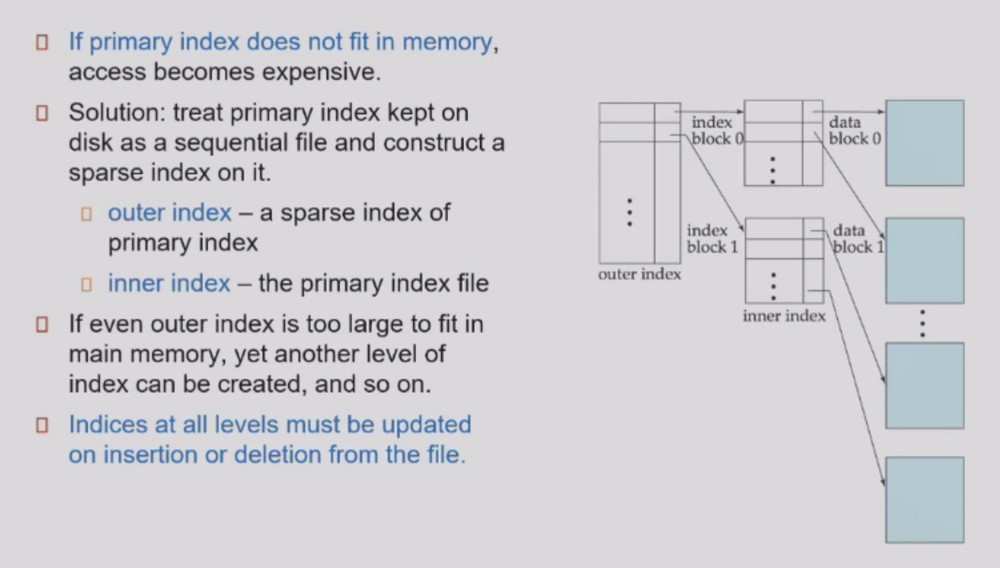

# Index

!!! note "Basic Concepts"

    


## Primary Index

* index sequence is equal to the key sequence

## Secondary Index

!!! example

    
    


## Dense INdex Files

!!! note

    
    

## Sparse Index Files

!!! note

    


## Multilevel Index

!!! note

    


## B+ Tree

* If there are K search-key values in the file, the tree height is no more than $\lceil \log_{n/2} K \rceil$.
searches can be conducted efficiently.

```less
C=root
While C is not a leaf node {
 Find the minimum i s.t. V <= Ki. //find from left to right in the node
 If found { if (V= Ki ) Set C = Pi +1 else set C = Pi} 
 Else set C = last non-null pointer in C
}
//now go to the leaf node and search in the leaf node
Find the minimum i s.t. Ki = V
If found, follow pointer Pi to the desired record.
Else no record with search-key value k exists.
```

* A node is generally the same size as a disk block, typically 4 kilobytes

* n is typically around 100 (40 bytes per index entry).

* The height of the tree is no more than $\lceil \log_{n/2} K \rceil$.


    

