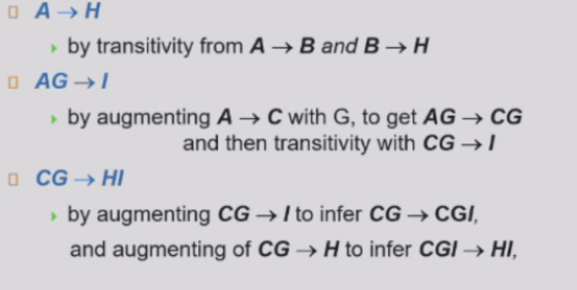
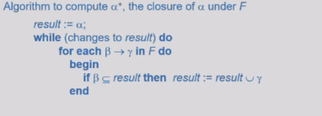
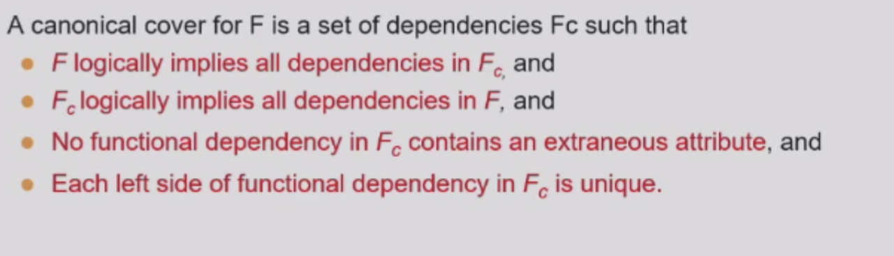
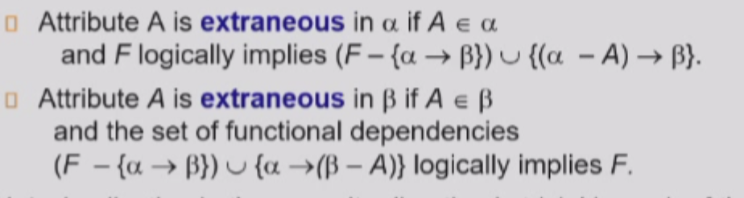
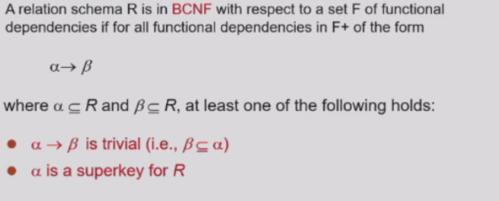
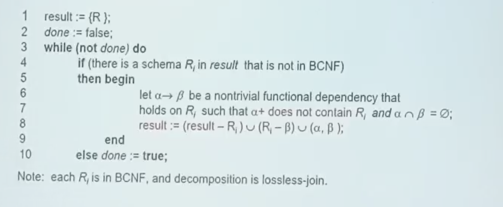
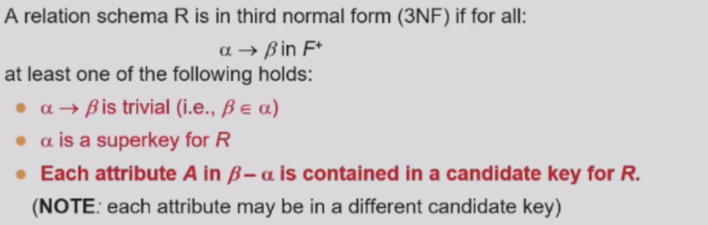
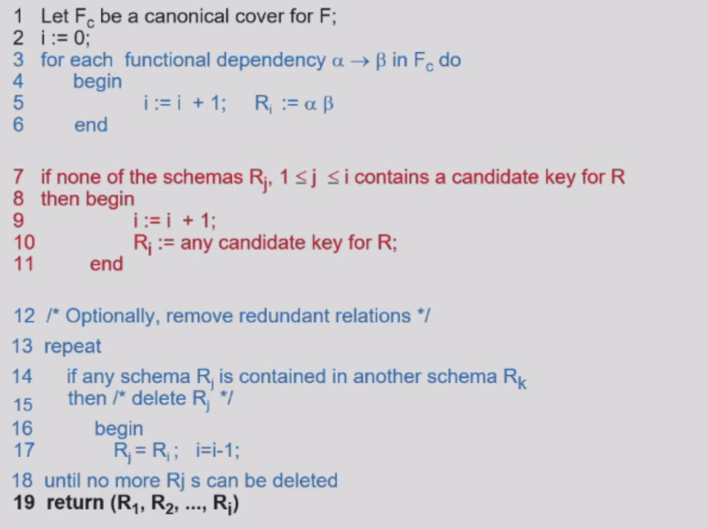

## Functional Dependencies

* K is a superkey of relation R if and only if K->R

* candidate key

> K->R
> for no proper subset K' of K, K'->R is true

* a bad relationship: exist an attribute A in R such that K->attribute yet K is not i n a superkey of R

* trivial functional dependency:

> K->A is trivial if A is a subset of K

* Closure
> The closure of a set of attributes K with respect to a set of functional dependencies F, denoted by F+, is the set of all attributes that are functionally determined by K under F.
**A->b, b->c, then A->c is a functional dependency in F+**

* 公理系统

> 1. reflexivity: 
>    if Y is a subset of X, then X->Y
> 2. augmentation:
>    if X->Y, then XZ->YZ for any Z
> 3. transitivity:
>    if X->Y and Y->Z, then X->Z

!!! tip "Example"

    
    * ab->cb is equal to av->c

!!! note "$A^+$"

    * $A^+$ is the closure of A with respect to F, the attributes it can determine

!!! tip "pseoducode"

    

* 其实本质上就是一个有向图

### Uses of Attribute Closure

* testing superkey

* testing function dependencies

* compute closure of F

> compute the closure of all the subset of F
> compute the subset of the determinants of all the subset of F

### Canonical Cover正则覆盖

!!! tip "Explanation and Definition"

    

### Extraneous Attributes无关属性

!!! tip "Explanation and Definition"

    

### Boyce-Codd Normal Form (BCNF)

=== "BCNF Definition"
    
    !!! note "definition"

        

=== "Implementation"

    !!! tip "pseudocode"

        

* decomposing a schema into BCNF

### Dependency Preservation

* a decomposition of relation R into relations R1, R2, ..., Rn is dependency preserving if every functional dependency in F+ can be enforced by a set of functional dependencies on the relations R1, R2, ..., Rn

### Third Normal Form (3NF)

=== "3NF Definition"
   
    !!! note "definition"

        

=== "Implementation"

    !!! tip "pseudocode"

        

    

    