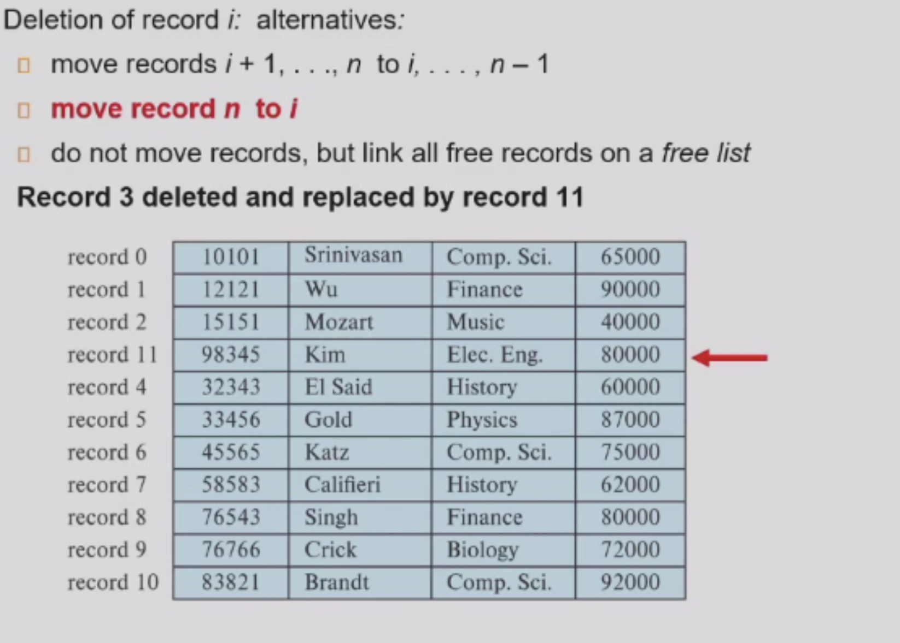
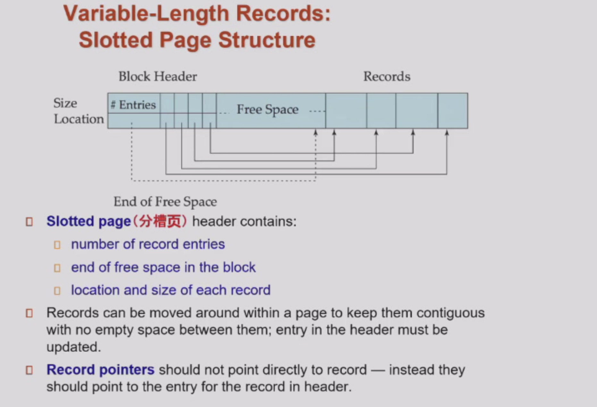
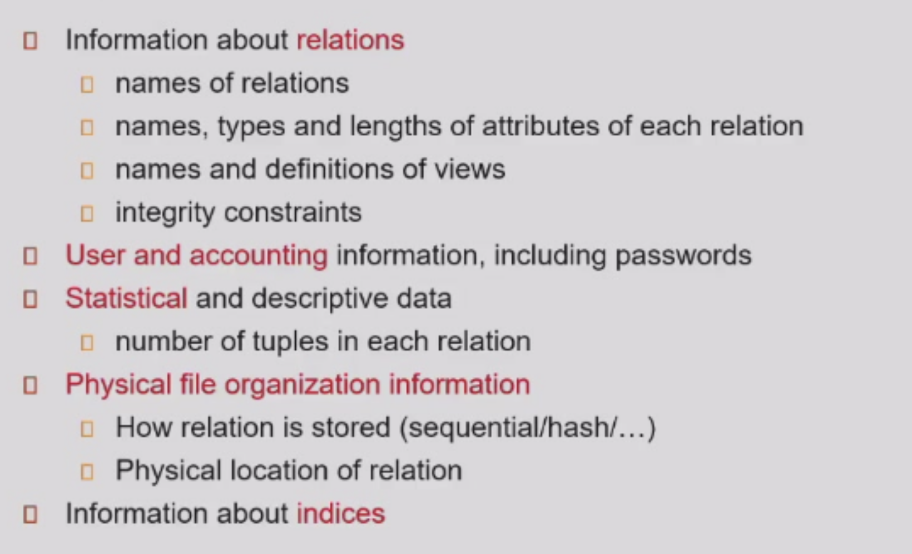
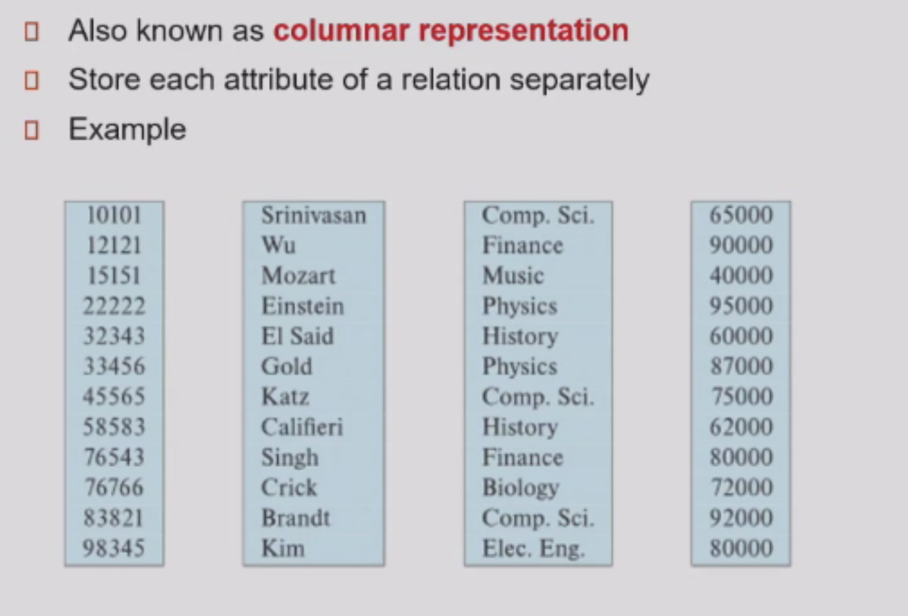
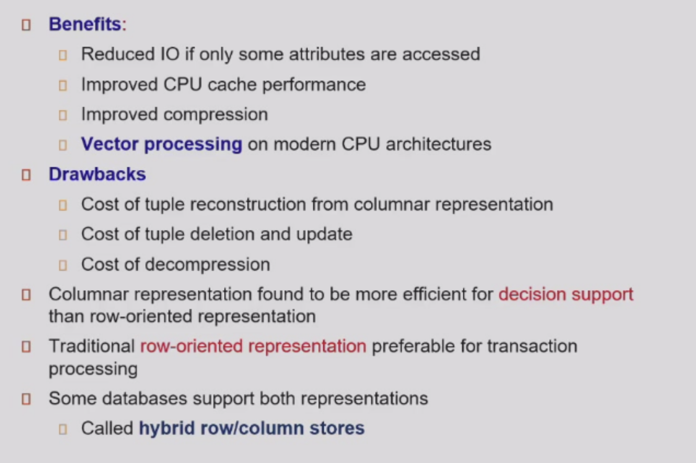

# Data Storage Structures

* database are stored as files, files are stored as seqeuential records, and records are stored as sequential fields

## Fixed-Length Records
 
* Deletion:

!!! note 

    

## Variable-Length Records

* null-value bitmap

### Slotted Page

!!! tip "Structure"

    

* When deletion, set to null

## Organization of records in Files

* Heap

* Sequential

* in a multitable clustering file organization: records of several different relations can be stored in the same file

* B+ tree

> records are stored in leaf nodes, and the internal nodes are used to direct the search

* hashing

### Heap

* Free-spaced map

### Sequential

* difficult to insert and delete, therefore use pointer

### Multitable clustering: help joining

### Table Partitioning

* hel single-fetch

## Data dictionary storage

!!! note

    

## LRU

* use a queue, the recent access one,  put the first

### Clock: An Approximation to LRU

* use a circular queue, and a reference bit

* unpin: reference_bit=1, which can be replaced

* when encountered a reference_bit=1, set to zero when used

* when encountered a reference_bit=0, replace it

## Column Oriented Storage

!!! note 

    
    * really good at analysis, as analysis require heavily on a single column
    

* cash-aware storage

