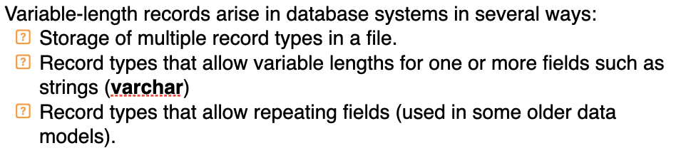
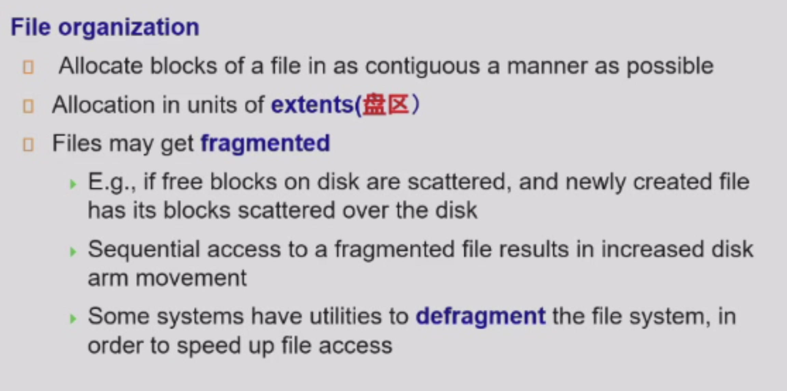
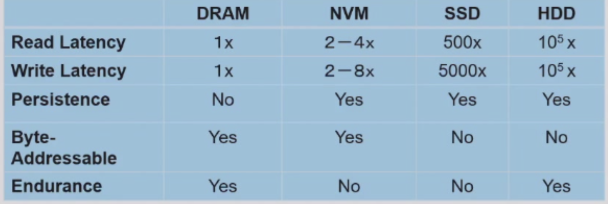

# Physical Storage Systems

## Magnetic Disk

* Read-Write head

> * reads or writes magnetically encoded information

> * surface of platter divided into circular tracks

> * track is divided into sectors
>    * Sector size typically 512 bytes Typical sectors per track: 500 to 1000 (on inner tracks) to 1000 to 2000 (on outer tracks)

> * To read and write a sector

* Disk Controller: interfaces between the computer system and the disk drive hardware.

> * initiates actions such as moving the disk arm to the right track and actually reading or writing the data
> * Computes and attaches checksums to each sector to verify that data is read back correctly
>     * If data is corrupted, with very high probability stored checksum won’t match recomputed checksum

> * Ensures successful writing by reading back sector after writing it

> * Performs remapping of bad sectors

* Performance Measures of Disks

> * Access Time: the time it takes from when a read or write request is issued to when data transfer begins  

> * Seek Time: time it takes to reposition the arm over the correct track. 
>    * Average seek time is 1/2 the worst case seek time.
>    * Would be 1/3 if all tracks had the same number of sectors, and we ignore the time to start and stop arm movement

> * 4 to 10 milliseconds on typical disks
> * Rotational latency: time it takes for the sector to be accessed to appear under the head.

>    * Average latency is 1/2 of the worst case latency.

>    * 4 to 11 milliseconds on typical disks (5400 to 15000 r.p.m.)

> * Data transfer rate: the rate at which data can be retrieved from or stored to the disk.
>    * 25 to 200 MB per second max rate, lower for inner tracks
>    * Multiple disks may share a controller, so rate that controller can handle is also important

> * Disk Block: a logical unit for storage allocation and retrieval
>    * Smaller blocks: more transfers from diskDisk 
>    * Larger blocks: more space wasted due to partially filled blocks

> * Sequential access pattern:
>   * Successive requests are for successive disk blocks
>   * Disk seek required only for first block

> * Random access Pattern:
>   * Successive requests are for blocks that can be anywhere on disk
>   * Because of the fact that each access required a seek, transfer rates are low since a lot of time is wasted in seeks

> * I/O operations per second (IOPS)

>    * Number of random block reads that a disk can support per second
>    * 50 to 200 IOPS on current generation magnetic disks
> * MTTF(Mean time to failure):  the average time the disk is expected to run continuously without any failure.
>   * Typically 3 to 5 years
>   * MTTF decreases as disk ages

## Flash Storage

* NAND flash

> * used widely for storage, cheaper than NOR flash

> * requires page-at-a-time read
>   * 20 to 100 microseconds for a page read
>   * Not much difference between sequential and random read

> * Page can be writtem once
>   * Must be erased to allow rewrite

* Solid state disks

> * Use standard block-oriented disk interfaces, but store data on multiple flash storage devices internally

> * Transfer rate of up to 500 MB/sec using SATA, and up to 3 GB/sec using NVMe PCIe

> * Erase happens in units of erase block
>    * Takes 2 to 5 millisecs
>    * Erase block typically 256 KB to 1 MB (128 to 256 pages)

* Remapping

> * Remapping of logical page addresses to physical page addresses avoids waiting for erase
> * Flash translation table

>   * also stored in a label field of flash page

>   * remapping carried out by flash translation layer

* Flash translation table

> * also stored in a label field of flash page
> * remapping carried out by flash translation layer

* Wear Levelling

## SSD

* Random reads/writes per second
    * Typical 4KB reads:  10,000 reads per second (10,000 IOPS)

* Typical  4KB writes: 40,000 IOPS

* Parallel reads:
    * Typical 4KB reads:

    > 100,000 IOPS with 32 requests in parallel (QD-32) on SATA
    > 350,000 IOPS with QD-32 on NVMe PCIe

* Data transfer rate for sequential reads and writes

> 400 MB/sec for SATA3, 2 to 3 GB/sec using NVMe PCIe

* Hybrid disks:

> combine small amount of flash cache with larger magnetic disk

## Optimization of Disk-Block Access

* Buffering

> * in-memory buffer to cache disk blocks
> * Read-ahead: Read extra blocks from a track in anticipation of future requests
> * Disk-arm scheduling: algorithms re-order block requests so that disk arm movement is minimized
>   * Elevator algorithm: requests are serviced in the order they arrive, but the disk arm moves in one direction until it reaches the end of the disk, then reverses direction and services requests in the opposite direction.

* File Organization

> * Allocate blocks of a file in as contiguous a manner as possible
> * Allocation in units of extents
> * Files may get fragmented

>    * if free blocks on disk are scattered, and newly created file has its blocks scattered over the disk

>    * Sequential access to a fragmented file results in increased disk arm movement

>    * Some systems have utilities to defragment the file system, in order to speed up file access

> * Non-volatile write buffers 

## File Organization, Record Organization and Storage Access

* File Organization

> * Each file is a sequence of records.  A record is a sequence of fields.

> * Record access is simple but records may cross blocks
>      * Modification: do not allow records to cross block boundaries
> * Deletion of Record i:
>      * move records i + 1, . . ., n to i, . . . , n – 1; move record n  to i; do not move records, but link all free records on afree list

* Free Lists

> * Store the address of the first deleted record in the file header. Use this first record to store the address of the second deleted record, and so on

> * Can think of these stored addresses as pointers since they “point” to the location of a record.

> * More space efficient representation:  reuse space for normal attributes of free records to store pointers.  (No pointers stored in in-use records.)

* Variable-Length Records

!!! note "Definition"

    

* Null values represented by null-value bitmap

* Variable-Length Records: Slotted Page Structure

> * Slotted page header contains:
>     * number of record entries; end of free space in the block; location and size of each record

> * Records can be moved around within a page to keep them contiguous with no empty space between them; entry in the header must be updated.

> * Pointers should not point directly to record — instead they should point to the entry for the record in header.

## Storing Large Objects

* Records must be smaller than pages

    
 

* Buffering

> Read-ahead(Pre-fetch): Read extra blocks of data into the buffer in anticipation of future requests.

> Disk-arm scheduling: algorithms re-order block requests so that disk arm movement is minimized.: Elevator algorithm

* File Organization: defragment

!!! note

    

* Optimization of Disk Block Access

> Non-volatile write buffers

> log disk

* flash storage

> NAND flash: non-volatile storage technology that uses memory cells made of floating-gate transistors. Page-at-a-time read, but be erased before rewrite

> SSD(Solid State Disks): a type of storage device that uses NAND flash memory to store data. block-oriented

> logic memory address: one block, when erased and written too many times, might become unusable. 

> wear leveling: a technique used in SSDs to distribute write and erase cycles evenly across the memory cells to prolong the lifespan of the device.

* NVM: 

!!! tip 

    

