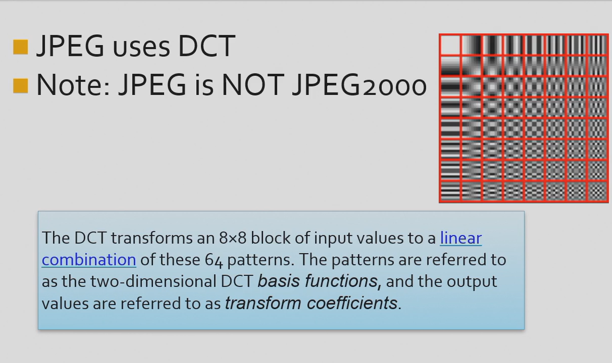

## Digital image representation  
* **Digital image**: a 2D array or matrix of small elements called **pixels**.  
* Eachpixel in a grayscale image is represented by a byte (8 bits), which can take on 256 different intensity values.   
* A color image is represented by three bytes (24 bits) per pixel, one byte for each of the three primary colors: red, green, and blue.
??? tip   

    <center>Another byte called alpha, representing the transparency.RGB are stored in three distinct arrays. The sequence might be different</center>   

## Image format    
* Representative format: BMp(windows,mostly without compression), GIF, JPEG(compression with loss), PNG, TIFF, etc.   
* Characteristic of image: pixel based, rectangle region, with information stored  
* Encoding method: without compression, with loss, with lossless, etc.  

* *BMP format*:  
   * One of the standard formats for storing bit-mapped images on Microsoft Windows systems.  
   * sometimes saved as .dib  
   * mostly organized in a non-compressed way.  
   * can be compressed though  

* *BMP file structure*:  
   * **File header**: 14 bytes, containing information about the type, size, and layout of the file.  
   * **Info header**: 40 bytes, containing information about the image, such as its width, height, and color depth.  
   * **Color table**: 0 or 1024 bytes, containing the colors used in the image.  
   * **Pixel data**: the actual image data.   
     
   * Palette: a table of colors used by the image.(not used right now, was used to save space(for those monitors with limited color display))   
   * image data: color greyscale image(if you want to convert a 24-bit image to a greyscale image,set the R G B data of every pixel to one number)    
      
!!! tip  

    <center>bfOffBits stores the offset from beginning of the file to bitmap data, therefore if you don't want to alter the bitmap information header,use this. </center>  

  
  
* a few things that worth a notice:  
bisize: the bytes of BITMAPINFOHEADER  
biheight: if positive: inverted
          else: upright  
bibitcount; the number o bits used to store one pixel  
biXPelsPerMeter: the size of pixel(number of pixels per meter)(horizonal)  
!!! tip "possible usage in daily life"  

    <center>Embed picture in essays, How much dpi?(shall be elevated to be professional,keep the balance between size and clarity)</center>

  
  
whether it is inverted or not, one shall be cautious  
  
## Basic principle of imaging:  
___imitate an eye__  
*what is the suitable size of the aperture?*  
* too big: 虚化  
* too small: clear yet not bright enough and 衍射 
* Lens * 


Both aperture and depth of field can effect the circle of confusion  
Lens Group: f can be changed  
## Digital Camera  
1. CCD: 
Charge Coupled Device: Now we use CMOS more often
photodiode: stimulated to release charges, and produces electrical signals  


Amplifier
2. AD:  
3. DSP: digital image processor (worth doing) 
4. Mermory    


## Physicsal meaning of color  
  
Dichromatic Reflection Separation: 
* Specular reflection: mirror reflection  
* Diffuse reflection: scattering reflection    
> dealing with the reflection of light, the color of the object is determined by the light source and the object itself.  

Color can be divided into chromatic color and achromatic color(no color).  
* Chromatic color: the color of the object itself.  
  
## Three-primary colors  
* RGB: additive color mixing  
  
R: 700nm  
G: 546.1nm  
B: 435.8nm  
human eyes can see far more colors than colors generated by normal monitors  
!!! tip  

    <center>Absolute color vision is not precise: human identifies color by visual context(comparing)</center>  

  
## Properties of color vision  
* Perceptive ability:  
  
different people have different  
Webber's Law: the difference between two colors is proportional to the background.  
  
  
Priority: first the hue(色调) changes, saruration(饱和度) changes, then the brightness changes.   
Sensitivity: human eyes are the most sensitive to the lightness changes and have the best resolution,  
which is responsible for the eyes' HDR capacity  
*device dependent color space model:*  
RGB, CMY, YUV, YIQ, YCbCr, HSV, HSL, etc.  
*device independent color space model:*  
CIE XYZ, CIE L*a*b*, CIE L*u*v*, etc.  
!!! question "Why independent?"  

    <center>the color space model should be independent of the device to convert image data to various devices</center>  

*RGB color model*  

* RGB is a subset of CIE primary color space  
* TV, Phones  

*CMY color model*  
  
* delete the color that is not needed(main idea)  
* printer  
!!! note  

    <center>C,M,Y,K(black)to save money while printing</center>  

subtractive color mixing(cmy)/ additive color mixing(rgb)  

*HSV color model*  
    
Adantage of HSV color model:  
  
more efficient and precise when altering pictures  
*CIE XYZ*  
XYZ follows three-primary color theory  
has direct relationship with RGB monitors  
*CIE L*a*b*  
  
*CIE YUV*  
  
## JPEG format  
* Joint Photographic Experts Group  
  * Founded in 1986, presented the first standard in 1992, accepted by ISO in 1994  
* File extension: .jpg, .jpeg, .jpe, .jfif  
* Compression format for static image  
  * Lossy compression  
* Encoding based on transformation  
    * DCT(Discrete Cosine Transform)(离散余弦变换，利用信息出现的频率来决定压缩的程度) 
!!! note  

    <center>.jpeg can also be used in video compression, when the background of the video is not moving, the video can be compressed by jpeg.(H264)</center>  

* JPEG2000 is baes on wavelet(小波变换，曾与深度学习一般火)  
* Different manipulationd for high-frequency signal and low frequency signal（有点像霍夫曼编码）    
* high frequency signal   

* Compression strategy: set a compression ratio,remove information from high frequency to low frequency  
* JPEG advantages:  
  * High frequency information occupies much more memmory. Hence, high frequency removal leads to high compression ratio  
  * Low frequency information preserves the principle structure and color distribution of object, which is the key factors of an image  
* suitabe for internet based visual media  


## JPEG syntax(just for acknowledgement)
  
DQT: DCT changes, quantization to a table(rounding)  
DHT: Huffman coding(a tree or a priority queue or trees)

  
APP0 Marker  
  
APP1 Marker: EXIF use APP1 to store meta data  
如背景虚化可以通过光圈大小和焦距  
ISO（感光度）的数值越大，光感度越高，但是噪点也会增加   
快门速度不能太慢，否则会模糊  
motion blur might occur  
  
Quantization table: quantize the high frequency region  
  
  
DPCM encoding: 
  
  
  
the evaluation of the quality of the image has its own regulations  
*JPEG disadvantage*  
* Nort for line drawing, text, symbol, icon, etc.  
* its lossy  compression leafs to unavoidable artifacts  
!!! warning  

    <center>Do not use it in essays</center>  

## TIFF format  
  
some public rules,and some private sections   
*characteristic*  
   
Basic TIFF sturcture:  
  
mono: greyscale  

## GIF examples  
Graphics Interchange Format  
encoding method: LZW  
   
## Image processing data structure  
* Matrices
* Chains  
### Matrics  
matics of different resolution  
  
to calculate the length between two images  
different rows are different channels  
### Chains  
chains are used for description of object borders  
avoid sparse matrics  
## Windows APIs for accessing images  
```s  
#include <windows.h>  
```  
## Matlab image processing toolbox 
* Image processing toolbox  
  
***How amazing!!!***  
* main contents  
  
## Adobe Photoshop  
* Function: professional software for image processing  
## GIMP  
* Function: open source software for image processing  
has source code, supporting linux and windows  
## Shadow magic hands  
* a photo quality enhancement and personalization software  


