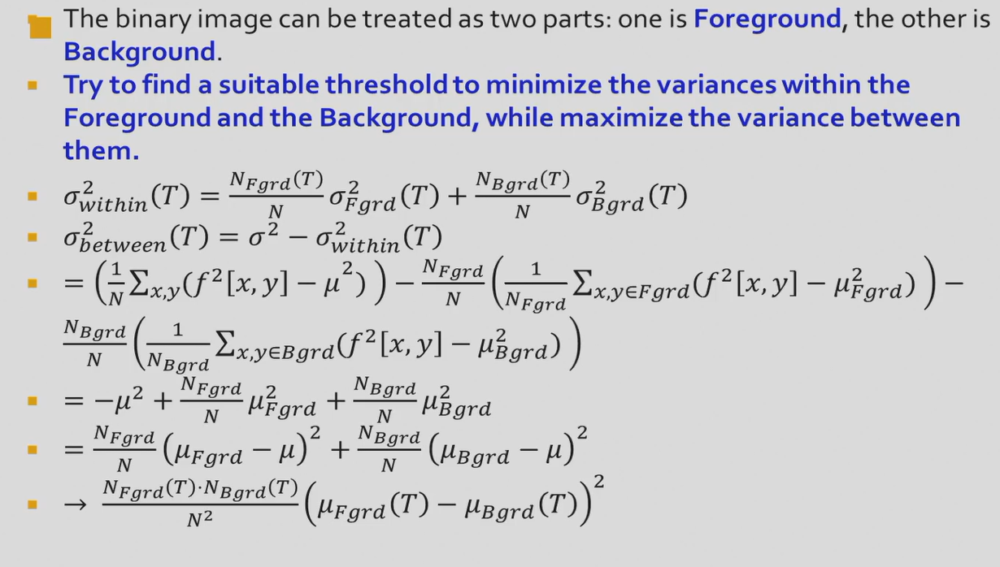
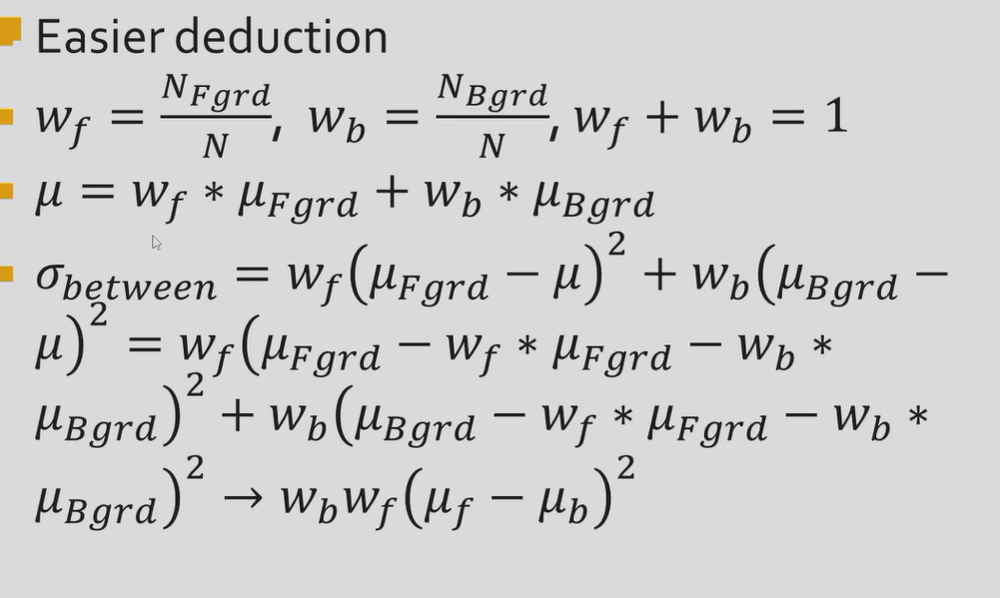

## Binary image  
* Binary image:  
    * 0: black  
    * 1: white (255)  

 **advantages**  
 * less memory  
 * easy to process  
 * can sometimes be applied on grayscale image  
 * more cheap 
  
**disadvantage**  
* application field is limited  
* cannot be applied on D data  
* less expressive force, fial to express the color and gray level of the image  

### Acquisiton of binary image  
* **Thresholding**:  
$I(x,y)=0 if I(x,y)<Threshold$  
$I(x,y)=255 if I(x,y)>=Threshold$  
!!! Qustion "How to find a good threshold?"  

    <center>大津算法</center>  
      

```matlab
    img=imread('INPUT_FILE.bmp'); 

    gray_img=rgb2gray(img);  
    binary_img=imbinarize(gray_img); 
    subplot(1,2,1); 
    imshow(gray_img);
    title('Grayscale Image');
    subplot(1,2,2);
    imshow(binary_img);
    title('Binarized Image');
```
Try to find a suitable threshold to minimize the variances within the foreground and background, while maximize the variance between them.  
$N_{Fgrd}$: the number of pixels in the foreground  
$N_{Bgrd}$: the number of pixels in the background  
$\sigma_{Fgrd}^2$: the variance of the foreground  
$\sigma_{Bgrd}^2$: the variance of the background  
$\sigma_{within}^2$: the variance within the foreground and background  
$\mu_{Fgrd}$: the mean of the foreground  
$\mu_{Bgrd}$: the mean of the background  
**Simplified formula**:  
  
$\sigma_{between}=w_b*w_f*(\mu_{Fgrd}-\mu_{Bgrd})^2$ (use findmax loop to find the maximum value of $\sigma_{between}$)  
**Otsu's method**: embedded in matlab 
```matlab
    threshold=graythresh(gray_img);
    binary_img=imbinarize(gray_img,threshold);
```  
      
!!! tip  

    <center>Numerical Analysis can bew imoplemented to find the optimal threshold</center>  

## Generalization  
  


## Weber's law  
* **Weber's law**:  
> $\frac{\Delta I}{I}=k$   
> $\Delta I$: the smallest difference that can be perceived by human eyes  
> $I$: the intensity of the light  
> $k$: constant, between 0.01 and 0.02  
  


