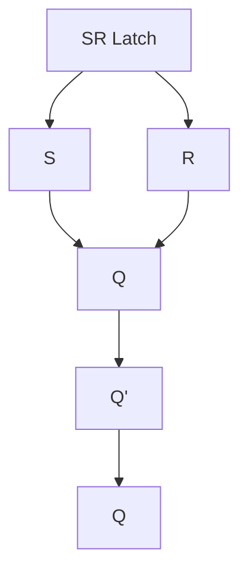
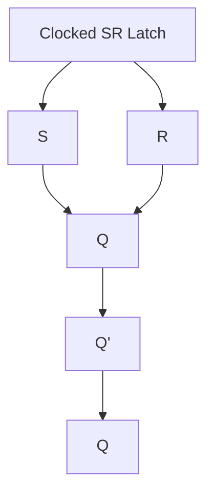
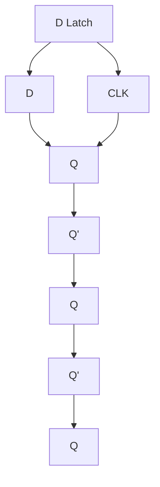
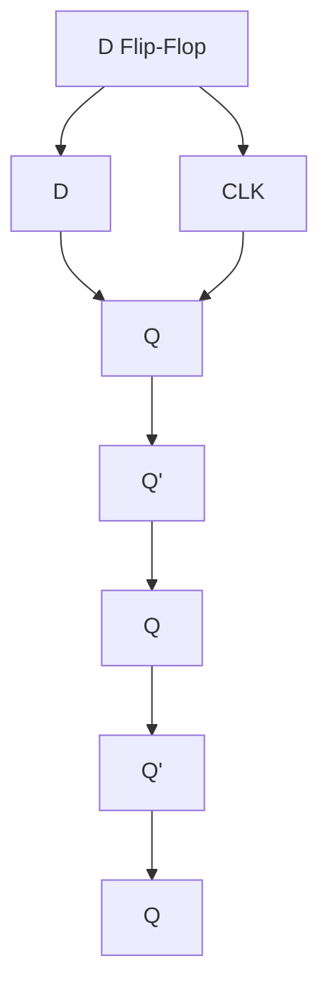
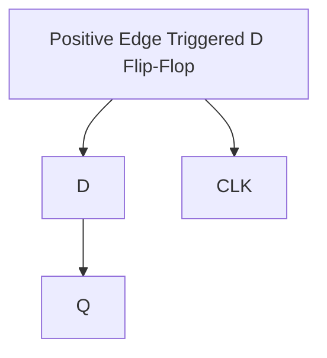
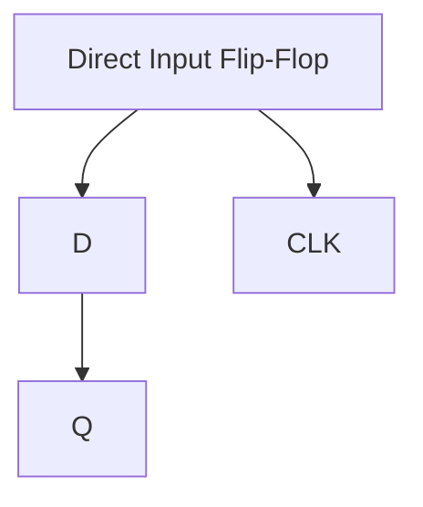
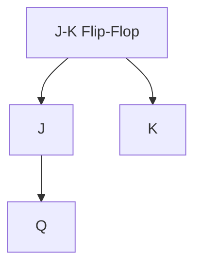
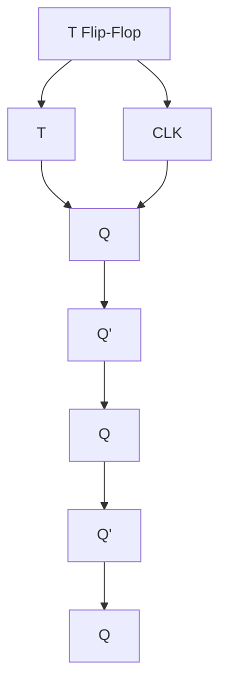
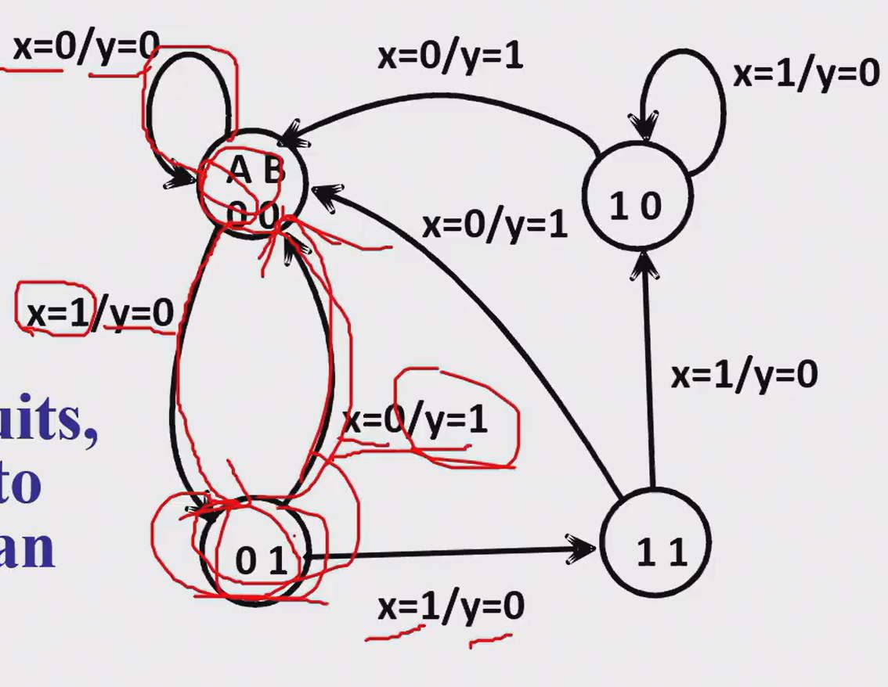
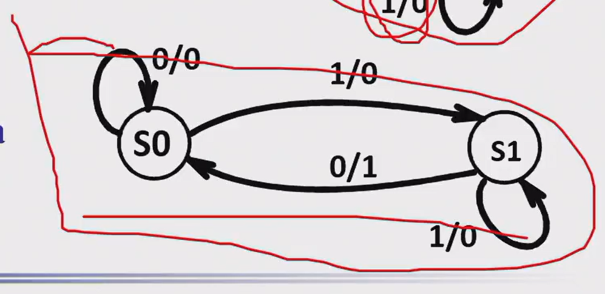

## Sequential Logic

* A seqential circuit

* latch

* flip-flop

* Mealy: output depends on both the present state and the present input

* Moore: output depends only on the present state

* Synchronous: clock-controlled

* Asynchronous: any type of input

### Storage elements

* discrete event simulation

#### SR Latch

##### Clocked SR Latch

* add a clock signal to transfer r and s

##### D Latch

* Make sure that S and R are not both 1

#### Flip-Flop

* The latch timing problem

* Y should change only one time during the clock cycle

* break the closed path

##### D Flip-Flop

* Negative edge triggered

##### Positive Edge Triggered D Flip-Flop

* Positive edge triggered

#### Direct Input Flip-Flop

* Direct input flip-flop

##### J-K Flip-Flop

* J-K flip-flop is a universal flip-flop

* J=1, K=1: toggle

##### T Flip-Flop

* Connect the J and K inputs together

* The difference between fil-flops and latches is that flip-flops are edge-triggered, while latches are level-triggered.

#### Basic Description of Flip-Flops

##### State Table

##### State Diagram

!!! note

    

##### Equivalent State Definitions

* 相同的状态可以合并
   * how to define the same state: same output procedure

!!! note

    

