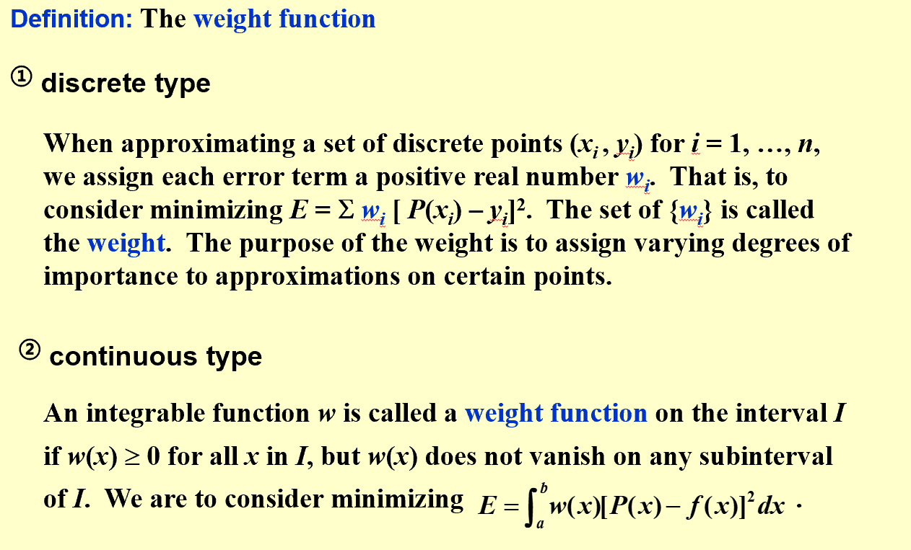
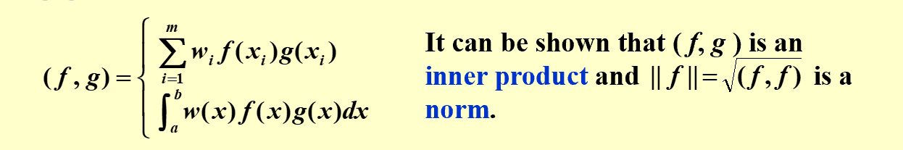
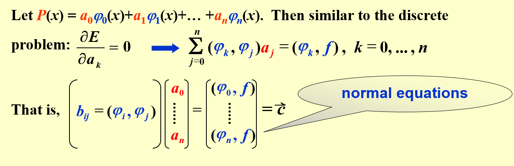

## 8.2 Orthogonal Polynomials and Least Squares Approximation  
   

      
         
            
               
     
  
    
The  general least squares approxiamtion problem is to find a generalized polynomial $P(x)$ ,such that $E=(P-y,P-y)=||P-y||^2$ is minimized.  

  
  
     
