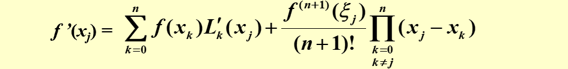
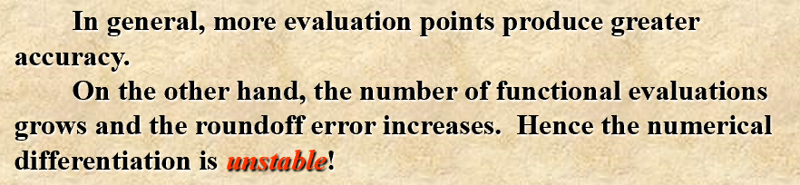

## **4.1 Numerical Differentiation**  
  
* forward: $f'(x)\approx\frac{f(x+h)-f(x)}{h}$  
* backward: $f'(x)\approx\frac{f(x)-f(x-h)}{h}$    
* to calculate the differentiation of $f(x)$ at $x$, we need a polyminial $P(x)$ that passes through the points(at least) $(x-h,f(x-h)),(x,f(x)),(x+h,f(x+h))$   
* Therefore, lagrange interpolation can be used  
  
  
!!! note "Problems might occur"  
 
      

  
## **4.3 Elements of Numerical Integration**  
* Approximate $I=\int_{a}^{b}f(x)dx$  
* we might use the interpolated polyminial to replace $f(x)$  

