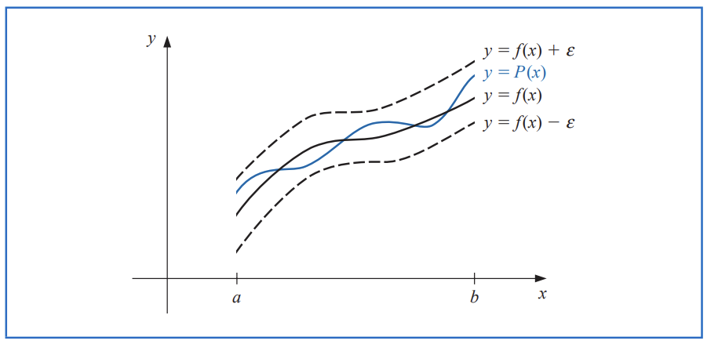

## 3.1 Interpolation and the Lagrange Polynomial   
One of the most useful classes of functions mapping the st of real numbers into itself is **algebraic polynomials**.  
\[P_n(x) = a_0 + a_1x + a_2x^2 + \cdots + a_nx^n\]  
One reason for their importance is that they uniformly approximate continuous functions.  
  
**Theorem 3.1: (Weiertrass Approximation Theorem**  
Let \(f\) be a continuous function on the interval \([a, b]\). Then, for every \(\epsilon > 0\), there exists a polynomial \(P(x)\) such that   
\[|f(x) - P(x)| < \epsilon\], for all \(x \in [a, b]\).  
**the derivative and indefinite integral of a polynomial are easy to determine**   
!!! note "The difference between polynomial interpolation and the Taylor polynomials"  
 
    
The Taylor polynomials agree as closely as possible with a given function at a specific point, but they concentrate their accuracy near that point. A good interpolation polynomial needs to provide a relatively accurate approximation over an entire interval
  

**Lagrange Interpolating Polynomial**  
* Polynomial interpolation definition: 
The problem of determining a polynomial of degree one that passes through the distinct
points (x0, y0) and (x1, y1) is the same as approximating a function f for which f (x0) = y0
and f (x1) = y1 by means of a first-degree polynomial interpolating, or agreeing with, the
values of f at the given points. Using this polynomial for approximation within the interval
given by the endpoints is called polynomial interpolation.  
  

