## 5.1 The Elementary Theory of Initial-Value Problems  
!!! note "A few basic theories for normal differential equations"  
    
    === "Lipschitz Comstant"
        A function $f(x,y)$ is said to satisfy a Lipschitz condition in the variable $y$ on a set $D$ in the $xy$-plane if there exists a constant $L>0$ such that
        $$|f(x,y_1)-f(x,y_2)|\leq L|y_1-y_2|$$
        for all $(x,y_1),(x,y_2)\in D$.  
        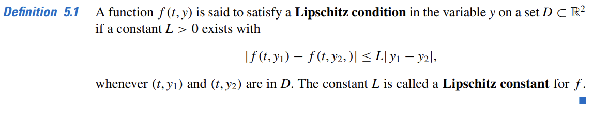  

    === "Convex"  
        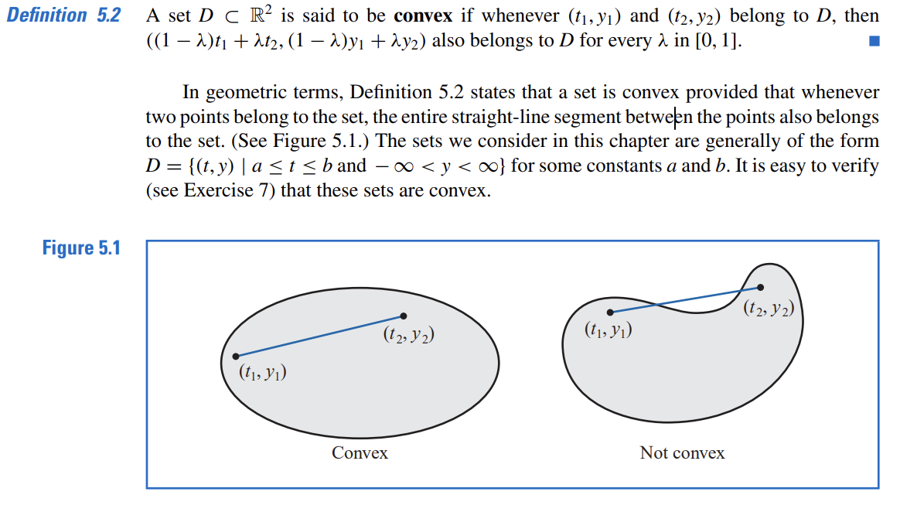  

    === "Lipschitz Condition"  
        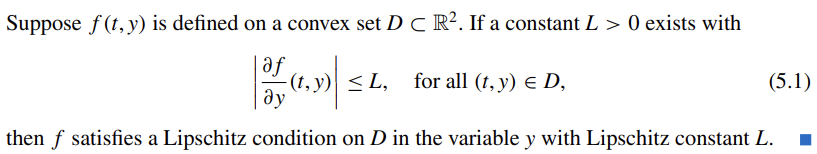  

    === "Fundamental Theorem of Existence and Uniqueness"  
        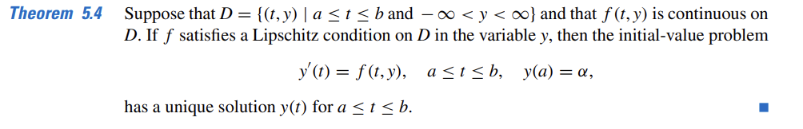  

* **Well-Posed Problems**  
!!! note  
    
    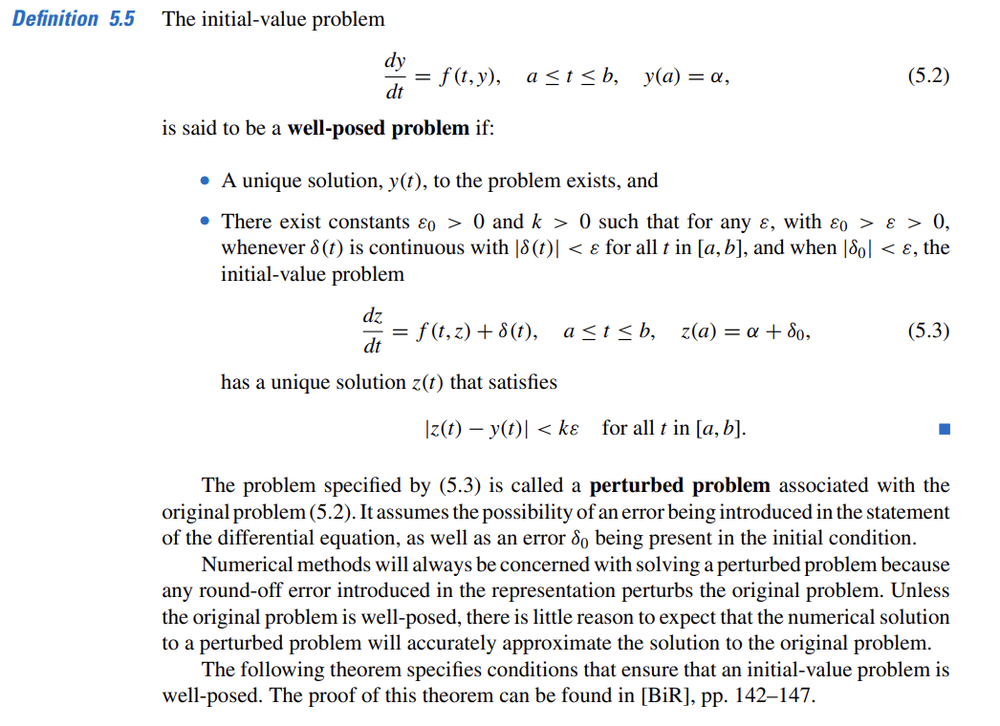  

> The problem specified by (5.3) is called a perturbed problem associated with the original problem (5.2). It assumes the possibility of an error being introduced in the statement of the differential equation, as well as an error $\sigma_0$ being present in the initial condition.   
!!! tip  

    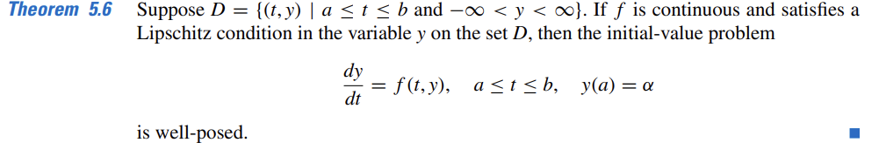   

## 5.2 The Euler Method  
* Quite simple and easy to implement, set foundations for advanced and sophiscticated methods  
* Based on Taylor series expansion  
> Suppose each step size is $h$, then the discrete points of $y$ can be aproxiamted by the following formula:  
> $w_i+1=w_i+hf(x_i,w_i)$->which is called the difference equation of the Euler method
> $w_0=y_0=\alpha$  
=== "seoducode"
    !!! tip "seoducode"  
    
        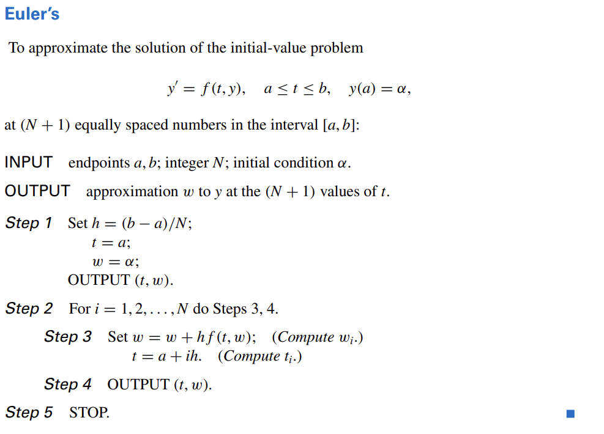   
=== "demonstration"   
    !!! note "demonstration"  
    
        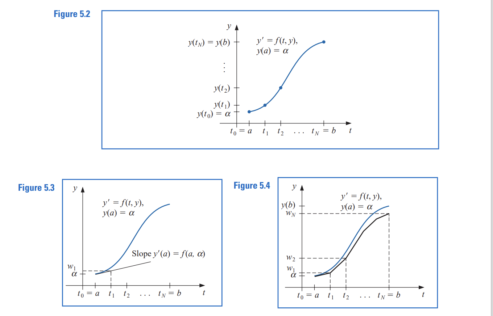  

* It's easy to identify that error grows slightly as the value of the input $t$ increases. Thanks to Euler method's simplicity and  stability, the error growth is controlled under a linear level.
### Error Bounds for Euler's Method  
* Although Euler’s method is not accurate enough to warrant its use in practice, it is sufficiently elementary to analyze the error that is produced from its application.   
!!! tip "Computational Lemmas" 
    === "Lemma 5.7"
    
        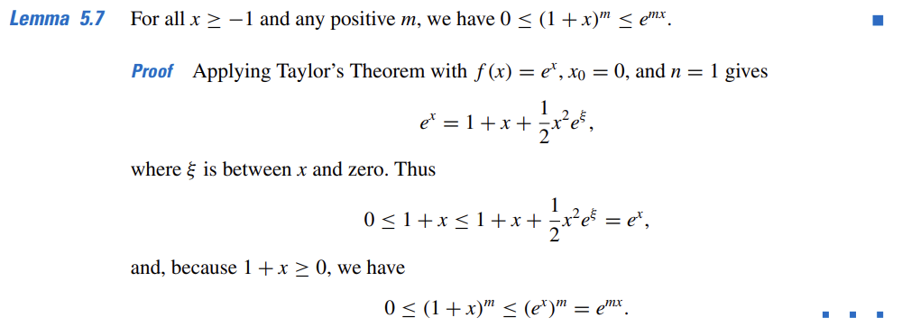  

    === "Lemma 5.8"  

        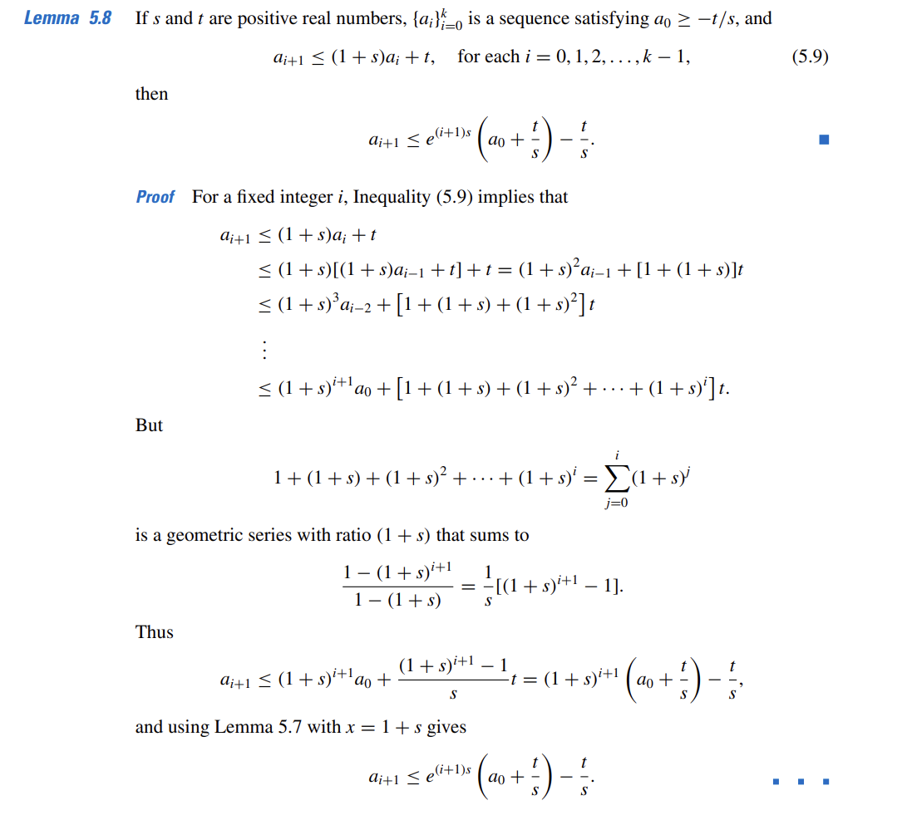  

    === "Theorem 5.9"  

        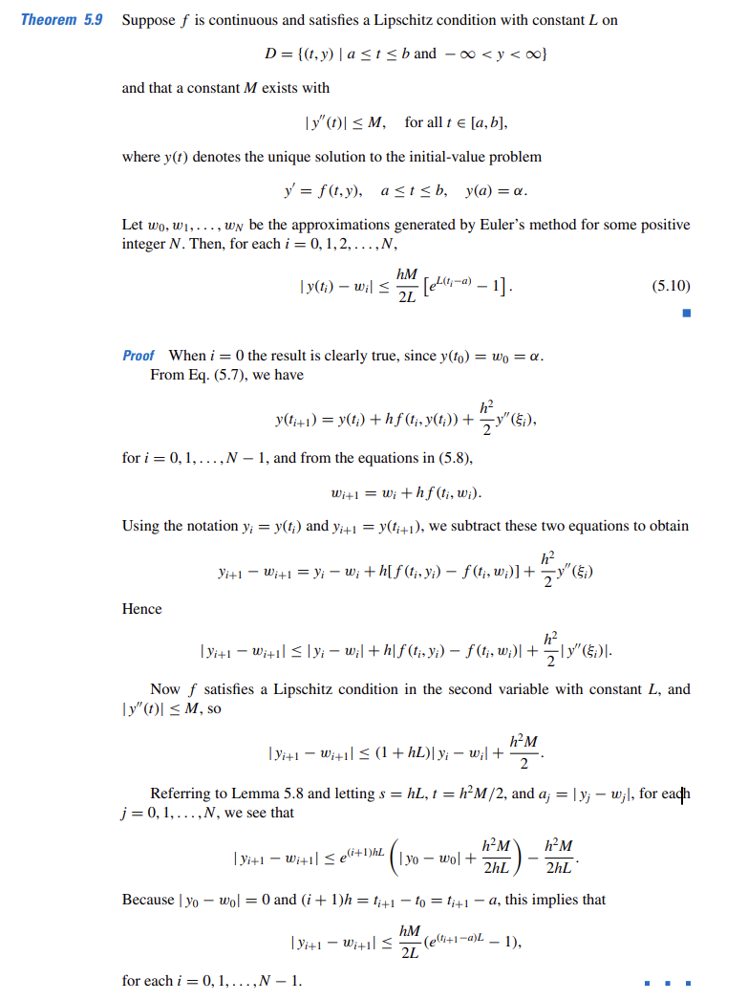  

* Have to mention that the requirement of the second deriative of $f$ is the weakness, but $\frac{\partial f}{\partial t}(t,u(t))+\frac{\partial f}{\partial y}(t,y(t))\cdot f(t,y(t))$, therefore its possible to obtain an error bound without explicitly knowing $y(t)$    
> Please bear in  mind that the error bound is linear to the step size $h$, therefore diminishing the step size can help to reduce the error.    

* However, round-off error plays in step size choosing. When we are operating Euler method on computers, we are unintentionally using the following formula to iterate: $u_0=\alpha+\sigma_0, u_{i+1}=u_i+hf(t_i,u_i)+\sigma_{i+1}$, where $\sigma_{i}$ is the round-off error.    
!!! tip "The sufficient theory for rounding errors"  

     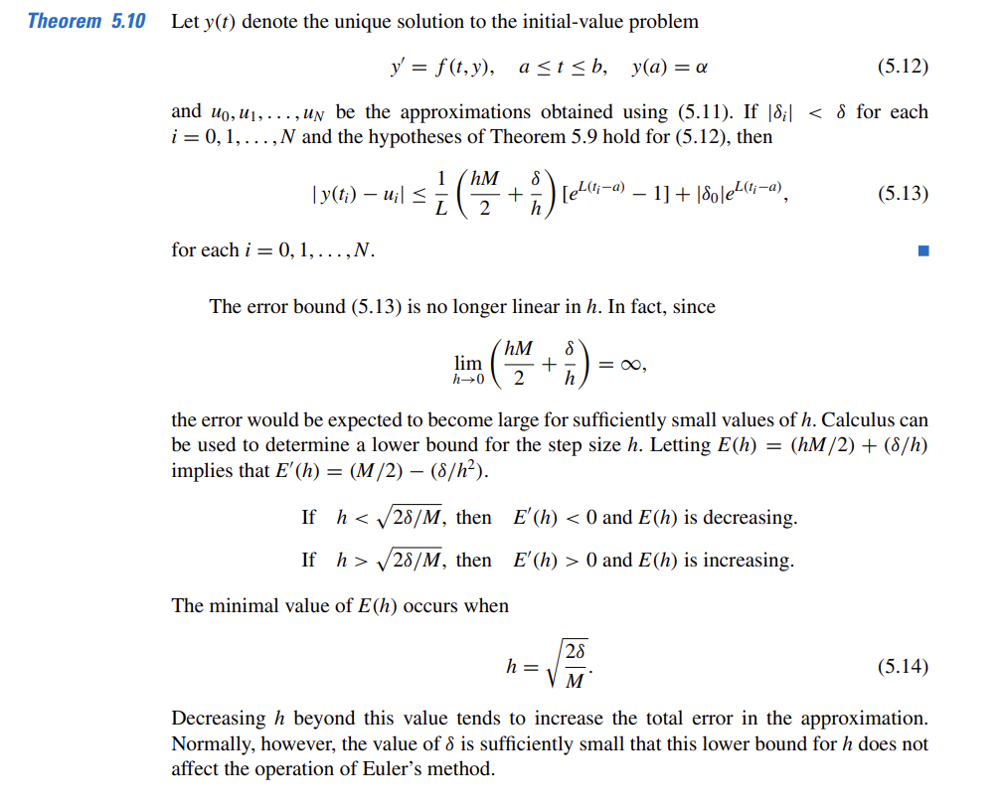  

       
    