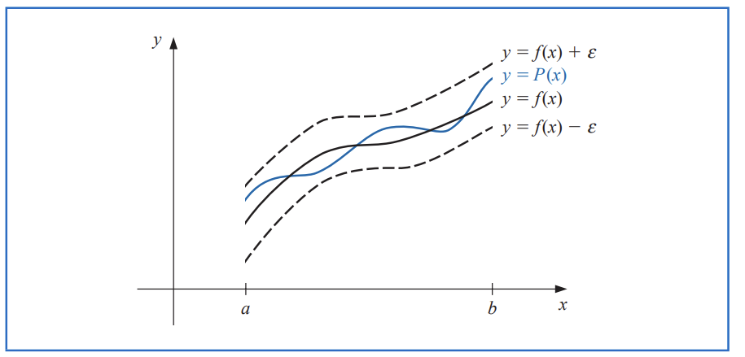
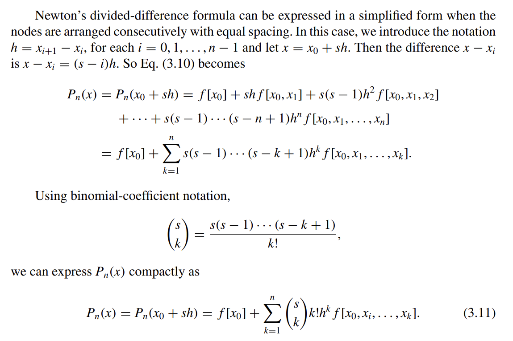
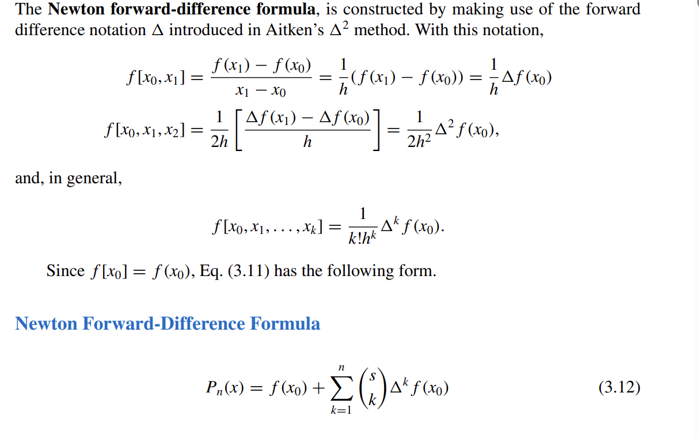
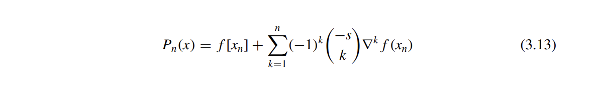
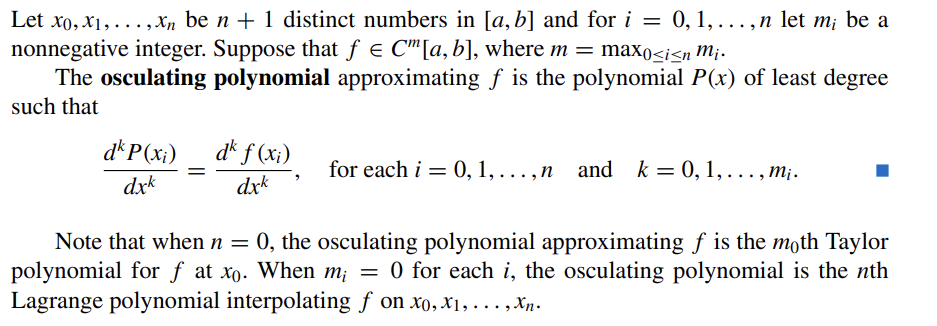
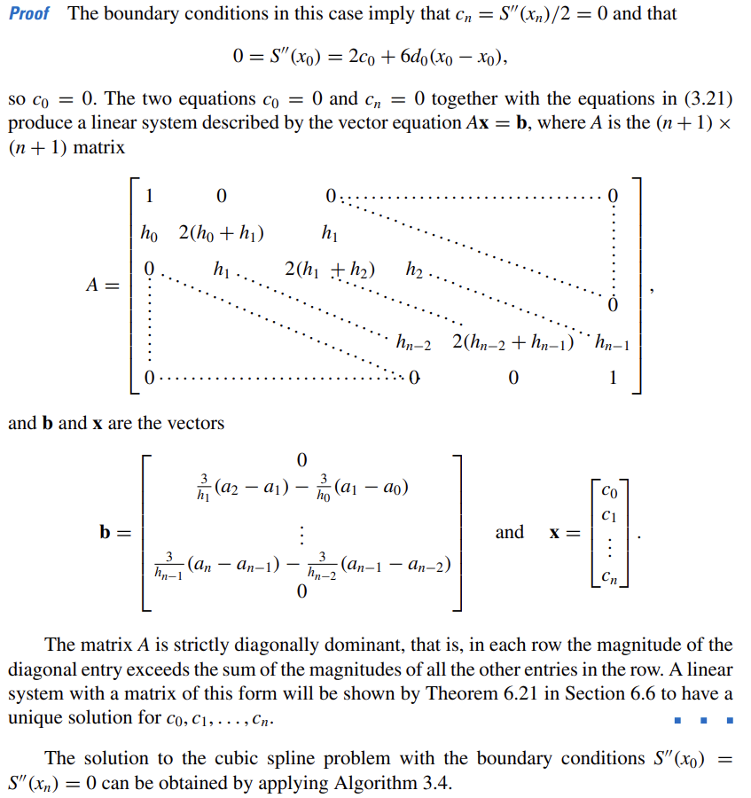
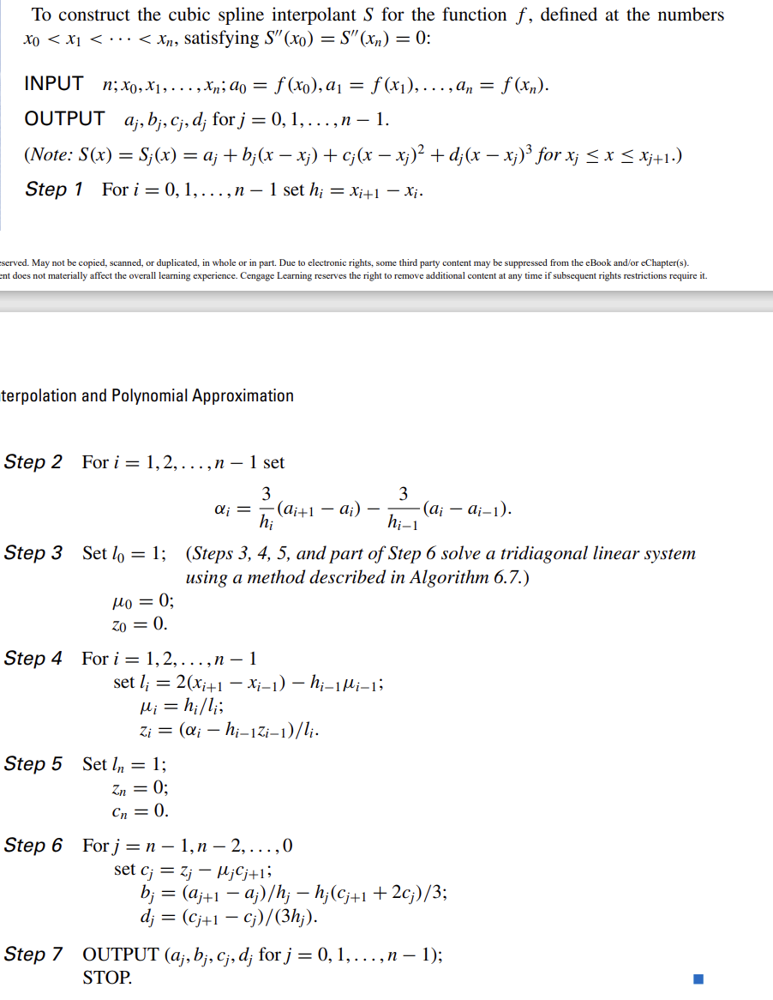
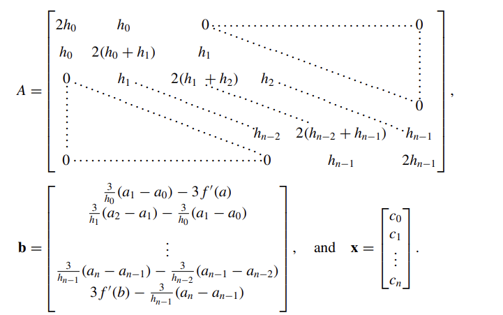
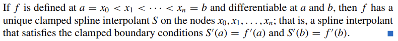
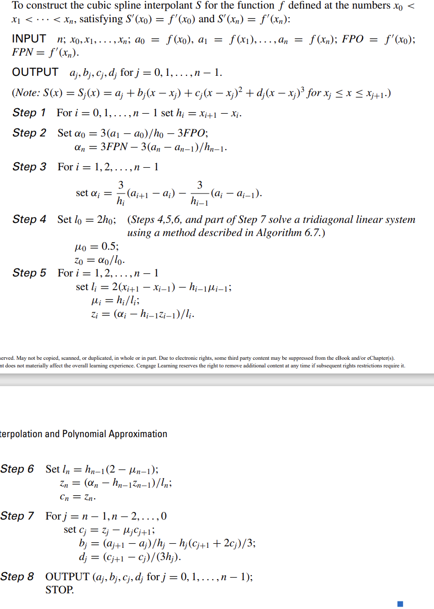

## 3.1 Interpolation and the Lagrange Polynomial   
One of the most useful classes of functions mapping the st of real numbers into itself is **algebraic polynomials**.  
$P_n(x) = a_0 + a_1x + a_2x^2 + \cdots + a_nx^n$ 
One reason for their importance is that they uniformly approximate continuous functions.  
  
**Theorem 3.1: (Weiertrass Approximation Theorem**  
Let $f$ be a continuous function on the interval $[a, b]$. Then, for every $\epsilon > 0$, there exists a polynomial $P(x)$ such that   
$|f(x) - P(x)| < \epsilon$, for all $x \in [a, b]$.  
**the derivative and indefinite integral of a polynomial are easy to determine**   
!!! note "The difference between polynomial interpolation and the Taylor polynomials"  
 
    
The Taylor polynomials agree as closely as possible with a given function at a specific point, but they concentrate their accuracy near that point. A good interpolation polynomial needs to provide a relatively accurate approximation over an entire interval
  

**Lagrange Interpolating Polynomial**  
* Polynomial interpolation definition: 
The problem of determining a polynomial of degree one that passes through the distinct
points (x0, y0) and (x1, y1) is the same as approximating a function f for which f (x0) = y0
and f (x1) = y1 by means of a first-degree polynomial interpolating, or agreeing with, the
values of f at the given points. Using this polynomial for approximation within the interval
given by the endpoints is called polynomial interpolation.    
  
* The n th Lagrange interpolating polynomial is defined as:   
**Theorem 3.2: (Lagrange Interpolating Polynomial)**  
Given n + 1 distinct points $(x_0, y_0), (x_1, y_1), \cdots, (x_n, y_n)$, there exists a unique polynomial $P_n(x)$ of degree at most n that passes through these points. This polynomial is given by 
$$P_n(x) = y_0L_0(x) + y_1L_1(x) + \cdots + y_nL_n(x)$$  
where the Lagrange basis functions $L_k(x)$ are defined by    
$$L_k(x) = \frac{(x - x_0)(x - x_1)\cdots(x - x_{k-1})(x - x_{k+1})\cdots(x - x_n)}{(x_k - x_0)(x_k - x_1)\cdots(x_k - x_{k-1})(x_k - x_{k+1})\cdots(x_k - x_n)}$$  

## 3.3 Divided Difference  
**Divided Difference**  
$P_n(x)=a_0+a_1(x-x_0)+a_2(x-x_0)(x-x_1)+\cdots+a_n(x-x_0)(x-x_1)\cdots(x-x_{n-1})$  
the main purpose is to calulate the coefficients $a_0, a_1, \cdots, a_n$ recursively  
**Theorem 3.3: (Divided Difference)**  
Given n + 1 distinct points $(x_0, y_0), (x_1, y_1), \cdots, (x_n, y_n)$, the divided difference $f[x_0, x_1, \cdots, x_k]$ is defined by  
$$f[x_0, x_1, \cdots, x_k] = \frac{f[x_1, x_2, \cdots, x_k] - f[x_0, x_1, \cdots, x_{k-1}]}{x_k - x_0}$$  
with $f[x_i] = y_i$ for $i = 0, 1, \cdots, n$.  
therefore, the interpolating polynomial can be written as:  
$$P_n(x) = f[x_0] + f[x_0, x_1](x - x_0) + f[x_0, x_1, x_2](x - x_0)(x - x_1) + \cdots + f[x_0, x_1, \cdots, x_n](x - x_0)(x - x_1)\cdots(x - x_{n-1})$$  
**Newton's Divided Difference Interpolating Polynomial**  
 
INPUT numbers $x_0,x_1,\cdots,x_n$ and values $f(x_0),f(x_1),\cdots,f(x_n)$ as $F_{0,0},F_{1,0},\cdots,F_{n,0}$  
OUTPUT the numbers of $F_{0,0}, F_{1,1}, \cdots, F_{n,n}$ where  
$P_n(x)=F_{0,0}+\sum_{i=1}^{n}F_{i,i}\prod_{j=0}^{i-1}(x-x_j)$  
for $i=1,2,\cdots,n$ do  
    for $j=0,1,\cdots,i$ do  
        $F_{i,j}=\frac{F_{i,j}-F_{i-1,j-1}}{x_i-x_{i-j}}$  
return $F_{0,0},F_{1,1},\cdots,F_{n,n}$  

**Theorem 3.6: (Newton's Divided Difference Interpolating Polynomial)**  
!!! note  

      

**Newton forward-difference formula**  
  
**Newton backward-difference formula**  
  
??? tip  

    
when we need to calculate a value of $f(x)$ at a point $x$ that is not in the table, we choose the Newton forward-difference formula or the Newton backward-difference formula by calculating whether the difference between $x$ and the first point in the table is smaller or larger than the difference between $x$ and the last point in the table. because s is relatively smaller, hence the amount of error can be relatively reduced when multiplying 
  

**Centered difference**  

## 3.4 Hermite Interpolation  
**Hermite Interpolating Polynomial**  
   

## 3.5 Cubic Spline Interpolation  
**Natural Splines**  
If f is defined at a = x0 < x1 < ··· < xn = b, then f has a unique natural spline interpolant
S on the nodes x0, x1, ..., xn; that is, a spline interpolant that satisfies the natural boundary
conditions $S''(a)$ and $S''(b)$ = 0.  
!!! note  

    
$h_{j-1}c_{j-1}+2(h_{j-1}+h_j)c_j+h_jc_{j+1}=3\left(\frac{f(x_{j+1})-f(x_j)}{h_j}-\frac{f(x_j)-f(x_{j-1})}{h_{j-1}}\right)$
  

  
!!! tip "Seoducode"  

      

**Clamped Splines**  
  
  

!!! tip "seoducode"  

      

