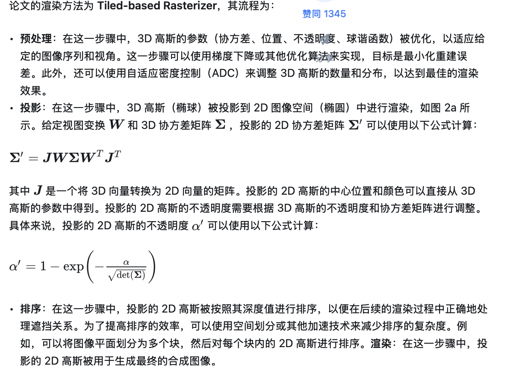

# Essay Reading

## 3DGS:

* preknowledge

> * NERF: 通过多角度的照片view，通过position encoding，处理位置的高频信息，输入位置和摄像机角度，输出颜色和density，同时在模型训练好之后，通过类似ray tracing的方法，为每个ray上的点采样，从而得到某一方向上的点的信息。做体渲染，因为其可微分
> * $C(\mathbf{r}) = \int_{t_n}^{t_f} T(t) \sigma (\mathbf{r}(t)) \mathbf{c} (\mathbf{r}(t), \mathbf{d}) dt, \quad \text{where} \quad T(t) = \exp \left( - \int_{t_n}^{t} \sigma (\mathbf{r}(s)) ds \right)$
> * 把射线分成N个小区间加权
> * 一个粗糙网络（Coares）一个精细网络（Fine）。粗糙网络是在均匀采样得到比较少$(N_c)$的点进行渲染并训练的网络，用来输出进行采样概率估计。然后用$\omega_{i}$的概率分布采样，训练精细网络。

!!! note neural network architecture of NERF

    
    
    * 把坐标$(x,y,z)$映射出60维的向量，输入到全连接网络得到密度 $\sigma$；视角$(\theta, \phi)$映射得到的24维向量和$\phi$的前一层输出特征拼接在一起，经过两层MLP得到RGB值。值得注意的是，为了加强坐标信信，坐标的信息会在网络中间再输入一次。这里的网络结构设计体现了，密度和视角无关，颜色和视角相关。

* **3DGS**

> * 3DGS 是在离散和连续间的一个平衡：在高斯球内部是连续的、可微的；在整个空间中，每个高斯球又是离散的
> * NeRF中的噪声在随机采样，蒙特卡洛积分，网络拟和优化时会产生
> * 3DGS辐射场
> * 三维高斯分布：用来表征3D点
$L_{3DGS}(x,y,z,\theta,\phi)=\sum_{i=1}G(x, y, z, \mu_i, \sigma_i) \cdot c_i(\theta,  \phi)$
> * $c_i(\theta, \phi)$是一个球谐函数，表示不同视角下的颜色
> * 球谐函数
> * real-time rendering
> * 初始化操作
> $\sigma$是正定矩阵，所以$RSS^TR^T$来初始化
> ågradient descent 把梯度传到下一层
> 由于放缩变换都是沿着坐标轴，所以只需要一个3D向量，旋转则用四元数表达
> * 以高斯概率分布构建三维模型
> * Splattiing

## 3DGS

* 论文中，三维高斯体的属性有其中心（位置）$\mu$、不透明度$\alpha$、三维协方差矩阵（表示缩放程度）和颜色$c$。$c(\theta, \phi)$ 用球谐函数表示，以呈现视角依赖的外观。所有属性都是可学习的，并通过反向传播进行优化。

论文给出了初始化方法是使用放缩变换$S$和旋转变换$R$组合得到$\sum$：
$\sum=RSS^TR^T$,由于放缩变换都是沿着坐标轴，所以只需要一个3D向量$s$，旋转则用四元数$q$表达。机器学习通常使用梯度下降对参数进行优化，但直接优化 $\sum$难以保证半正定，所以论文的方法是继续将梯度传递到$s,q$进行优化。

!!! note "illustration of splatting"

    

### 渲染

* 预处理：在这一步骤中，3D 高斯的参数（协方差、位置、不透明度、球谐函数）被优化，以适应给定的图像序列和视角。这一步骤可以使用梯度下降或其他优化算法来实现，目标是最小化重建误差。此外，还可以使用自适应密度控制（ADC）来调整 3D 高斯的数量和分布，以达到最佳的渲染效果。

!!! note

    

### 分块

在处理图像时，为了减少对每个像素进行高斯运算的计算成本，论文采用了一种不同的方法：它不是在像素级别进行精确计算，而是将精度降低到了更宏观的图块级别。这个过程首先涉及将整个图像划分成多个不重叠的小块，这些在原始的研究论文中被形象地称为“砖块”。按照原始论文的建议，每个砖块包括 $16\times16$ 个像素。

接下来，会进一步识别出哪些砖块与特定的高斯投影相交。考虑到一个高斯投影可能会覆盖多个砖块，一种有效的处理方式是复制这个东西，并为每个复制出的高斯分配一个唯一的标识符，即与之相交的 Tile 的 ID。这样，每个砖块都与一个或多个高斯相关联，这些高斯标识了该砖块在图像中的位置和重要性。通过这种方式，3DGS 
能够在图像中高效地处理和渲染高斯投影，同时保持较低的计算成本。

### 排序 & Alpha blending

* 给定像素位置 $x$，通过视图变换 $W$，可以计算与所有重叠高斯体的距离，即这些高斯体的深度，形成高斯体的排序列表 $N$。然后，进行Alpha Blending，也就是混合 alpha 合成来计算整体图像的最终颜色：

$ C=\sum_{i\in N} c_i \alpha_i^' \prod_{j=1}^{i-1} (1-\alpha_j^')$

