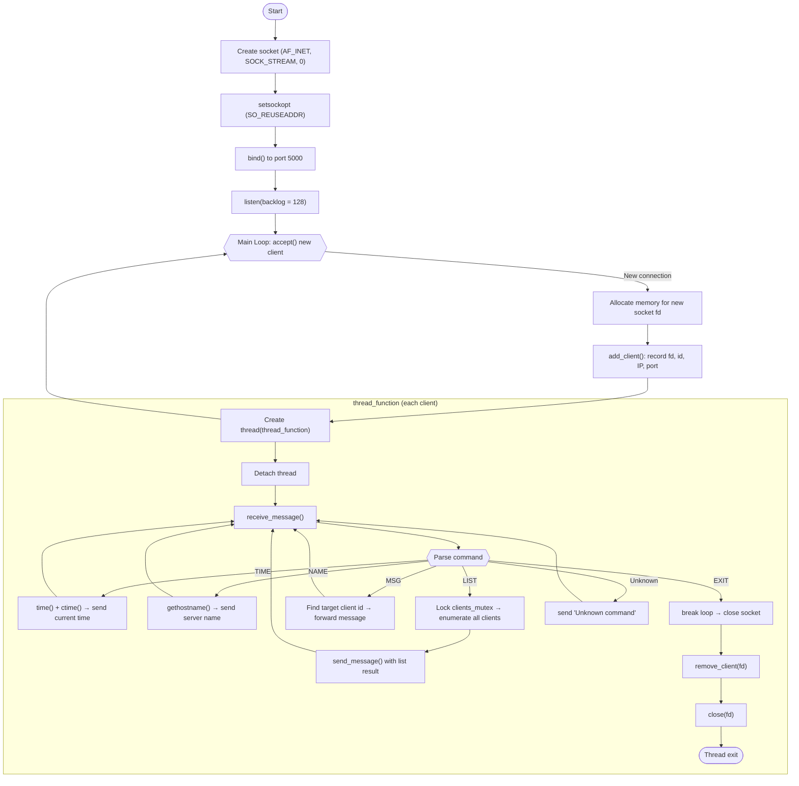
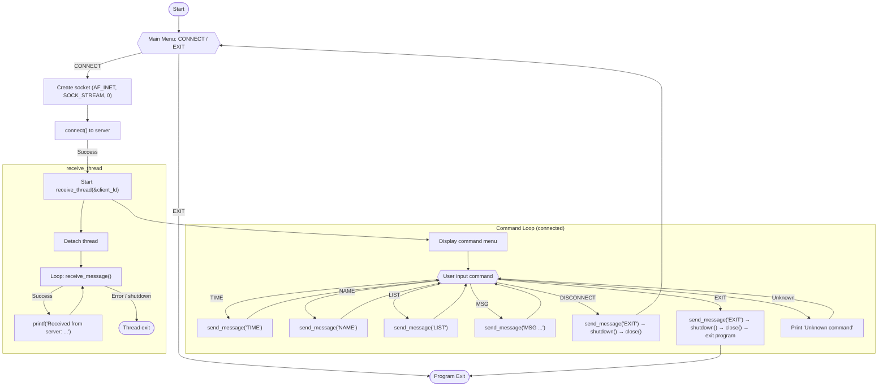

```mermaid
flowchart TD

A0([Start]) --> A1["Create socket (AF_INET, SOCK_STREAM, 0)"]
A1 --> A2["setsockopt (SO_REUSEADDR)"]
A2 --> A3["bind() to port 5000"]
A3 --> A4["listen(backlog = 128)"]
A4 --> A5{{"Main Loop: accept() new client"}}

A5 -->|New connection| B1["Allocate memory for new socket fd"]
B1 --> B2["add_client(): record fd, id, IP, port"]
B2 --> B3["Create thread(thread_function)"]
B3 --> A5

%% 子线程逻辑
subgraph "thread_function (each client)"
B3 --> C1["Detach thread"]
C1 --> C2["receive_message()"]
C2 --> C3{{"Parse command"}}

C3 -->|TIME| C4["time() + ctime() → send current time"]
C3 -->|NAME| C5["gethostname() → send server name"]
C3 -->|LIST| C6["Lock clients_mutex → enumerate all clients"]
C6 --> C7["send_message() with list result"]
C3 -->|MSG <id> <content>| C8["Find target client id → forward message"]
C3 -->|EXIT| C9["break loop → close socket"]
C3 -->|Unknown| C10["send 'Unknown command'"]

C4 --> C2
C5 --> C2
C7 --> C2
C8 --> C2
C10 --> C2
C9 --> D1["remove_client(fd)"]
D1 --> D2["close(fd)"]
D2 --> D3([Thread exit])
end
```

```mermaid
flowchart TD

A0([Start]) --> A1{{"Main Menu: CONNECT / EXIT"}}

A1 -->|EXIT| Z1([Program Exit])
A1 -->|CONNECT <ip> <port>| B1["Create socket (AF_INET, SOCK_STREAM, 0)"]
B1 --> B2["connect() to server"]
B2 -->|Success| B3["Start receive_thread(&client_fd)"]
B3 --> B4["Display command menu"]

%% 命令循环
subgraph "Command Loop (connected)"
B4 --> C1{{"User input command"}}
C1 -->|TIME| C2["send_message('TIME')"]
C1 -->|NAME| C3["send_message('NAME')"]
C1 -->|LIST| C4["send_message('LIST')"]
C1 -->|"MSG <id> <message>"| C5["send_message('MSG ...')"]
C1 -->|DISCONNECT| C6["send_message('EXIT') → shutdown() → close()"]
C1 -->|EXIT| C7["send_message('EXIT') → shutdown() → close() → exit program"]
C1 -->|Unknown| C8["Print 'Unknown command'"]

C2 --> C1
C3 --> C1
C4 --> C1
C5 --> C1
C8 --> C1
end

C6 --> A1
C7 --> Z1

%% 接收线程部分
subgraph "receive_thread"
B3 --> R1["Detach thread"]
R1 --> R2["Loop: receive_message()"]
R2 -->|Success| R3["printf('Received from server: ...')"]
R3 --> R2
R2 -->|Error / shutdown| R4(["Thread exit"])
end
```